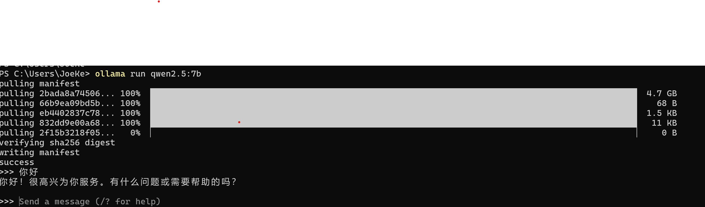
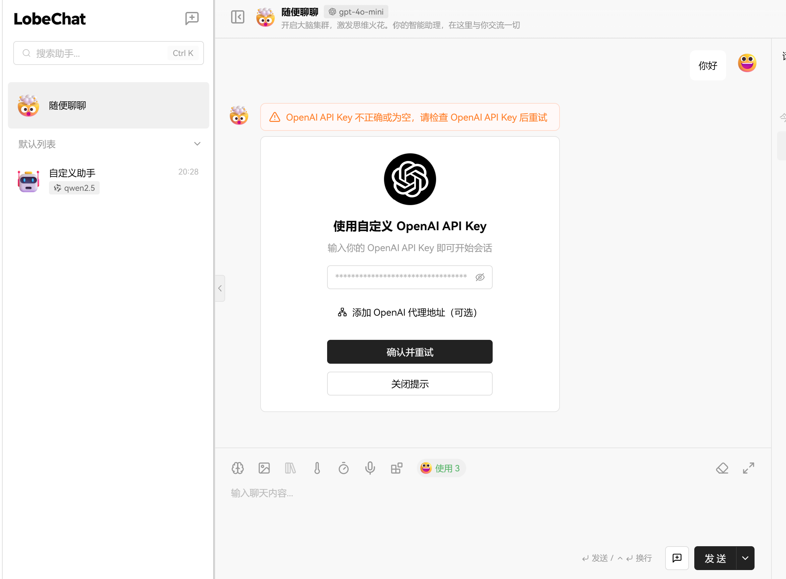
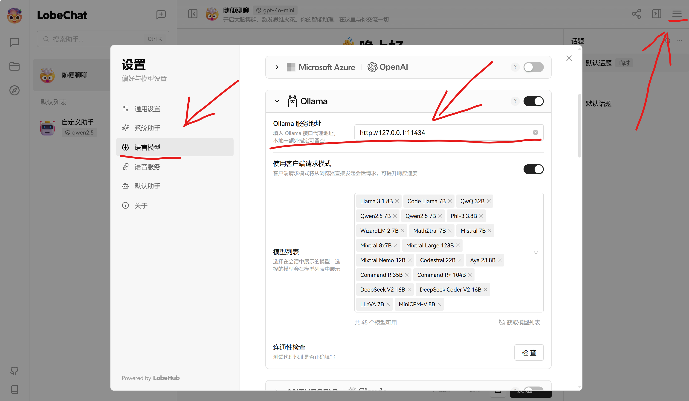
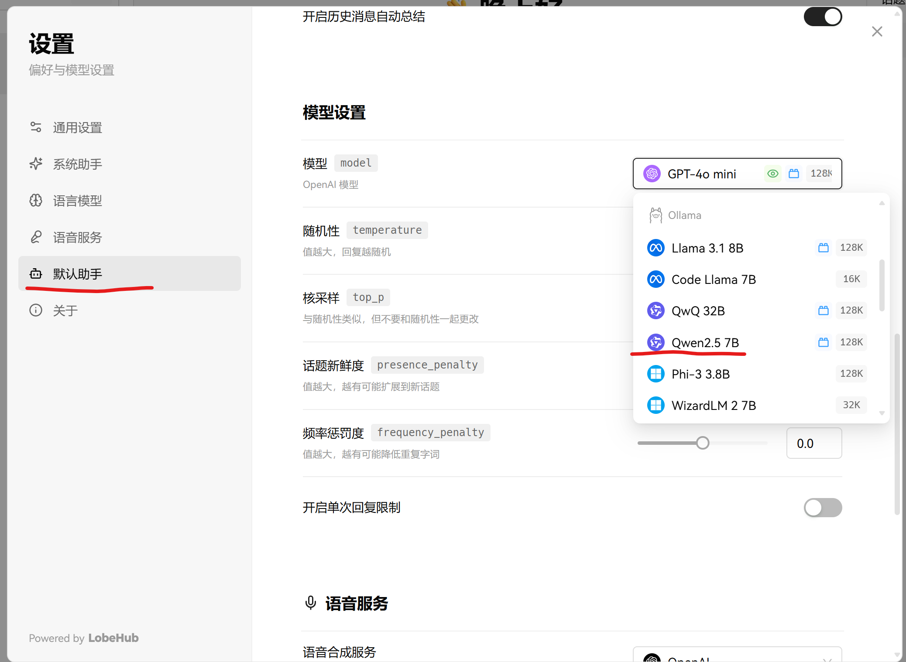
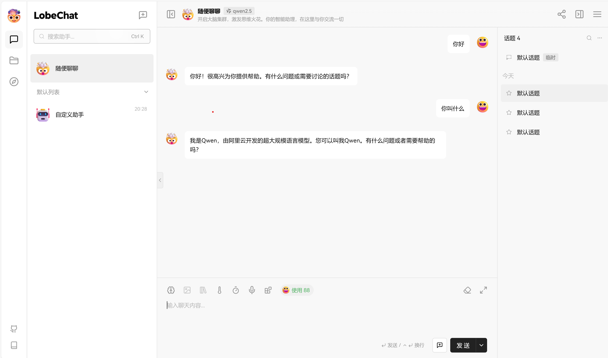

# AI扫盲

当下AI火热，无论什么都要跟AI沾点儿边，不会点儿AI都无法跟别人交流了，但是AI的学习曲线很陡峭，想快速的、全面的了解一些AI相关的知识是比较困难的，而本文就为此而来，带你快速认识AI、了解AI；

> 注意：本文内容仅限于让你对AI有一个快速的、全面的认识，知道一些常见名词指的是什么以及一些简单的原理，可以跟别人愉快的吹水而不至于插不上嘴，并不涉及一些核心的原理解释，想要系统的、深入的学习，还是要从基础开始一步步学习；

> 本文最后会教你部署一个自己的AI


## 监督学习、非监督学习

这两个词对于没有接触过AI的人可能是最容易误解的，来看看你有没有误解吧：

- 监督学习：监督学习是需要对训练数据进行标注、学习从输入到输出的映射关系，例：对于给定的两种水果，监督学习是我们告诉机器其中一种是苹果，一种是草莓，机器学习后对于后续给定的数据告诉我们他是苹果还是草莓；
- 非监督学习：非监督学习无需对训练数据进行标注，会尝试寻找给定数据的内在关系，例：对于给定的两种水果，机器通过算法自行找不同最终将水果分为两种（分为多少种是我们告诉机器的），机器学习后对于后续给定的数据告诉我们他是哪一种；


## 机器学习的过程

机器学习（也叫训练）的过程中，简单来讲就是在不断试错，尝试找出模型正确的参数，最终学到的是许许多多的参数值，对于最简单的一个场景，假如我们有一系列数据集（格式：[x, y]）：

```
[[1, 2], [3, 7], [4, 7], [7, 16]]
```

现在我需要让机器学习这组数据，以预测当x=20的时候y应该等于多少，那么首先我要给定一个模型（函数）：

```
y = ax + b
```

其中a、b是未知的，机器学习的过程如下:

- 1、首先假定a是3，b是5；
- 2、将我们给定的所有x带入，算出y，然后逐个计算与实际y的差值的平方，最终取和后再除以4（因为总共4组数据），得到71.25`=((8-2)^2 + (14-7)^2 + (17-7)^2 + (26-16)^2) / 4`，我们将这步的函数（算法）写为`J(a, b)`，现在我们知道了当`a=3，b=5`时`J(a, b)=71.25`
- 3、尝试将a减小1，b减小2，按照第二步计算出`J(a, b) = 7.5`
- 4、重复第3步，直到找到最小的`J(a, b)`值；PS: 如果运行顺利，最终a应该等于2，b等于0；


> Q: 这里为什么是`y = ax + b`而不是`y = ax^2 + bx + c`或者其他函数？

> A: 因为这个模型比较简单，而且我们知道用这个模型会有效，当然其他模型可能也会有效，因为现有数据集比较简单，并没有足够多的数据支撑我们挑选出一个足够好的模型；

> Q: 那我们以后面对复杂问题时是否也需要这样挑选模型？

> A: 是的，所以AI的一大难点就是建模，建模的好坏直接决定模型的上限（结果准确率是否满足预期），当然，对于大多数常见问题，都有一些对应的模型可用，这些都是前人总结出来的；

> Q: PS: 第一步为什么假定a等于3，b等于5？

> A: 这个是随便选的一个值，这个值的选择重要也不重要，重要的是，选择的值比较合适（接近最终答案甚至等于）时，训练所需的时间就会较短，不重要的是，对于稍微复杂一些的模型，我们很难判断那些值是合适的，全凭经验与运气，剩下的就交给算力，而对于那些有几十上百亿参数的模型，emmmm.........

> Q: 对于第二步的算法，是否是固定的？叫什么？

> A: 不固定，是我们自己定的，但是通常有几个大家都会采用的函数，这步的函数就叫损失函数（loss function），或者代价函数（cost function）

> Q: 第3步为什么将a减小了1、b减小了2，而不是其他值？

> A: 首先，这个值就是学习率，学习率可以自定义，重要也不重要，重要是因为选择的学习率合适了可以快速得到结果，而不合适了可能会永远得不到结果，不重要因为现代框架通常可以在训练过程中自适应调整学习率，当检测到学习率过大时会调小，反之；另外：通常a和b是分开学习的，我们听到的某个模型有多少个参数，指的也是这个；

> Q: 第4步叫什么，如何判断值最小？

> A: 你只需要知道这个过程叫做梯度下降即可，具体如何做有多种方法，但是我们并不打算在这里详细介绍，你可以自行查阅资料；

> 注意，这里我们简化了很多步骤和概念，比如这里会有一个过拟合的概念，就是模型对给定的训练数据集拟合的太好了（损失函数值特别小），但是当将其应用到实际数据时得出的结果又太不好，造成过拟合的原因有很多，解决办法也有不少 ，有兴趣可以自行学习；同时，学习模型也有很多种，实际情况远比这复杂，但是这也是一个实用的基础模型；


## 逻辑回归、线性回归

- 逻辑回归是一种用于二分类问题的统计模型，输出一个概率值，表示某个事件发生的可能性。
- 线性回归是用于预测连续数值的回归模型，假设输入特征与输出变量之间存在线性关系。PS: 我们上一节大的例子就是线性回归；


## 什么是CNN、RNN、LSTM、Transformer
CNN（卷积神经网络）、RNN（循环神经网络）、LSTM（长短期记忆网络）、Transformer都是一些基础的模型架构，原理和我们上边那个模型类似，只不过更复杂，他们通过将一系列的简单模型（如上边的那个线性回归）封装组成一个大的、**针对特定问题较为有效的模型**；

## 什么是TensorFlow、PyTorch
TensorFlow、PyTorch都是一些基础类库，用于做一些基本的数学运算和调度（比如充分的利用GPU来进行计算），以及封装了一些基本的模型，例如上面章节提到的CNN、RNN等，让我们在开发的过程中可以不必太过关心底层那些重复性的编码工作，无需重复造轮子（当然还是要了解其原理的），有效提高我们的开发效率；


## 开源模型开源了什么
对于开源模型而言，开源的就是他们的模型组合（建模），就像我们在`机器学习的过程`这一章节提到的，如何选择一个合适的模型是很难的，而让成百上千个这样的模型组合起来工作更难，此时就有了开源模型，有一批在机器学习领域有较深造诣和较多经验的人在基础模型之上搭建出来的针对特定场景（例如OCR）开箱即用的模型；

在开源模型的同时，一般也会开源他们针对内部或者开源数据集训练好的参数，这样我们拿到模型后就不必在自己训练而能直接使用；

## 什么是Hugging Face、ModelScope

Hugging Face可以认为是模型商店，里边包含了市面上开源的绝大多数模型供你选择下载，这样你就不必去各个厂商官网查找下载模型了；

ModelScope与Hugging Face功能类似，不同的是ModelScope是由国内的阿里开发的，而Hugging Face则是海外的服务提供商，当你在国内、并且指定模型在两个网站都有的时候，优先推荐使用ModelScope，这样就不必忍受Hugging Face那慢到极点的下载速度了；（有海外专线的另说）

## 什么是ollama
有了Hugging Face、ModelScope后，我们可以快速的找到我们想要的模型，下一步就是部署运行了；

如果自己不考虑二次开发，只是想要快速的部署运行的话，ollama是你不二选择，无需安装复杂的环境，只需要下载ollama的安装包，然后执行以下命令，即可跑起一个模型：

```
# 这里实例是千问模型，如果需要其他模型，可以在ollama上查找支持的其他模型；
ollama run qwen2.5:7b
```

现在，你可以愉快的跟他对话了，运行结果如下：



## 界面化操作

当然，你可能并不满足于上述在命令行中对话，此时你希望在一个页面上来进行交互，我们能快速实现这个吗？答案是可以的，现有的开源项目是可以满足你的，例如`lobechat`，下面我们来部署下`lobechat`，`lobechat`部署起来也很简单，首先你要本地安装docker，然后运行如下命令：

```
docker run -d -p 3210:3210 -e ACCESS_CODE=lobe66 --name lobe-chat lobehub/lobe-chat
```

等到命令完成后，我们可以在浏览器访问`http://127.0.0.1:3210`来访问`lobechat`，不过此时还不能使用，如果你尝试跟他对话，他会报如下错误：



这里会让你填写`OpenAI API Key`，这是因为`lobechat`本身并不提供模型服务，而是将各种三方模型的调用聚合进了系统，默认使用的是`OpenAI`的服务，所以就需要配置`OpenAI API Key`了，如果你有的话，可以直接配置，如果没有，我们上一步使用`ollama`部署的模型就有用了，我们可以配置`lobechat`使用`ollama`，首先在`lobechat`上配置`ollama`地址：



然后我们配置默认助手，将默认的`GPT-4o mini`替换为`ollama`中的`Qwen2.5 7B`（注意，不要选太大的模型，例如`QwQ 32B`，除非你的电脑配置很好，如果选择的模型本地还未下载，则也会提示你下载）



最后，我们就可以愉快的跟他交谈了：



以上就是本篇全部内容了，希望能让你对AI有一个初步的认识；

# 联系我
- 作者微信：JoeKerouac
- 微信公众号（文章会第一时间更新到公众号，如果搜不出来可能是改名字了，加微信即可=_=|）：代码深度研究院
- GitHub：https://github.com/JoeKerouac

# 文中提到的一些网站地址
- ollama官网: https://ollama.com
- Hugging Face官网: https://huggingface.co/
- ModelScope官网: https://modelscope.cn/home
- lobechat官网: https://gw.chatgptten.com/welcome
- docker官网: https://www.docker.com/
