# java服务器调试指南

在实际开发中，总会遇到程序启动不起来或者运行结果不符合期望的情况，如果是在本地，直接debug就行了，几乎人人都会，但是如果到了远程，大多数情况下我们可以看日志，通过日志排查定位到问题，但是如果你的日志不多，或者日志中看不出问题，此时情况就比较难以处理了，而实际上我们仍然可以通过debug的形式来解决，只不过由原来的本地在ide中通过GUI来debug变为通过命令行来debug；

## 开启服务debug端口
如果想要对我们远程部署的服务进行debug，那么首先我们要开启debug端口，开启方式如下：

```
开启远程debug：
在Java启动命令后追加系统参数
-agentlib:jdwp=transport=dt_socket,server=y,suspend=y,address=8000

PS：suspend表示是否需要等待远程debug连接在开始启动，y表示需要等待远程debug连接才会继续执行；
```

## 开始debug

当我们的服务启动后，我们就可以开始debug了，此时有两种情况：
- 我们本地可以直接连接到服务所在的机器；
- 我们本地无法直接连接到服务所在的机器；（可能时服务在容器中、堡垒机后等）；


如果我们本地可以直接连接到服务所在的机器，那么可以在ide中直接选择远程debug，填写好IP和端口号即可连接上进行远程debug，与本地debug的体验基本是一致的，没什么好讲的，我们这里主要说说本地无法连接到服务所在的机器时如何进行debug；


当我们无法连接到远程服务所在的机器时，此时可以使用jdk中为我们提供的jdb来调试，熟悉C语言的可能会想到gdb，这个和C语言的gdb是一个作用，都是用来让我们调试程序的；下面我们来介绍jdb的详细用法：


## jdb详细用法
在远程服务的主机上使用jdb命令连接到服务，命令如下（如果jdb所在的机器与服务所在机器不一致，需要将127.0.0.1替换为服务所在机器的IP，但是注意需要保证jdb所在的机器可以通过这个ip+端口直连到服务）：

```
jdb -attach 127.0.0.1:8000
```

如果有源码，可以使用-sourcepath指定源码，用法与Java指定classpath一致

```
jdb -sourcepath /源码路径 -attach 127.0.0.1:8000
```


使用上述命令进入调试控制台后（命令行），我们就可以使用下面这些命令（常用命令）来调试我们的应用了：
```
stop at: 在指定地方断点，例如stop at com.joekerouac.Test:10 在com.joekerouac.Test的第10行断点；
locals：当前堆栈中所有本地变量，包含方法入参（注意：不包含本类的成员变量）；
step：执行当前行，如果当前行调用了某个方法，则进入方法；
step up：执行到当前方法结束；
next：与step类似，不同的是如果当前行调用了某个方法，会跳过方法而不是进入方法；
cont：执行到下个断点；
up：上移线程栈；
down：下移线程栈；
print: 打印指定变量值；例如一个方法有一个参数叫num，进入方法后可以使用print num来打印num的值；
eval：与print类似，不同的是这个支持使用表达式；
where all：打印当前所有线程堆栈；
where 线程ID：打印指定线程的堆栈，线程ID可以通过threads获取；
set：修改当前某个变量的值；
fields：列出指定类的所有字段；
list: 查看当前所在调用栈的源码；
```

可以在调试控制台使用help查看jdb支持的完整命令列表及其说明；


## 简单示例

### 1、编写一个Test.java用来测试

```
public class Test {

    public static void main(String[] args) {
        int a = 1;
        int b = 2;
        int c = 3;
        int d = add(a, b, c);
        int e = add(b, c, d);
        System.out.println(e);
    }

    private static int add(int a, int b, int c) {
        int d = a + b;
        return d + c;
    }

}
```

### 2、编译
使用如下命令编译我们的程序：

```
# 注意，这里加了一个-g选项，表示编译时携带debug信息，否则是没办法正常进行debug的，对于我们的服务，使用maven编译时自动开启了该选项，携带了debug信息，所以我们没有主动指定；
javac -g Test.java
```

### 3、运行我们的程序

使用如下命令运行我们的程序：
```
# 这里我们开启debug选项，并且指定监听8000端口，这个端口可以自行修改
java -agentlib:jdwp=transport=dt_socket,server=y,suspend=y,address=8000 Test
```

运行后提示如下：

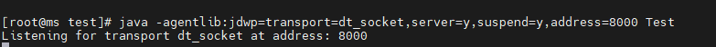


### 4、debug连接
再开一个shell窗口，在这个窗口执行如下命令进行连接：

```
# 注意，这里我们运行jdb的目录就是源码所在目录，所以源码目录使用了当前目录./
jdb -sourcepath ./ -attach 127.0.0.1:8000
```

运行结果如下：

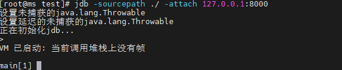


### 5、开始debug

#### 设置一个断点

使用如下命令设置一个断点：

```
# 表示在Test类的第7行打一个断点，注意，类名要完全限定名，我们这里由于是测试，所以并没有包，也不需要添加包名；
stop at Test:7
```

结果如下：

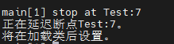


#### 开始执行

使用cont指令开始执行，结果如下：

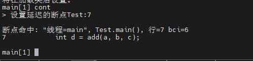


#### 查看源码
使用list查看当前源码，结果如下：

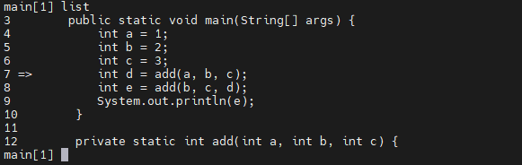


可以清晰的看到当前执行到了我们定义的断点处停止了；

#### 使用step进入方法调用
使用step命令进入add这个方法调用的内部，执行结果如下：


当我们使用list查看当前断点上下的源码时，结果如下：

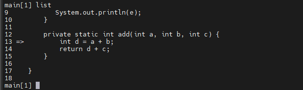


可以看到，当前已经进入方法了（还未执行任何行）；

#### 使用locals查看本地变量

此时我们可以使用locals来查看本地变量，因为还未执行任何一行，所以本地变量中只有三个方法参数，结果如下：

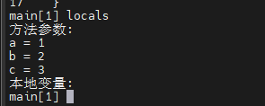


#### 使用step up来结束方法执行
使用step up前我们的调用栈处于这个状态：


使用step up后会直接结束add方法的执行，跳回到方法调用处，结果如下：


此时使用list来查看，我们回到了主方法中，add方法执行完毕，但是还未赋值给d

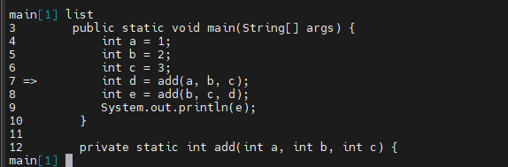


#### 使用next来执行当前行

此时我们执行next，然后执行list，会发现我们已经来到了第8行，而此时如果使用step的话，我们仍会进入add方法中，而此时我们不想再看add方法的调用了，可以使用next来直接跳过add方法，来到下一行，结果如下

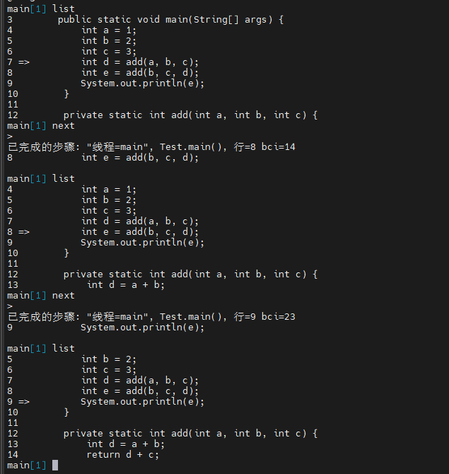

可以看到，当我们再第8行执行next的时候，并没有进入add方法内部，而是直接将其执行完毕来到了第9行；


此时再使用locals命令查看变量，此时会打印处args这个main方法的入参和a、b、c、d、e这5个本地变量，结果如下

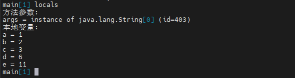


#### 使用set命令修改e的值

此时我们可以使用set命令来修改e的值，运行结果如下：

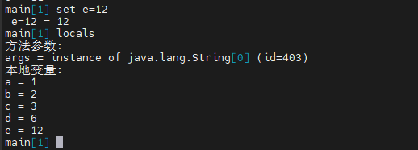


可以发现此时e已经是12了

#### 打印当前线程栈
##### 使用where all打印所有线程栈

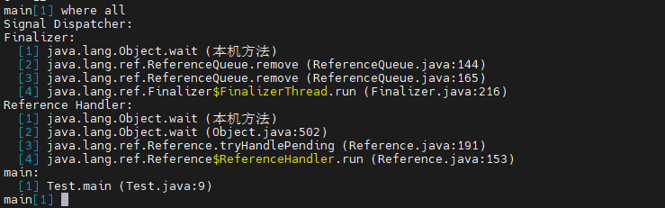


##### 使用where 线程ID打印指定线程栈
先使用threads获取线程ID：

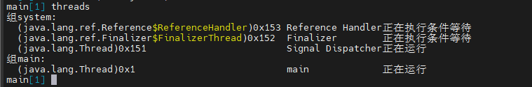


然后使用where 线程ID来打印指定线程栈：

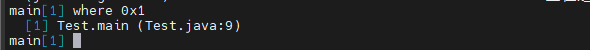


可以看到，当前main线程正处于Test的第9行，而这与我们实际运行的也是一致的

# 联系我
- 作者微信：JoeKerouac
- 微信公众号（文章会第一时间更新到公众号，如果搜不出来可能是改名字了，加微信即可=_=|）：代码深度研究院
- GitHub：https://github.com/JoeKerouac