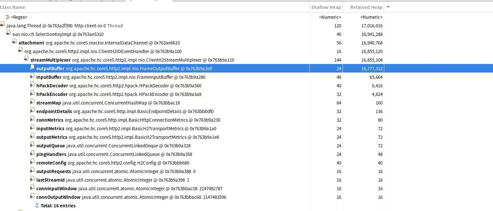
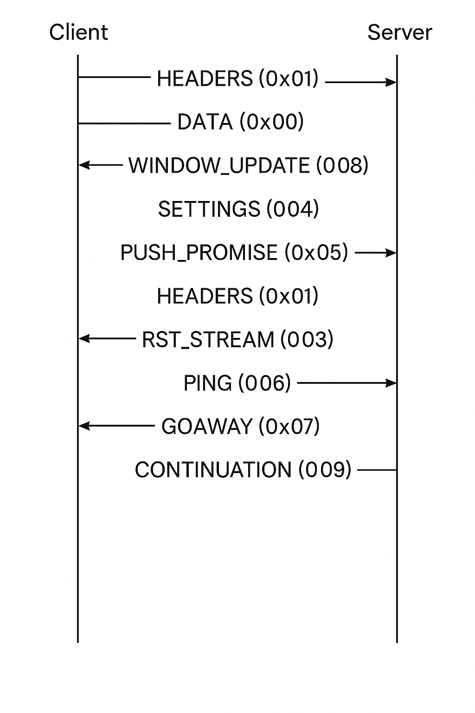

# 从一次OOM认识HTTP/2

在服务A上线一段时间后，发现服务OOM了，于是按照排查流程，把JVM堆进行了dump，开始进行分析；

> 可以使用命令 `jmap -dump:format=b,file=dump文件名 PID` 对指定JVM进程进行堆dump；

拿到dump文件后，使用eclipse mat打开，发现有大量的byte数组，进一步查看后发现都是http缓冲区，分析如下：

项目中确实也有使用到apache http client，所以第一时间找到了http调用的地方，发现发起网络请求的方法在每次调用都会构建一个新的http client发起请求，并且在请求完成后没有关闭，熟悉apache http client的应该都知道，每个http client对应的都是一个连接池，本身是为了链接复用，但是这里每次都新建，就使该框架失去了意义，并且请求完成也没有关闭，导致了内存泄露；这段代码因为最初是做验证的，本地main方法跑的，所以也没啥问题，但是直接复制到项目中后这个连接池忘了抽出来放到类中，导致了该问题，最终解决起来也很简单，那就是把这个连接池抽到类中作为一个字段，在类实例化为bean的时候初始化连接池，bean销毁的时候关闭连接池；

本来问题到这里就告一段落了，但是从mat的堆栈分析中我发现了另外一个问题，上边mat分析的图中展示的output buffer单个就有16M左右，但是实际上我是明确设置过输出缓冲区的，只有8K，为什么没有生效呢？

接下来，我就对本地写了一段代码，然后进行了debug查找问题，最开始跑的时候，我发现`org.apache.hc.core5.http2.impl.nio.AbstractH2StreamMultiplexer#outputBuffer`字段对象里边的buffer大小确实是我设置的8K，但是当我收到响应的时候看这个字段，发现大小已经变成了16M，看了这个字段对应的class `org.apache.hc.core5.http2.impl.nio.FrameOutputBuffer` 后发现里边有一个`expand`方法可以修改buffer大小，于是在这里加了断点，最终发现是在收到服务端的一个报文后，从报文中解析出了一个buffer大小，是16M，然后修改了本地的输出buffer大小为16M，这个报文就是http/2里边的`SETTINGS frame`，下面，我们来一起系统的认识下http/2；

## http/2
### http/1.1存在的问题
要了解为什么有http/2，我们需要先认识到http/1.1存在的问题：

- 单连接内的请求必须串行（队头阻塞 Head-of-line blocking）。
- 建立多个 TCP 连接带来额外的连接和拥塞控制开销。
- 头部冗余大（每次都发送完整头部，如 cookie）。
- 没有真正意义上的双向推送能力。

### http/2的核心目标
HTTP/2 并没有重新发明 HTTP：

- 保持语义兼容：URL、方法（GET/POST）、状态码、首部字段等与 HTTP/1.1 相同。
- 改变传输格式：从纯文本请求/响应切换到二进制分帧，提升效率和灵活性。

核心目标：

- 降低延迟
- 更好利用带宽
- 提高页面加载速度
- 保持应用层无感知

### http/2主要特性

1、二进制分帧（Binary Framing Layer）：
- HTTP/2 的核心是把请求和响应拆成小的帧（frame），在二进制层传输，而不是一整个报文。
- 每个帧属于某个流（stream），每个流有唯一 ID。
- 帧类型包括：DATA、HEADERS、PRIORITY、RST_STREAM、SETTINGS、PUSH_PROMISE、PING、GOAWAY、WINDOW_UPDATE、CONTINUATION

2、多路复用（Multiplexing）：
- 同一个 TCP 连接上可以并发发送多个流，每个流是全双工的。
- 不同流的帧可以交错发送，再在对端根据流 ID 重新组装。
- 解决了 HTTP/1.1 的队头阻塞（请求串行） 问题。

3、流量控制（Flow Control）
- 类似 TCP，HTTP/2 在帧层面也支持流量控制（WINDOW_UPDATE）。
- 可以对每个流和整个连接分别设置窗口大小，防止单个大文件传输占用全部带宽。

4、首部压缩（HPACK）
- HTTP/1.x 的头部是纯文本且重复度高（如 Cookie、User-Agent）。
- HTTP/2 使用 HPACK 算法做 静态表 + 动态表 压缩：
  - 静态表：常见头字段索引。
  - 动态表：对端维护状态，后续相同字段可直接引用索引。
- 有效减少了重复头部带宽占用。

5、服务器推送（Server Push）
- 服务器可以主动把客户端“可能需要”的资源一起推送过去，省去额外的请求。
  - 例如：客户端请求 HTML，服务器推送 CSS、JS。
- 客户端可以拒绝推送（发送 RST_STREAM）。

6、优先级与依赖（Priority）
- 客户端可以对流设置优先级和依赖关系，告诉服务器哪些资源更重要。
  - 例如：HTML 优先级高于图片。
- 服务器可据此动态调整资源发送顺序。

### 与 HTTP/1.1 的对比

| 特性    | HTTP/1.1             | HTTP/2 |
| ----- | -------------------- | ------ |
| 传输格式  | 文本                   | 二进制    |
| 连接复用  | 不支持（每个请求几乎一个 TCP 连接） | 单连接多流  |
| 队头阻塞  | 有                    | 消除     |
| 头部压缩  | 无                    | HPACK  |
| 服务器推送 | 无                    | 有      |
| 请求优先级 | 无                    | 有      |

### 现状

- HTTP/2 需要 HTTPS/TLS 作为传输层（主流浏览器强制只在 TLS 上启用）。
- 现在大多数主流网站、CDN（如 Cloudflare、Akamai）、浏览器（Chrome, Firefox, Edge）都支持。
- ALPN（Application-Layer Protocol Negotiation）：TLS 扩展，用来协商使用 HTTP/1.1 还是 HTTP/2。

### frame详解
下面我们来详细介绍下http/2的frame，首先是http/2交互时序图：

---

#### DATA (0x00)

**作用**：  
用于在某个流（Stream）上传输真正的 HTTP 请求/响应实体（即 Body 部分）。

**特点**：
- **Stream ID 必须非零**，表示它属于哪个流。
- 可以分片发送，比如一个大文件可以分成多个 DATA 帧顺序发送。
- 有 `END_STREAM` 标志，表示这是该流最后一个 DATA 帧。

**典型使用**：
- 客户端发送 POST 请求体。
- 服务器返回 HTML、JSON、文件等实际内容。

---

#### HEADERS (0x01)

**作用**：  
用于发送 HTTP 头信息（Header），比如 `:method`, `:path`, `:status` 等。

**特点**：
- 必须是一个新流的起始帧（除非是推送或续帧）。
- 使用 **HPACK** 压缩头部，减小重复头部开销。
- 有 `END_HEADERS` 标志，表示头块结束；若头太大，可后续用 CONTINUATION 帧续传。
- 有 `END_STREAM` 标志，若同时没有 Body，可以直接结束流。

**典型使用**：
- 客户端发起 GET/POST 请求：HEADERS（+可选 DATA）
- 服务器返回响应状态和头：HEADERS（+可选 DATA）

---

#### PRIORITY (0x02)

**作用**：  
用于告知对端：这个流的优先级（权重）与依赖关系。

**特点**：
- 可以单独发送，也可以嵌入到 HEADERS 帧里（用 HEADERS 的 PRIORITY 标志位）。
- 包含：依赖流 ID（Stream Dependency）、是否独占（Exclusive）、权重（Weight）。
- 实现端可以根据优先级调度数据发送顺序。

**典型使用**：
- 浏览器根据页面结构告诉服务器：先传 HTML，再传 CSS，再传图片。

---

#### RST_STREAM (0x03)

**作用**：  
强制取消一个流。类似 TCP 的 `RST`。

**特点**：
- 包含一个错误码，说明为什么取消，比如 `CANCEL`、`STREAM_CLOSED`。
- 双方任意一方都可以发，立即终止该流，回收资源。

**典型使用**：
- 用户停止下载时，浏览器给服务器发 RST_STREAM。

---

#### SETTINGS (0x04)

**作用**：  
在连接级别协商参数，比如帧大小、最大流数等。

**特点**：
- 必须在连接初始化时先交换（客户端发完 Preface 后先发 SETTINGS）。
- 无 Stream ID（ID 必须是 0）。
- 可包含多个参数：如 `SETTINGS_MAX_CONCURRENT_STREAMS`、`SETTINGS_INITIAL_WINDOW_SIZE`。
- 发送后必须对端回复 ACK。

**典型使用**：
- 协商流数量上限、防止内存过载。
- 协商初始窗口大小，影响流量控制。

**实际可包含的参数**
- HEADER_TABLE_SIZE: 这是 HPACK（头部压缩算法）的核心配置之一，表示对端可用的 动态表（Header Table）大小，单位是字节。默认4096；
  - HPACK 用动态表来存储已发送的头部字段，实现重复字段的高效压缩。
  - 这个值越大，压缩率越高（因为能缓存更多头字段），但占用内存也更多。
  - 客户端用它告诉服务器：“请不要用太大的表，否则我内存吃不消。”
- ENABLE_PUSH：是否允许服务器进行 Server Push。默认1；
  - 值为 1 时：允许服务器发送 PUSH_PROMISE 帧。
  - 值为 0 时：禁用 Server Push，服务器不得发送 PUSH_PROMISE
- MAX_CONCURRENT_STREAMS：限制对端可同时开多少条并发流。默认不限；
  - 用于防止单个对端开太多流导致资源耗尽（CPU、内存、带宽）。
  - 这是个上限，不代表一定要用到。
- INITIAL_WINDOW_SIZE：每个流的初始流量窗口大小，单位是字节。默认65536（64K）；
  - 影响流量控制（Flow Control）。
  - 当发送方发送的字节数超过窗口大小时，就必须等待对端用 WINDOW_UPDATE 扩充窗口。
  - 用于避免单个流独占所有带宽。
- MAX_FRAME_SIZE：单个帧的最大允许大小（仅对 DATA 和 HEADERS 等帧有效），单位是字节。
  - 协议规定最小值 16384（16 KB）。
  - 最大值是 2^24-1 = 16777215 （约 16 MB）。
- MAX_HEADER_LIST_SIZE：限制单次请求或响应的 头部字段总大小（Header List Size），单位是字节。
  - 头部列表指的是 HPACK 解压后真实的所有头字段累加值。
  - 可防御恶意大头部攻击（Header Bomb）。

> 我们上边的buffer修改，就是基于这里的SETTINGS frame，服务端告诉了客户端MAX_FRAME_SIZE，然后客户端基于此来调整本地的output buffer；

**总结**

| 参数                       | 作用               | 默认值   | 单位      |
| ------------------------ | ---------------- | ----- | ------- |
| HEADER\_TABLE\_SIZE      | HPACK 动态表大小      | 4096  | bytes   |
| ENABLE\_PUSH             | 是否允许 Server Push | 1     | boolean |
| MAX\_CONCURRENT\_STREAMS | 并发流上限            | 无     | streams |
| INITIAL\_WINDOW\_SIZE    | 每个流初始窗口          | 65535 | bytes   |
| MAX\_FRAME\_SIZE         | 单帧最大大小           | 16384 | bytes   |
| MAX\_HEADER\_LIST\_SIZE  | 头列表最大大小          | 无     | bytes   |

---

#### PUSH_PROMISE (0x05)

**作用**：  
服务器向客户端声明：将要推送一个资源（Server Push）。

**特点**：
- 由服务器发送，属于现有流。
- 告诉客户端：后面会用一个新流 ID 主动推送这个资源。
- 包含被推送资源的伪头字段（如 `:path`、`:method`）。

**典型使用**：
- 服务器在响应 HTML 时，推送 CSS、JS，减少后续请求延迟。

---

#### PING (0x06)

**作用**：  
用于探测对端是否活跃，测 RTT，做 KeepAlive。

**特点**：
- 连接级别，Stream ID 必须是 0。
- 固定 8 字节的可选数据，收端必须原样回复。
- 有 ACK 标志区分请求和应答。

**典型使用**：
- 保活探测，快速检测连接是否断开。

---

#### GOAWAY (0x07)

**作用**：  
优雅关闭连接，告知对端「别开新流了」。

**特点**：
- 连接级别，Stream ID = 0。
- 包含：最后一个已处理的流 ID、错误码、可选调试信息。
- 不影响已存在的流，继续处理完，但禁止新流。

**典型使用**：
- 服务器升级、维护、优雅下线。

---

#### WINDOW_UPDATE (0x08)

**作用**：  
流量控制的核心帧，告诉对端可以发送更多字节了。

**特点**：
- 可以是连接级别（ID=0），也可以针对某个流（ID>0）。
- 包含一个增量值（增大流量窗口），最大 2³¹-1。
- 防止单个流或连接占用全部带宽或内存。

**典型使用**：
- 客户端处理完部分数据后，告知服务器可以继续发。

---

#### CONTINUATION (0x09)

**作用**：  
续传太大的头部块。

**特点**：
- 跟在 HEADERS/PUSH_PROMISE 帧后面。
- 头块必须连续，用 `END_HEADERS` 标志收尾。
- Stream ID 与前一个一致。

**典型使用**：
- 请求头或响应头非常大时（如有大 Cookie）。

---

#### 总结

| Frame        | 主要作用                     | 是否流相关 |
|--------------|------------------------------|-------|
| DATA         | 承载 Body                     | 是     |
| HEADERS      | 承载头部/新流开始             | 是     |
| PRIORITY     | 优先级调度                    | 是     |
| RST_STREAM   | 中断流                        | 是     |
| SETTINGS     | 协商连接参数                  | 否     |
| PUSH_PROMISE | 服务器推送声明                | 是     |
| PING         | 探活 RTT                      | 否     |
| GOAWAY       | 优雅关闭连接                  | 否     |
| WINDOW_UPDATE| 流量控制                      | 同时存在  |
| CONTINUATION | 大头部续传                    | 是     |

---

