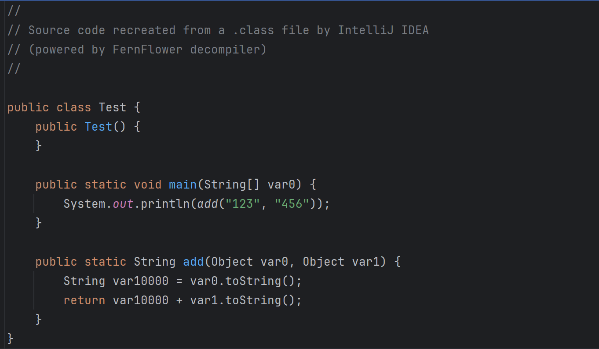

# 夭寿啦，代码执行逻辑出错了


最近同事项目中用到了一个三方包，没有源码，并且代码做了一些混淆，反编译时很麻烦，并且其中有一个类反编译后的代码与实际执行逻辑并不一致，找不到原因，所以就帮忙一起看了下；

本来想着Java嘛，类可以直接使用普通JVM加载执行，并不需要定制JVM，所以肯定不会有特别复杂的加密，顶多做些混淆，但是实际操作下来发现事情没有那么简单，下面是类文件（base64编码的class文件）：

```text
yv66vgAAAD0AOgoAAgADBwAEDAAFAAYBABBqYXZhL2xhbmcvT2JqZWN0AQAGPGluaXQ+AQADKClW
CQAIAAkHAAoMAAsADAEAEGphdmEvbGFuZy9TeXN0ZW0BAANvdXQBABVMamF2YS9pby9QcmludFN0
cmVhbTsIAA4BAAMxMjMIABABAAM0NTYKABIAEwcAFAwAFQAWAQAEVGVzdAEAA2FkZAEAOChMamF2
YS9sYW5nL1N0cmluZztMamF2YS9sYW5nL1N0cmluZzspTGphdmEvbGFuZy9TdHJpbmc7CgAYABkH
ABoMABsAHAEAE2phdmEvaW8vUHJpbnRTdHJlYW0BAAdwcmludGxuAQAVKExqYXZhL2xhbmcvU3Ry
aW5nOylWCgACAB4MAB8AIAEACHRvU3RyaW5nAQAUKClMamF2YS9sYW5nL1N0cmluZzsSAAAAIgwA
IwAWAQAXbWFrZUNvbmNhdFdpdGhDb25zdGFudHMBAARDb2RlAQAPTGluZU51bWJlclRhYmxlAQAE
bWFpbgEAFihbTGphdmEvbGFuZy9TdHJpbmc7KVYBADgoTGphdmEvbGFuZy9PYmplY3Q7TGphdmEv
bGFuZy9PYmplY3Q7KUxqYXZhL2xhbmcvU3RyaW5nOwEAClNvdXJjZUZpbGUBAAlUZXN0LmphdmEB
ABBCb290c3RyYXBNZXRob2RzDwYALQoALgAvBwAwDAAjADEBACRqYXZhL2xhbmcvaW52b2tlL1N0
cmluZ0NvbmNhdEZhY3RvcnkBAJgoTGphdmEvbGFuZy9pbnZva2UvTWV0aG9kSGFuZGxlcyRMb29r
dXA7TGphdmEvbGFuZy9TdHJpbmc7TGphdmEvbGFuZy9pbnZva2UvTWV0aG9kVHlwZTtMamF2YS9s
YW5nL1N0cmluZztbTGphdmEvbGFuZy9PYmplY3Q7KUxqYXZhL2xhbmcvaW52b2tlL0NhbGxTaXRl
OwgAMwEAAgEBAQAMSW5uZXJDbGFzc2VzBwA2AQAlamF2YS9sYW5nL2ludm9rZS9NZXRob2RIYW5k
bGVzJExvb2t1cAcAOAEAHmphdmEvbGFuZy9pbnZva2UvTWV0aG9kSGFuZGxlcwEABkxvb2t1cAAh
ABIAAgAAAAAABAABAAUABgABACQAAAAdAAEAAQAAAAUqtwABsQAAAAEAJQAAAAYAAQAAAAYACQAm
ACcAAQAkAAAAKgADAAEAAAAOsgAHEg0SD7gAEbYAF7EAAAABACUAAAAKAAIAAAAJAA0ACgAJABUA
KAABACQAAAAmAAIAAgAAAA4qtgAdK7YAHboAIQAAsAAAAAEAJQAAAAYAAQAAAA0QCQAVABYAAQAk
AAAAIAACAAIAAAAIKyq6ACEAALAAAAABACUAAAAGAAEAAAARAAMAKQAAAAIAKgArAAAACAABACwA
AQAyADQAAAAKAAEANQA3ADkAGQ==
```

> 注意，这里的class文件是为了方便文章重新使用相同的技巧生成的，并不是实际项目中的class；

将上面的数据base64解码后就是类文件，拖入idea中反编译后结果如下图：




逻辑很简单，就是调用一个add方法，将传入的参数toString然后拼接起来，按照反编译结果，最终应该输出`123456`的，但是！！！


如果你实际运行代码就会发现，实际输出的是`456123`，与反编译代码行为并不一致，那么是出了什么问题才会导致这个结果呢？难道是idea出错了？


因为在实际场景中，同事的那个class是有几个方法反编译时缺失，但是实际运行又没问题，而不是像这种反编译的结果与运行结果不一致，所以当时立马就想到了用`javap`试试，毕竟既然JVM能运行，说明代码肯定还是在class文件中的，肯定是因为某些原因导致没有反编译出正确结果，所以就使用了javap来反编译了一下这个类，瞬间就知道答案了，下面是使用javap反编译的结果：


从javap反编译结果可以看出来，实际上`add`方法有两个，一个入参是两个`Object`，一个入参是两个`String`，实际运行时因为参数是两个`String`，所以实际上调用的是具有两个`String`入参的`add`方法，而并不是另外一个，因为idea中只反编译出来了有两个`Object`入参的`add`方法，并没有反编译出来有两个`String`入参的`add`方法，所以导致我们看到的逻辑与实际运行的逻辑不一致；


到了这里，运行结果与idea反编译结果不一致的原因就找到了，原来是因为idea反编译的时候有一个方法没有反编译出来，导致我们找错了方法，看起来事情到这里就结束了？


不，我们只是找到了为什么运行时结果与我们看到的反编译代码不一致的原因，本着遇到问题刨根问底的原则，是什么原因导致了idea没有反编译出来另外一个`add`方法呢？

此时，我们只能分析这个class二进制文件了，想要分析这个二进制文件，就需要知道class文件的布局，从官网我们找到了`class file format`，即class文件的二进制布局，如下代码所示：

```cpp
ClassFile {
    u4             magic;
    u2             minor_version;
    u2             major_version;
    u2             constant_pool_count;
    cp_info        constant_pool[constant_pool_count-1];
    u2             access_flags;
    u2             this_class;
    u2             super_class;
    u2             interfaces_count;
    u2             interfaces[interfaces_count];
    u2             fields_count;
    field_info     fields[fields_count];
    u2             methods_count;
    method_info    methods[methods_count];
    u2             attributes_count;
    attribute_info attributes[attributes_count];
}

```

对于`method_info`这个结构体，定义如下：

```cpp
method_info {
    u2             access_flags;
    u2             name_index;
    u2             descriptor_index;
    u2             attributes_count;
    attribute_info attributes[attributes_count];
}

```

对于`method_info`的`access_flags`描述如下：

| Flag Name | Value | Interpretation |
| --- | --- | --- |
| ACC_PUBLIC | 0x0001 | Declared public; may be accessed from outside its package. |
| ACC_PRIVATE | 0x0002 | Declared private; accessible only within the defining class. |
| ACC_PROTECTED | 0x0004 | Declared protected; may be accessed within subclasses. |
| ACC_STATIC | 0x0008 | Declared static. |
| ACC_FINAL | 0x0010 | Declared final; must not be overridden (§5.4.5). |
| ACC_SYNCHRONIZED | 0x0020 | Declared synchronized; invocation is wrapped by a monitor use. |
| ACC_BRIDGE | 0x0040 | A bridge method, generated by the compiler. |
| ACC_VARARGS | 0x0080 | Declared with variable number of arguments. |
| ACC_NATIVE | 0x0100 | Declared native; implemented in a language other than Java. |
| ACC_ABSTRACT | 0x0400 | Declared abstract; no implementation is provided. |
| ACC_STRICT | 0x0800 | Declared strictfp; floating-point mode is FP-strict. |
| ACC_SYNTHETIC | 0x1000 | Declared synthetic; not present in the source code. |


我们看到了一个很可疑的flag: `ACC_SYNTHETIC`，当方法上存在这个这个flag时表示这个方法不在源码中，这指示这个方法是由编译器生成的；实际上当我写了一个简单的class file解析器去解析这个方法的`access_flags`时发现确实包含这个flag，而且去除这个flag后确实idea就能正常反编译了，实际上本文用到的这个class就是先正常生成了一个class，然后使用这个解析器去修改了这个方法的`access_flags`，为其添加了`ACC_SYNTHETIC`；；

> 受限于文章篇幅，如果需要这个解析器，可以私信联系我获取；

最后，通过本篇文章，我们知道了为什么会出现这种运行逻辑与反编译的代码逻辑不一致的行为，也知道了为什么idea`没有正确`的反编译出这个class文件（实际上不只是idea，所有其他正常的、符合规范的反编译器都不会正确的反编译出这个class文件，因为这种`不正确`对于反编译器来说才是正确的，因为他们完全遵守了jvm规范），同时也多掌握了一种代码混淆加密手段，如果以后我们需要混淆加密我们的代码，就可以用上这种手段了；


# 参考

- class file format: https://docs.oracle.com/javase/specs/jvms/se8/html/jvms-4.html

# 联系我
- 作者微信：JoeKerouac
- 微信公众号（文章会第一时间更新到公众号，如果搜不出来可能是改名字了，加微信即可=_=|）：代码深度研究院
- GitHub：https://github.com/JoeKerouac

