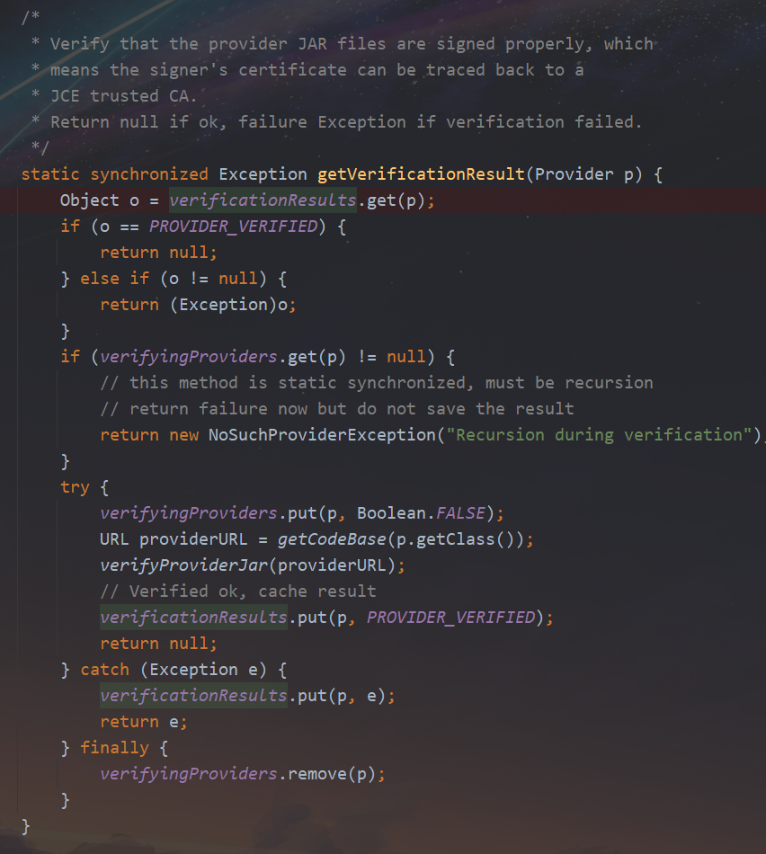

# 由JDK bug引发的线上OOM

最近生产环境的一个应用忽然发生了OOM，还好是业务低峰期，没有导致什么严重问题，下面记录下本次排查的过程；

## 故障临时处理
在某天下午，正在愉快的写代码时，忽然看到业务反馈支付服务不能用的消息，因为最近没有发布，所以感觉不会是什么大事，十有八九是网络波动啥的，毕竟之前遇到过好多次，那剩下的就是找证据了，先看看日志，有没有报错（暂时还未接告警，所以要人肉看），结果不看不要紧，一看吓一跳，日志密密麻麻全都是OOM报错


幸好作者这百年Java开发经验不是白给的，反手就是一个重启服务，虽然看起来只是一个简单的重启，但是操作起来可并不简单，里边的道道还是很多的，重启的时候要注意留一台作为现场保护起来，同时给这台保留现场的实例的流量摘除掉，然后给其他实例重启起来，这样用户就能正常使用了；


本来以为事情到这里就结束了，但是就当我准备继续下一步的时候，我发现重启的早的那台机器内存已经又直线上升上来了；


不过这也难不倒我，既然重启后服务内存又开始飙升，说明肯定是定时任务、批处理之类的触发了，查看了下日志，果然是有大批的定时任务在执行，将定时任务暂停后发现就好了，下面开始对现场进行分析；


## 现场处理
登录到我们保留的现场机器上，使用下面的命令执行堆dump，方便我们后续分析：

```shell
# 安装gdb，如果机器上有就无需安装
yum install -y gdb

# 设置不限制core dump大小
ulimit -c unlimited

# 生成core dump，文件名叫core，也可以自己起名，100是目标Java进程pid，这个需要根据实际的来，命令执行完毕后会生成一个core.100的core dump
gcore 100 -o core
```

有的同学可能看到这里就开始迷糊了，Java堆dump不是用`jmap`命令吗，上边的命令跟`jmap`也没什么关系呀，我们这里之所以用`gcore`而不是`jmap`来dump，主要是因为在OOM时，通常JVM已经无法正常使用`jmap`来dump了（针对本次排查就是这种情况），如果你一定要使用`jmap`来操作，那么他会报错，无法进行堆dump，同时会在错误信息中告诉我们可以尝试使用`jmap -F`参数来进行堆dump，但是加上这个参数后，你会发现噩梦开始了，因为此时虽然能正常进行dump，但是速度可以说是惨不忍睹，4G的堆dump时间要按小时算，本质上是因为当我们使用`jmap -F`来进行堆dump的时候实际上底层使用了`ptrace`来dump（使用`ptrace`读取目标进程内存然后写出到文件），由于`ptrace`一次最多只能读取4字节（32位机器），所以导致他的速度也极其的慢； 而`gcore`生成速度相对于正常`jmap`来说也是比较快的，对于`jmap -F`就更快了； 所以，基于以上几点，我们选择了使用`gcore`来进行堆dump；


当我们使用`gcore`dump完后，因为最终还是需要使用Java系的工具进行内存分析，所以还是要将core dump转换为Java的堆dump，此时我们就可以执行以下命令来转换了：

> 注意，core dump完成后就可以先重启服务了，重启完服务再进行下面的步骤；

```shell
# 生成堆dump
jmap -dump:format=b,file=heap.hprof `which java` core.100
```

堆dump生成完毕后，将其下载下来，然后导入eclipse Memory Analyzer（MAT）开始分析，发现大量`org.bouncycastle.jce.provider.BouncyCastleProvider`实例被`javax.crypto.JceSecurity`类的`verificationResults`这个静态字段持有，下面就可以开始源码分析了；

> 具体怎么分析出是这个地方内存泄漏这里不做单独说明了，可以自行查询官方使用文档，后续也会考虑单独出一期分析方法的文章；

## 问题分析
查看`javax.crypto.JceSecurity`的源码，发现`verificationResults`是一个map，同时只在`getVerificationResult`这个方法中被放入了数据，源码如下：



经过结合我们的业务代码分析，发现是我们调用了`javax.crypto.Cipher.getInstance(java.lang.String, java.security.Provider)`这个方法，这个方法调用了`javax.crypto.JceSecurity.getVerificationResult`方法；`getVerificationResult`这个方法比较简单，就是对我们提供的`java.security.Provider`所在的jar进行签名校验，校验完毕后将我们提供的`Provider`作为key、校验结果作为value放入`verificationResults`这个map缓存，下次就不用校验了，但是这里有个问题，就是这个缓存没有任何清理机制，也就意味着我们如果频繁调用`javax.crypto.Cipher.getInstance(java.lang.String, java.security.Provider)`来获取AES实例的话，就是可能会导致内存泄漏的，经过我们验证，也确实是这样，可以使用以下代码复现：

> 注意指定jvm参数: -Xmx128m

```java
import java.security.NoSuchAlgorithmException;

import javax.crypto.Cipher;
import javax.crypto.NoSuchPaddingException;

import org.bouncycastle.jce.provider.BouncyCastleProvider;

/**
 * @author JoeKerouac
 * @date 2023-08-24 12:50
 */
public class Test {

    public static void main(String[] args) throws NoSuchAlgorithmException, NoSuchPaddingException {
        for (int i = 0; i < 500; i++) {
            Cipher c = Cipher.getInstance("AES", new BouncyCastleProvider());
        }
    }

}

```

## 问题解决
既然问题定位到了，那解决起来就比较简单了，我们可以把`Provider`实例全局共享，或者使用`Provider`的名字来获取AES实例，这样不去反复创建`Provider`而是使用同一个`Provider`，在`JceSecurity`中自然也不会内存泄漏，代码如下：

> 至于作者为什么不使用单例？那是因为AES并不是线程安全的，无法全局共享，当然，可以使用单例然后自行控制并发，或者使用对象池技术、ThreadLocal等来解决；


```java
import java.security.NoSuchAlgorithmException;
import java.security.NoSuchProviderException;
import java.security.Security;

import javax.crypto.Cipher;
import javax.crypto.NoSuchPaddingException;

import org.bouncycastle.jce.provider.BouncyCastleProvider;

/**
 * @author JoeKerouac
 * @date 2023-08-24 12:50
 */
public class Test {

    private static BouncyCastleProvider provider = new BouncyCastleProvider();

    public static void main(String[] args)
        throws NoSuchAlgorithmException, NoSuchPaddingException, NoSuchProviderException {
        // 使用全局共享的provider
        Cipher cipher = plan1();

        // 使用provider的名字获取AES实例，其实本质上也是全局共享了provider
        // 注意，如果要使用provider的名字获取AES实例，要先注册
        Security.addProvider(new BouncyCastleProvider());
        cipher = plan2();
    }

    public static Cipher plan1() throws NoSuchAlgorithmException, NoSuchPaddingException {
        return Cipher.getInstance("AES", provider);
    }

    public static Cipher plan2() throws NoSuchAlgorithmException, NoSuchPaddingException, NoSuchProviderException {
        return Cipher.getInstance("AES", "BC");
    }

}

```


## 问题溯源
这应该是一个比较容易发现的问题，既然这样，那有没有人提出这个问题呢，想到这里，作者打开了Google，经过一番搜索后（其实很容易就能搜到，只需要搜索关键字`javax.crypto.JceSecurity#getVerificationResult`即可），发现确实有人给jdk提了这个bug，而且也给出了解决方案，代码已经合并到了master，不过截至发文时，在作者使用的eclipse jdk（`Temurin`）中，`jdk8`、`jdk17`这两个版本的最新发布中（`2023-07-25`发布）仍然存在该问题，并未修复，所以如果遇到该问题，还是需要使用上边的解决方案来处理；


> 官方bug记录：https://bugs.openjdk.org/browse/JDK-8168469


至此，我们的问题已经解决了，通过本篇文章，你应该大概知道了线上发生OOM时的处理流程了，以后碰到类似问题可以按照本流程来直接套用，至少大多数场景下都是可以的；


# 联系我
- 作者微信：JoeKerouac
- 微信公众号（文章会第一时间更新到公众号，如果搜不出来可能是改名字了，加微信即可=_=|）：代码深度研究院
- GitHub：https://github.com/JoeKerouac
