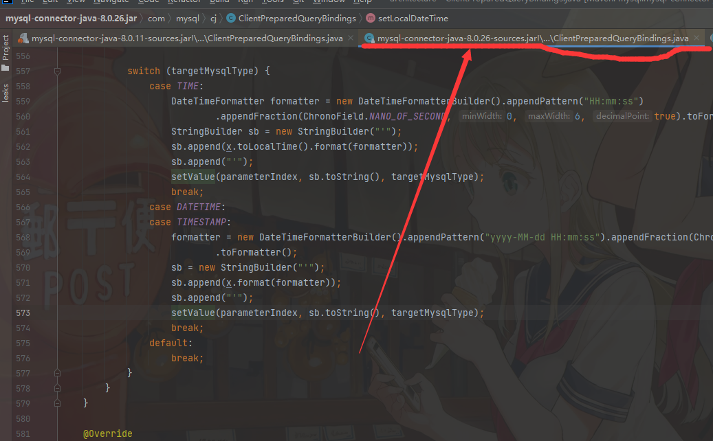

# MySQL驱动中关于时间的坑
> 背景：MySQL 8.0数据库；

最近在做一个小框架，因为本身比较精简，就没有引入太多依赖，直接用了JDBC来操作数据库，因为我的表中有一个`datetime`类型的字段，对应的Java代码中使用的是`java.time.LocalDateTime`，在处理这个日期字段的时候，就遇到了一个有趣的问题；


在我的数据库表建好后，在Java中使用JDBC原生API实现了一个repository，包含一些数据库的操作，因为代码中有`java.time.LocalDateTime`字段，在使用`java.sql.PreparedStatement`的时候不确认`java.sql.PreparedStatement.setObject(int, java.lang.Object)`方法接收`java.time.LocalDateTime`类型的入参后是否可以正确处理，就写了一小段测试用例来测试，核心代码如下：
```
preparedStatement.setObject(1, LocalDateTime.now());
```
一行简单的JDBC调用设置参数，参数类型是LocalDateTime，最终发现没有报错，如果一切OK，那么事情到这里就结束了，但是.......


当我到数据库查看数据的时候，发现日期竟然不对，日期存到数据库后竟然少了14个小时，整整14个小时，当时的我真的是....


还好，机智的我马上就醒悟过来了，这肯定是时区问题，我们现在是东8区，比UTC时间是快8小时，存储到数据库后时间比我们现在慢了14个小时，也就是比UTC时间慢了6个小时，而这正好处于CST时区，CST时区中的代表地区就是北美中部，难道我的服务器人被搬到了北美？


那当然不是了，应该是MySQL的时区设置有问题，MySQL数据库是美国开发的软件，默认情况下时区是CST很符合逻辑，而在我登录到服务器上之后，查看服务器时区，服务器的时区是对的，然后又查看了MySQL的默认时区，果然，我发现MySQL的默认时区设置是CST，使用如下代码将其修改为UTC+8后就正常了：
```
set global time_zone = '+8:00';
flush privileges;

# 使用上述命令修改完毕后使用下面的命令查看修改是否成功
show variables where Variable_name like "%time_zone%";
```

如果事情到这里就结束了，那这也太简单了，而且跟标题似乎没有半毛钱关系呀？别急，其实在执行上一步修改时区之前，机智的我忽然想起来我还有另外一个项目，也用到了`java.time.LocalDateTime`，并且使用的测试数据库与我当前这个项目是同一个，但是那个项目从来没有发现过这个问题，难道是因为那个项目中使用了mybatis，mybatis对此做了什么特殊处理？ 想到这里，笔者赶紧去翻了下mybatis相关源码，发现mybatis对于LocalDateTime也是直接调用了`java.sql.PreparedStatement.setObject(int, java.lang.Object)`方法将LocalDateTime传给了MySQL驱动，没有做任何处理，那怎么就没问题呢？


既然想不明白，那就debug一下吧，看下在我们JDBC版本的项目中debug LocalDateTime参数是如何传输到MySQL的，最终debug到如下关键源码：
```
代码在com.mysql.cj.ClientPreparedQueryBindings.setTimestamp(int, java.sql.Timestamp)处：

// PS:这里x是Timestamp类型的，在上层调用时将LocalDateTime转换为了Timestamp类型，这个不影响我们的分析
setTimestamp(parameterIndex, x, this.session.getServerSession().getDefaultTimeZone());
```
在上述代码中`this.session.getServerSession().getDefaultTimeZone()`最终返回了MySQL数据库中的默认时区，因为我们MySQL中默认时区是CST，所以这里也符合我们观察到的现象，最终保存到数据库的日期比实际我们当前的东8区慢14个小时，但是为什么使用mybatis的另外一个项目就没有问题呢，要知道这两个项目使用的测试数据库是同一个的，这就很奇怪，到这里，我决定再在另一个项目中也debug一下，看下问题到底出在了哪里；


然后我就在使用mybatis版本的项目中做了一个插入测试，然后debug看是怎么处理的，最终debug到如下源码处：
```
代码在com.mysql.cj.ClientPreparedQueryBindings#setLocalDateTime处，关键代码如下：

formatter = new DateTimeFormatterBuilder().appendPattern("yyyy-MM-dd HH:mm:ss").appendFraction(ChronoField.NANO_OF_SECOND, 0, 6, true)
                            .toFormatter();
sb = new StringBuilder("'");
sb.append(x.format(formatter));
sb.append("'");
setValue(parameterIndex, sb.toString(), targetMysqlType);
```

可以看到这里并没有使用MySQL数据库的时区信息，所以肯定不会出错，但是这怎么跟没有使用mybatis的项目行为不一致呢？


就在这时，我忽然瞥见了IDEA上方tab标签上有两个ClientPreparedQueryBindings文件，如下所示（这里是给其他不必要的文件关了后的效果，为了更好看出效果）：




然后我瞬间明白了，这个问题与mybatis没有任何关系，是两个项目的MySQL驱动不一致导致的，使用mybatis的项目使用的MySQL驱动版本是`8.0.26`，其中日期处理没有去使用MySQL服务端的时区，所以使用mybatis的项目存储到MySQL中的日期是没问题的，而我当前这个直接使用JDBC项目的MySQL驱动版本是`8.0.11`，在这个版本的驱动中对于LocalDateTime的处理使用了MySQL服务端的时区，这就导致了存储到MySQL中日期变了；


最后，这个问题到这里有两个最简单的方案解决，一个是修改数据库默认时区，还有一个就是升级使用MySQL`8.0.26`版本的驱动，而我使用了第三种更复杂一点儿的方案：
```
1、将数据库默认时区修改为东8区；
2、将项目的MySQL驱动升级为8.0.26版本；
3、对LocalDateTime提前处理，在我自己的代码中将其格式化为字符串，然后调用`java.sql.PreparedStatement.setObject(int, java.lang.Object)`将其设置进去；
```

为什么使用这种方案呢？
- 1、将数据库默认时区修改为东8区防止其他人在出相同问题，也防止在其他地方有用到这个时区数据时出错；
- 2、将项目的MySQL驱动升级为8.0.26是因为其他项目已经在用这个版本的驱动了，尽量保持一致防止再出一些其他兼容性问题；
- 3、对LocalDateTime提前处理，在自己的代码中将其格式化为字符串而不是等待MySQL驱动去格式化他，防止未来某天升级MySQL驱动时MySQL驱动行为再次修改导致出现问题；


最后，建议大家没有必要不要随意升级jar包，特别是这种涉及底层驱动的jar包，防止出现兼容性问题；


# 联系我
- 作者微信：JoeKerouac
- 微信公众号（文章会第一时间更新到公众号，如果搜不出来可能是改名字了，加微信即可=_=|）：代码深度研究院
- GitHub：https://github.com/JoeKerouac
