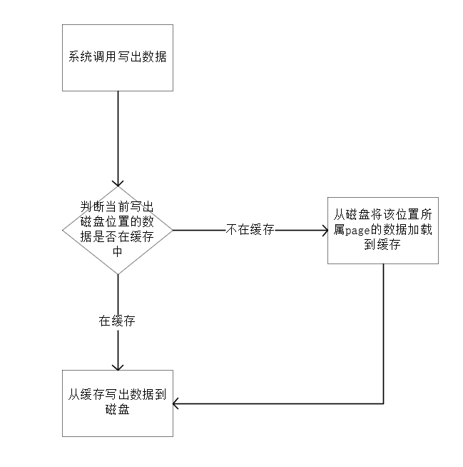

# 一文讲清MySQL的innodb_log_write_ahead_size参数
要想知道innodb_log_write_ahead_size参数怎么配置，最重要的就是先了解这个参数解决了什么问题，那么这个参数是解决什么问题的呢？官网对该参数的描述
如下：

```
Defines the write-ahead block size for the redo log, in bytes. To avoid “read-on-write”, set innodb_log_write_ahead_size
to match the operating system or file system cache block size. The default setting is 8192 bytes. Read-on-write occurs 
when redo log blocks are not entirely cached to the operating system or file system due to a mismatch between write-ahead
block size for the redo log and operating system or file system cache block size.
```

译文：
```
为了避免read-on-write，为redo log定义了write-ahead block size，单位byte，请将innodb_log_write_ahead_size参数的大小设置为操作系统或
者文件系统的缓存块（对应的就是page cache），默认设置大小是8K，如果该参数大小设置的与page cache不匹配那么将会发生Read-on-write；
```
翻译过来能读懂了，每个字都认识，但是这些字连起来是什么意思呢？如果懂这段话的意思，说明你对文件系统有一定的了解，那么后边的内容大概率你已经知道了，如果
不懂，那么后面就是解释这句话的意思；


首先，上边提到的了innodb_log_write_ahead_size主要是解决`read-on-write`问题的，看来我们需要先知道什么是`read-on-write`,`read-on-write`
的描述如下（个人理解，如果错各位大佬可以指出）：

```
现代操作系统对磁盘的最小操作单位是page，每次读取、写出都是按照一个page一个单位操作的，读取的时候没有特别的问题，但是在写出的时候会有问题，如果要写
出的数据所在的磁盘上的page（逻辑）没有在内存中，那么需要先将磁盘上该page的数据加载到内存然后才能写出，这个就叫做read-on-write；
```

`read-on-write`的简要流程图：




从流程中很容易看出发生`read-on-write`的时候系统会比没有`read-on-write`的时候多一次read IO，相当于原来只需要一次write IO的现在变成了先read IO
然后在write IO，一下工作量翻倍，单这一个点就造成了我们系统速度下降一半（毛估，还有很多其他因素）；如果想要针对这点优化，只要我们不让这次read IO发生
不就行了？那如何不让这次read IO发生呢？有两种办法：
- 确保写出数据所在的磁盘page已经缓存在内存中了，而要确保这个只能先进行一次read将数据缓存到内存，这跟上边的read-on-write差不多了，只不过是我们手
  动调用了一次read IO，虽然没有发生系统层面的read-on-write，但实际上是等效的，所以这个方案不行；

- 利用系统的另外一个特性，即如果IO满足一下两个条件则也不会发生`read-on-write`：
  - 该IO的目的地址是磁盘上某个page的其实偏移地址；
  - 该IO的数据大小是page大小的整数倍；
 
> 为什么如果没有缓存时必须发生一次read-on-write呢？其实很简单，因为系统写出的最小单位是page，如果不先把磁盘上指定区域的内容加载上来，那么在本次
> 写出的时候会将旧数据覆盖了，这样就可能会导致数据丢失，所以只能将原有数据加载上来，然后与本次要写出的数据合并然后一次写出；而第二个方案的前提条件
> 其实就是如果你的数据正好把这个page整个都覆盖了，那么无论内存中是否有该page的缓存，都可以直接写磁盘，因为你就是要覆盖磁盘上整个page的区间，不
> 存在丢失原有数据的问题；

第二个方案就比较好实现了，我们不用额外的IO就能让我们的写出数据满足该条件，而MySQL中用的也是该方案，而innodb_log_write_ahead_size就是我们告诉
MySQL我们的系统实际的page size是多少，该值最小要等于page size，如果比page size小就可能会发生`read-on-write`，可以比实际的page size大，但
是必须是page size的整数倍；默认值是8K，一般大多数系统的page size都是4K，所以大多数情况下默认值是可以避免`read-on-write`发生的；当MySQL要写
出数据时，如果写出数据小于innodb_log_write_ahead_size则会在后边补0，然后将整个innodb_log_write_ahead_size的数据一次性写出，使他满足上边
的两个不触发`read-on-write`机制的条件从而达到优化IO提高性能的目的（第一个条件MySQL可以控制满足，第二个条件是否真的能满足就看我们配置的
innodb_log_write_ahead_size 的值，如果配置的不符合条件则也不会）；


不加write_ahead机制的写出示意图：


加了write_ahead机制的写出示意图：


innodb_log_write_ahead_size解决什么问题现在已经很清楚了，那么到底配多少合适呢？上边只是说了最小要等于文件系统的的page size，也可以是page size
的整数倍，那调整大点儿会有影响嘛？根据上边的图示可以看出，无论我们写出多少数据，MySQL都会将整个`write_ahead_buffer`写出，也就是如果`write_ahead_buffer`
值太大的话可能会对系统IO有轻微的影响，毕竟本来只需要写出一个page就可以的结果因为配置的过大导致写了两个page甚至更多，还是会有轻微影响的（实测影响确
实很轻微，配置2-4倍几乎是无影响的 ），官网对于这个也是有说明的，说明如下：

```
Setting the innodb_log_write_ahead_size value too low in relation to the operating system or file system cache block size
results in “read-on-write”. Setting the value too high may have a slight impact on fsync performance for log file writes
due to several blocks being written at once.
```


# 思考
MySQL可以使用这个优化跟MySQL的文件结构有关，MySQL写出是append write而不是random write的，这个很重要，如果是random write那么这个策略就会
失效，各位可以作为一个拓展思考回去自己想下，有知道原因的可以在评论区打出来；

# 联系我
- 作者微信：JoeKerouac
- 微信公众号（文章会第一时间更新到公众号，如果搜不出来可能是改名字了，加微信即可=_=|）：Java初学者
- GitHub：https://github.com/JoeKerouac


# 参考文献
- innodb_log_write_ahead_size官方解释:https://dev.mysql.com/doc/refman/5.7/en/innodb-parameters.html#sysvar_innodb_log_write_ahead_size
