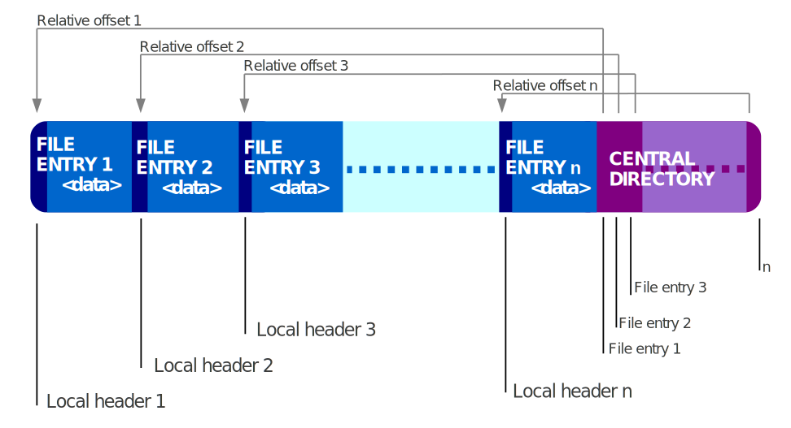

# ZIP(32位)文件格式详解
## 为什么要去了解ZIP文件格式
最近有个需求，需要加载jar包中的jar包中的class，此时有两种方式：
- 1、将jar解压缩，然后将解压缩后的路径添加到class path，这样就不存在嵌套jar的读取方式了，tomcat就是采用的这种方式；
- 2、不解压缩jar，直接定位到jar包中的jar包中的class，然后将其数据抽离出来，将其解析为class注册到系统中去（可以利用ClassLoader的defineClass方法实现），spring-boot就是采用的这种方式；

最终我们决定使用第二种方案（解压可能会导致我们的环境污染，多出来许多文件），即不解压缩jar包，而这就需要我们深入了解jar包的格式，由于jar包就是ZIP格式的，所以要实现该功能必须得了解ZIP格式，这样才能从中抽取我们需要的数据；

## ZIP文件设计
。ZIP文件是存储多个文件的存档。ZIP允许使用许多不同的方法压缩包含的文件，以及简单地存储文件而不压缩它。每个文件都单独存储，允许使用不同的方法压缩同一存档中的不同文件。由于 ZIP 存档中的文件是单独压缩的，因此可以提取它们或添加新文件，而无需对整个存档应用压缩或解压缩。

ZIP文件有一个目录，记录了ZIP文件中的各个文件的位置以及大小等信息，目录放置在 ZIP 文件的末尾。这允许ZIP读取器加载文件列表，而无需读取整个ZIP存档。ZIP 存档还可以包含与 ZIP 存档无关的额外数据。这允许将ZIP存档预置到ZIP存档中并将文件标记为可执行文件，从而将ZIP存档制作成自解压存档（解压缩其包含数据的应用程序）。将目录存储在末尾还可以通过将压缩文件附加到无害的文件（如 GIF 图像文件）来隐藏压缩文件。
> 个人理解：ZIP文件的这种特性也就意味着我们不仅仅可以在前边放置自解压程序，还可以防止一些渗透攻击程序，也就是说ZIP文件可能是不安全的，别人可能用一个ZIP文件来攻击我们；

## ZIP文件格式
ZIP文件通常由以下五部分组成：
- local file header（每个文件对应一个）
- data（文件实际数据，可能压缩，也可能未压缩）
- data descriptor（条件存在）
- central directory file header（中央目录，每个文件一条记录）
- end of central directory record（后续简称 `EOCD` 全局只有一个）

当我们将多个文件压缩为一个ZIP包时，多个文件在ZIP包中是分别存储的，每个文件都会生成一个entry，entry包括最前边的 `local file header` 、中间的data（实际的文件数据，可能被压缩了，也可能没压缩）以及末尾的data descriptor（这个是有条件的存在，后续会介绍）；所有文件组成的entry存储完毕后生成 `central directory file header` ，每个文件都会对应一个 `central directory file header` ，所有的 `central directory file header` 结束后会添加一个 `EOCD` ，这个是一个ZIP文件只有一个；

最终我们的ZIP文件存储结构如下：

## ZIP文件各个部分详细说明
### local file header定义
| offset | bytes | description |
| --- | --- | --- |
| 0 | 4 | local file header签名，固定值：0x04034b50 |
| 4 | 2 | 提取本文件需要的最低版本号 |
| 6 | 2 |  标志位，如果第三个bit被设置了（0x08），表示写入的时候不知道数据大小和CRC-32，则该entry包含data descriptor部分 |
| 8 | 2 | 压缩方法，0表示本entry没有压缩，只是归档到ZIP中了，0x08表示使用了DEFLATE算法压缩 |
| 10 | 2 | 文件最后修改时间 |
| 12 | 2 | 文件最后修改日期 |
| 14 | 4 | 文件压缩前的CRC-32 |
| 18 | 4 | 文件压缩后的大小，单位byte（如果是0xffffffff则表示是ZIP64文件，我们暂时不关心ZIP64，因为目前jar基本都是ZIP32的） |
| 22 | 4 | 文件压缩前的大小，单位byte（如果是0xffffffff则表示是ZIP64文件） |
| 26 | 2 | 文件名长度，单位byte，这表示我们的文件名长度不能超过65535 byte，并且这里的文件名是包含前边的目录的 |
| 28 | 2 | 扩展字段长度，单位byte（这个我们暂时并不关心，所以无需去解析） | 
| 30 | n | 文件名 |
| 30 + n | m | 扩展字段 |

从这个local file header定义可以看出local file header实际上是变长的，并不是定长的（因为文件名和扩展字段长度都是不固定的）；

### data descriptor
> 如果entry的local file header的标志位第三个bit被设置了（0x08），表示写入的时候不知道数据大小和CRC-32，则该entry包含本部分；

| offset | bytes | description |
| --- | --- | --- |
| 0 | 4 | 签名，固定值：0x08074b50 |
| 4 | 4 | 文件压缩前的CRC-32 |
| 8 | 4 | 文件压缩后的大小，单位byte |
| 12 | 4 | 文件压缩前的大小，单位byte |

### central directory file header
> 每个entry都有一个central directory file header记录，central directory file header中的大部分信息都是冗余的local file header（或者data descriptor）中的信息，然后就是entry的定位信息，主要就是为了根据中央目录快速定位entry，而不用读取完整的整个文件去查找某个文件，这在早期磁盘较小（意味着一个ZIP文件可能存储于多个磁盘）、读取速度较慢的场景下极为有用，相当于索引；

| offset | bytes | description |
| --- | --- | --- |
| 0 | 4 | 签名，固定值：0x02014b50 |
| 4 | 2 | 制作于那个ZIP版本 |
| 6 | 2 | 解析该目录需要的最低版本号，与对应entry的local file header中的值一致 |
| 8 | 2 | 一般标志位，与对应entry的local file header中的值一致 |
| 10 | 2 | 压缩方法，与对应entry的local file header中的值一致 |
| 12 | 2 | 文件最后修改时间，与对应entry的local file header中的值一致 |
| 14 | 2 | 文件最后修改日期，与对应entry的local file header中的值一致 |
| 16 | 4 | 文件压缩前的CRC-32 |
| 20 | 4 | 文件压缩后大小 |
| 24 | 4 | 文件压缩前大小 |
| 28 | 2 | 文件名长度（n），与对应entry的local file header中的值一致 |
| 30 | 2 | 扩展字段长度（m），与对应entry的local file header中的值 ** 可能不一致 ** |
| 32 | 2 | 文件备注长度（k） |
| 34 | 2 | 文件起始位置所在的磁盘编号（这个用于zip跨磁盘的场景，在早期磁盘（软盘）是很小的，所以一个zip文件可能会跨多个磁盘，而现在基本不太可能出现这种场景了） |
| 36 | 2 | 内部文件属性 |
| 38 | 4 | 外部文件属性 |
| 42 | 4 | 本目录指向的entry相对于第一个entry的起始位置，单位byte，这也就限制了ZIP文件最大也就是4G了，再大就无法定位了 |
| 46 | n | 文件名 |
| 46+n | m | 扩展字段 |
| 46+n+m | k | 文件备注 |

### EOCD
> 标志ZIP文件结束，判断一个文件是否是ZIP格式的文件就是读取文件末尾的EOCD来判断，而不是像其他文件一样读取文件头来判断；

| offset | bytes | description |
| --- | --- | --- |
| 0 | 4 | 签名，固定值：0x06054b50 |
| 4 | 2 | 占用磁盘数（0xffff表示是ZIP64格式） |
| 6 | 2 | 中央目录的起始位置所在的磁盘 |
| 8 | 2 | 当前磁盘上的中央目录记录数 |
| 10 | 2 | 中央目录的总数量（0xffff表示是ZIP64格式），这限制了一个ZIP32文件中存储的文件数最多不能超过65534个 |
| 12 | 4 | 中央目录的总大小（单位byte），（0xffffffff表示这是一个ZIP64文件） |
| 16 | 4 | 中央目录相对于ZIP文件第一个entry的起始位置（注意，不是ZIP文件，是ZIP文件的第一个entry，这是一个细微的差别，在大多数场景下都是可以忽略的，但是如果ZIP文件头包含一些前缀数据，例如自解压程序时，这个起始位置是包含这些前缀数据的，而zip的第一个entry是在这些前缀数据之后，如果不关注这个细节可能会导致ZIP解析失败） |
| 20 | 2 | 备注长度 |
| 22 | n | 备注 |

## 回到我们的需求
由于我们采用了第二种方式，所以我们需要能从ZIP中抽取我们需要的数据，而根据上述ZIP规范描述ZIP的中央目录设计正好能满足我们的需求，剩下的就是如何实现的问题了，下面说下大概思路（如果需要具体实现代码可以参考spring-boot-loader中的相关代码）：

根据ZIP规范，我们读取一个ZIP时应该从后读取，先读取到EOCD来确定这是一个ZIP文件，同时根据EOCD来定位到中央目录，然后读取中央目录，根据中央目录构建索引，找到我们要读取的文件，由于我们是需要读取嵌套jar，所以也需要对嵌套jar构建索引，所以我们找到嵌套jar后还需要嵌套解析，最后类加载的时候根据索引来查找类数据；

这里有一个关键性的问题，当我们把索引构建完毕后，如果类加载的时候发现一个jar是在嵌套jar中，并且该嵌套jar是以压缩的方式存储在ZIP文件中，那么我们就需要对整个jar进行解压缩，否则我们是无法定位到嵌套jar中的class数据的，此时解压嵌套jar就存在两种策略了：一个就是我们将嵌套jar解压缩后缓存到内存，下次需要加载该jar中的class的时候直接从内存中取数据，可能这个嵌套jar中有几百个class，而只有两三个class是我们需要的，这样会导致内存浪费，还有一个就是我们每次需要从该嵌套jar中加载class的时候重新解压缩该嵌套jar，这就会导致我们的class加载极为耗CPU，同时也会导致类加载比较缓慢；

那么上述问题该如何解决呢？我们发现，导致上述问题的原因就是因为嵌套jar是压缩存储在ZIP中的，那么如果嵌套jar是未压缩的呢？如果嵌套jar只是存储在ZIP中，但是并未压缩，那么我们可以直接使用偏移量定位到嵌套jar中的class数据，就不会存在上述问题了，而实际上spring-boot也是这样解决这个问题的；

至此，我们的需求就解决了，而再此过程中我们也学到了很多 `非（并）常（无）有（卵）用（用）` 的知识；

## 参考文献
- ZIP文件格式：https://en.wikipedia.org/wiki/ZIP_(file_format)
