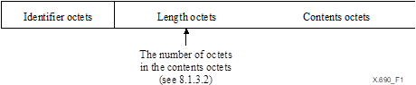

# ASN.1
ASN.1是一种用来定义数据结构的接口描述语言，它不是二进制，也不是文件格式，本身只定义了表示信息的抽象句法；标准ASN.1编码规则有BER（Basic Encoding Rules）、CER（Canonical Encoding Rules）、DER（Distinguished Encoding Rules）、PER（Packed Encoding Rules）、XER（XML Encoding Rules）；


## BER
### 编码的一般规则
> bit1-8分别对应二进制从低到高的8个bit
#### 编码结构
数据值的编码应由四个部分组成，它们应按以下顺序出现：
- ID（identifier octets）
- 长度（length octets）
- 内容（contents octets）
- 内容结束（end-of-contents octets）

> end-of-contents octets不应该出现，除非长度字段的值要求他们存在；


不带end-of-contents octets的结构：




带end-of-contents octets的结构：


#### ID（identifier octets）
##### id范围0-30
对于数据范围0-30的标签，id为8bit，结构如下：
- bits 8和7的含义如下表所示；
- 如果编码是原生的(primitive)，bit 6应该为0，如果编码是构造的（constructed），那么应该设置为1；
- bit 5 到 bit 1 位是具体的ID编号的二进制，第 5 位为最高有效位。

| class             | bit 8 | bit 7 |
| --- | --- |-------|
| Universal | 0 | 0     |
| Application | 0 | 1     |
| Context-specific | 1 | 0     |
| Private | 1 | 1     |

ID字段图示：


##### ID大于等于31
对于数据范围大于等于31的，标识符应包括一个前导八位字节，后跟一个或多个后续八位字节。

前导8bit数据如下：
- bit 8和7参考前边的表格定义；
- 如果编码是原始的(primitive)，bit 6应该为0，如果编码是构造的（constructed），那么应该设置为1；
- bit 5到 bit 1应编码为11111（即5个bit都是1）

随后的8位字节应以如下方式对ID进行编码：
- 每个8位字节的bit 8都应该设置为1，除非他是最后一个8位字节；
- 第一个后续8位字节的bit 7-1拼上第二个后续8位字节的bit 7-1，依此类推，直到最后一个8位字节，这些字节组成一个无符号整数作为ID，第一个后续8位字节的第7位作为最高有效位；
- bit 1-7不应该全部未0（全部为0时表示该字节是多余的）；

ID字段图示：


#### 长度（length octets）
指定了两种形式的长度八位字节：
- 对于明确的形式，长度八位字节应由一个或多个八位字节组成，并应使用短格式或长格式表示内容八位字节中的八位字节数。 发件人的选项。注：只有在内容八位字节中的八位字节数小于或等于 127 时才能使用短格式。
- 对于不定形式，长度8位字节表示内容8位字节由内容结束八位字节终止，并且应由单个八位字节组成。该字节的bit 8为1，bit 7-1都是0；如果使用这种形式的长度，则内容结束符(end-of-contents octets)应该出现在内容之后；

发送方：
- 如果编码是原始的，则使用明确的形式；
- 如果编码已构建并且所有立即可用，则使用确定形式或不定形式，发送者的选项；
- 如果编码已构建且并非全部立即可用，则使用不定形式。

##### 短格式
在简写形式中，长度八位字节应由一个八位字节组成，其中位 8 为零，位 7 到 1 组成无符号正数，bit7为最高位，表示内容的长度，单位byte（8bit）；

只有在内容长度小于等于127时才能用短格式；

示例：L = 38 可以被编码为 00100110；

##### 长格式
在长格式中，长度八位字节应由一个初始8位字节和一个或多个后续八位字节组成。 初始八位字节应编码如下：
- bit 8应该为固定1；
- bits 7 到 1 组成一个无符号整数，bit7是最高位，表示后续长度字段的长度，单位byte（8bit）；
- 11111111不应该被使用；

初始8位字节后的所有字节拼接为一个无符号整数，表示内容的长度，单位byte（8bit），其中初始8位字节后的第一个字节的bit8为无符号整数的最高位；


示例：
```
201可以被编码为：
10000001  11001001 

其中第一个字节10000001的bit 8是1，bit 7-1表示后续长度字段的长度，值为1，表示后续还有一个长度字节；
11001001表示后续内容的长度，值是201
```


#### 内容结束符（end-of-contents octets）
如果内容结束符存在，则内容结束符应该在内容之后，由两个8位数字0组成；

内容结束符可以被认为是一个值的编码，该值的ID是0，并且长度也是0;

#### 内容
##### 编码Boolean值
Boolean值是原生的（primitive），内容由一个byte（8bit）组成；如果这个byte值是0，则是false，否则是true；

##### 编码int值
int值的编码是原生的（primitive），内容由一个或者多个byte（8bit）组成；如果由多个byte组成，那么第一个byte和第二个byte的bit8应该符合：
- 1、不全是1；
- 2、不全是0；

编码为大端序；并且byte数组等于原int值的补码；

##### 编码枚举值
枚举值的编码是与其相关联的整数值（int）的编码；

##### 实数值（real value）
实数值的编码是原生的（primitive）；

> 实数值实际使用中应该较少使用，而该值编码又比较复杂，所以这里就不展开说明了；


##### bitstring
bitstring可以是原生的（primitive）或者由发送者选择构造的（constructed）；


## DER
- 应使用确定的长度编码；
- 对于Boolean值true，用一个byte表示，并且这个byte的所有bit都是1；
