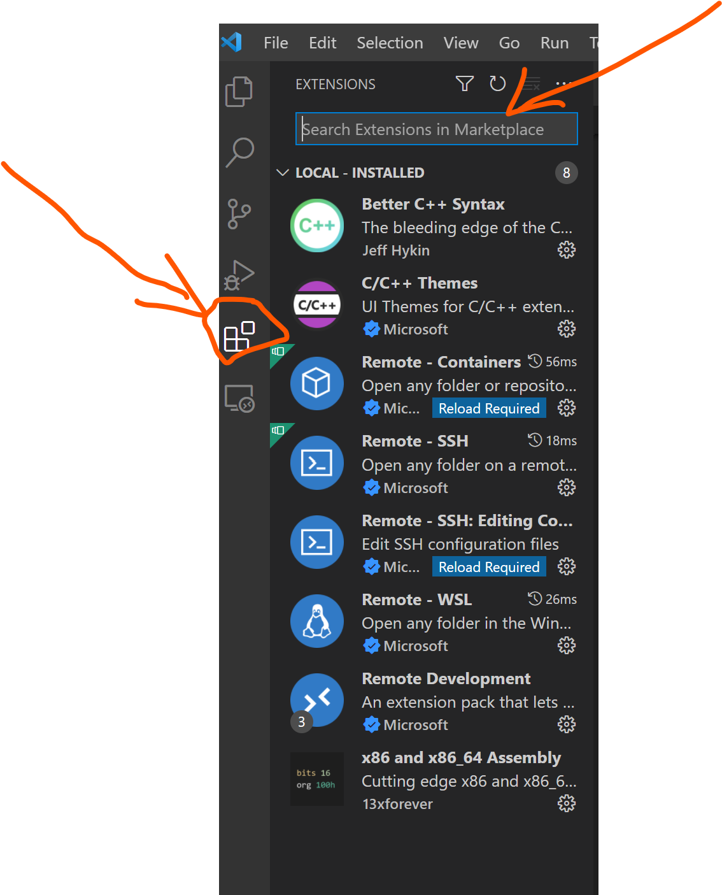
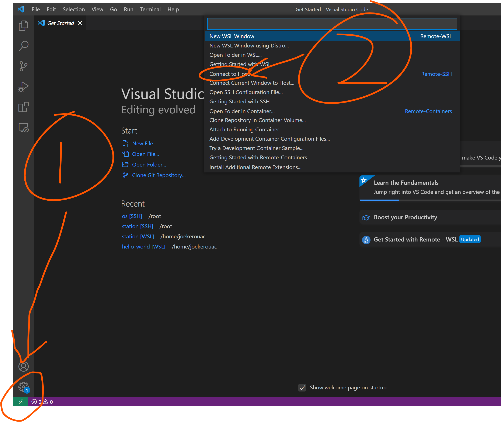
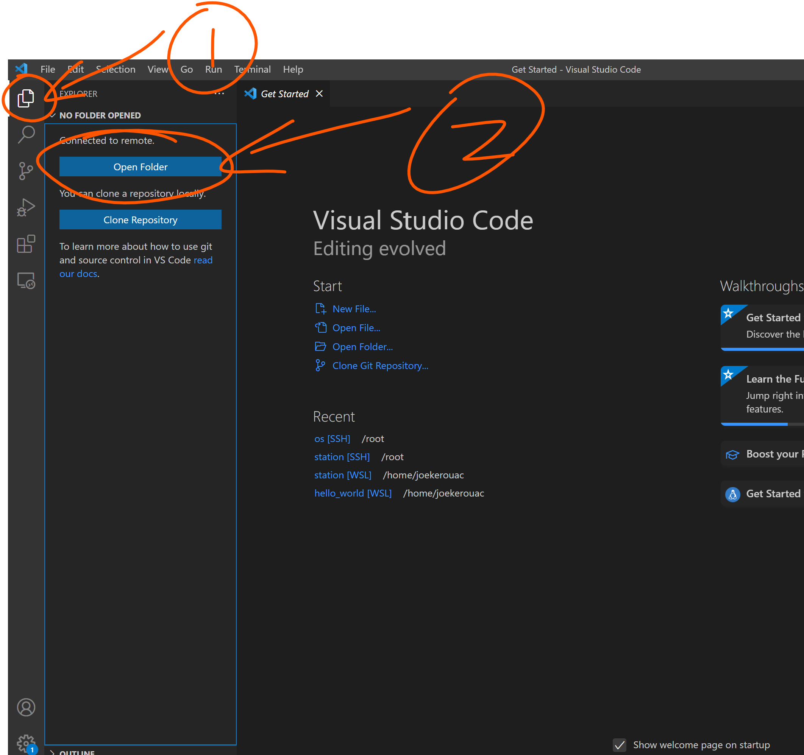

# ESP8266 RTOS开发环境搭建
## 背景
最近在学习ESP8266的开发，了解到有以下几种开发方式：
- 一种是使用arduino来开发，这个感觉不是什么正经开发工具，用的都是别人封装好的工具，感觉不是太专业；
- 一种是使用AT指令的方式开发，这种开发方式是官方提供的一种开发方式，优势就是简单，劣势也很明显，就是这种开发方式必须要有一个独立的MCU来给ESP8266芯片发送指令，太浪费了；
- 一种是使用RTOS SDK开发，这个也是官方提供的一种开发方式，优势就是无需像AT模式一样需要一个独立的MCU来发送指令，可以使用ESP8266本身作为MCU，劣势同样也很简单，那就是上手比较困难；

考虑再三，最终决定使用RTOS SDK的来开发，理由嘛也很简单，本身笔者自己也是程序员，也是会C语言开发的，这个RTOS SDK也是C写的，想来上手也不会太难；

要使用RTOS SDK开发的第一步就是搭建环境，本来在我的预想中，搭建开发环境这不是开发最基本的素养嘛，最多给我一小时就能搞定，谁知道还是年轻了，鬼知道这东西的环境搭建还挺复杂的，特别是坑比较多，而且还没啥文档，百度、Google就不说了，没文档就没文档了，谁知道就连官方也是没有文档的，官方仅仅是提供了一个Ubuntu的镜像，直接就可以放virtual box中启动；可是我并不是太熟悉Ubuntu，而且也不是太想用（就是懒），还是想要使用我自己比较熟悉的centos7，想着搭建一个环境嘛，能有多难，唉....


鉴于环境搭建中坑比较多，所以搞篇笔记记录下如何搭建环境，省的过段时间给忘了，还得从头再来，下面开始正文；

## 编译环境搭建
### 1、首先安装一些必要的软件
```
yum install -y gcc git wget make ncurses-devel flex bison gperf python3 pyserial unzip which
```

### 2、然后下载工具链，下载地址可以从官方git上找
地址如下：
```
https://github.com/espressif/ESP8266_RTOS_SDK
```
工具链下载完毕后将其解压，然后将里边的bin目录添加到path中；


### 3、clone官方的RTOS SDK
将上一步git地址clone到/root/ESP8266_RTOS_SDK目录中（这里仅仅是示例，也可以是其他目录）；clone完毕后设置一个环境变量：
```
export IDF_PATH=/root/ESP8266_RTOS_SDK
```

### 4、将默认的python2替换为python3
修改${IDF_PATH}目录中以下几个文件中的python为python3；
```
tools/cmake/project.cmake
tools/cmake/build.cmake
export.sh
Kconfig
tools/ldgen/samples/sdkconfig
make/common.mk
```


注意，make/common.mk修改比较麻烦，需要将
```
PYTHON=$(call dequote,$(CONFIG_SDK_PYTHON))
```
修改为：
```
ifdef CONFIG_SDK_PYTHON
PYTHON=$(call dequote,$(CONFIG_SDK_PYTHON))
else
PYTHON=python3
endif

ifeq ("$(PYTHON)", "python")
PYTHON=python3
endif
```

PS：因为centos7系统默认python命令链接的是python2，而ESP8266 RTOS SDK要求使用的是python3，所以这里我们要将python强制修改为python3；那为什么不将默认的python链接到python3呢？因为centos本身也依赖python命令，例如yum，同时要求版本是2，不能是3...

### 5、执行以下命令安装必要依赖
```
python3 -m pip install --user -r $IDF_PATH/requirements.txt
```

## 编译环境搭建完毕
到这里，我们的环境就搭建成功了，可以开始编译我们的hello world了，先将${IDF_PATH}/examples/get-started/hello_world目录copy出来到root目录（主要是为了防止污染SDK目录，后续SDK目录内容就不会更改了），然后进入目录，执行make命令编译即可；

## IDE开发环境搭建
经过上述步骤后，我们的编译环境就搭建完成了，但是此时我们仅仅是能编译项目了，如果想要开发，肯定还是需要使用IDE更方便快捷的，除非你想用vim来开发，否则IDE开发环境也是很重要的，其实这一步也卡了作者很久，因为一直找不到合适的IDE，直到作者发现了vs code的remote功能，真的是绝配，下面来讲下如何在vs code中搭建我们的ESP8266 RTOS SDK开发环境；


1、首先是vs code下载，这个请自行去官网下载；

2、找到图中位置，搜索remote，然后安装该插件；PS:如果你的vs code版本和笔者不一致，那请自行百度如何安装extension；



3、找到图中位置，点击它，会出现一个对话框，从对话框中选择connect to host，输入root@你的虚拟机IP 然后回车，然后再输入你的密码即可；



4、连接到你的虚拟机后（虚拟机中搭建了编译环境），点击open folder选择刚才的hello world目录


5、打开我们的hello world目录后，还要安装下面的extension：
```
cmake
cmake-tools
c/c++
```
注意，上述的三个extension是需要安装到远程的，不是安装到本地，安装方法与上边安装remote的方法一致，只不过是需要连接到远程后安装；


6、添加一个远程配置

> 注意，这个远程配置可能已经存在了，如果已经存在那么只需要编辑即可；

要添加的配置文件为：~/.local/share/CMakeTools/cmake-tools-kits.json
```

[
    {
        "name": "esp8266",
        "toolchainFile": "${IDF_PATH}/tools/cmake/project.cmake",
        "compilers": {
            "CC": "xtensa-lx106-elf-g++",
            "CXX": "xtensa-lx106-elf-gcc"
        }
    }
]
```

7、项目空间的.vscode目录中添加一个tasks.json文件，添加完这个文件后需要在cmake的扩展设置中勾选build using tasks.json instead of internal process，否则这个文件不会生效；文件内容如下：
```
{
    "options": {
        "env": {}
    },
    // See https://go.microsoft.com/fwlink/?LinkId=733558 
    // for the documentation about the tasks.json format
    "version": "2.0.0",
    "tasks": [
        { // Init by MenuConfig
            "label": "Menuconfig",
            "group": {
                "kind": "build",
                "isDefault": true
            },
            "type": "shell",
            "command": "${IDF_PATH}/tools/idf.py",
            "args": [
                "menuconfig"
            ],
            "presentation": {
                "reveal": "always",
            },
            "problemMatcher": []
        },
        { // Build Environment
            "label": "Build Project",
            "group": {
                "kind": "build",
                "isDefault": true
            },
            "type": "shell",
            "command": "${IDF_PATH}/tools/idf.py",
            "args": [
                "build"
            ],
            "presentation": {
                "reveal": "always",
                "echo": true
            },
            "options": {
                "shell": {}
            },
            // "problemMatcher": ["$gcc"] // Gcc matcher does't work here
            "problemMatcher": {
                "owner": "cpp",
                "fileLocation": "absolute",
                "pattern": {
                    "regexp": "^(.*):(\\d+):(\\d+):\\s+(warning|error):\\s+(.*)$",
                    "file": 1,
                    "line": 2,
                    "column": 3,
                    "severity": 4,
                    "message": 5
                }
            }
        },
        { // Flash Environment and Monitor
            "label": "Flash & Monitor",
            "group": {
                "kind": "test",
                "isDefault": true
            },
            "command": "${IDF_PATH}/tools/idf.py",
            "type": "shell",
            "args": [
                "-p",
                "COM${input:ComPortNum}",
                "flash",
                "monitor"
            ],
            "presentation": {
                "reveal": "always",
            },
            // "problemMatcher": ["$gcc"] // Gcc matcher does't work here
            "problemMatcher": {
                "owner": "cpp",
                "fileLocation": "absolute",
                "pattern": {
                    "regexp": "^(.*):(\\d+):(\\d+):\\s+(warning|error):\\s+(.*)$",
                    "file": 1,
                    "line": 2,
                    "column": 3,
                    "severity": 4,
                    "message": 5
                }
            }
        },
        { // Clean Project
            "label": "Clean Project",
            "command": "${IDF_PATH}/tools/idf.py",
            "type": "shell",
            "args": [
                "clean"
            ],
            "problemMatcher": []
        },
        { // Full-Clean Project
            "label": "Full-Clean Project",
            "command": "${IDF_PATH}/tools/idf.py",
            "type": "shell",
            "args": [
                "fullclean"
            ],
            "problemMatcher": []
        }
    ],
    "inputs": [
        {
            "id": "ComPortNum",
            "type": "promptString",
            "description": "Type the number of used COM port" // this runs obviously only on a windows machine
        }
    ]
}


项目空间的.vscode目录添加一个c_cpp_properties.json文件：

{
    "configurations": [
        {
            "name": "Linux",
            "includePath": [
                "${workspaceFolder}/**"
            ],
            "defines": [],
            "compilerPath": "/usr/bin/gcc",
            "cStandard": "c89",
            "cppStandard": "c++17",
            "intelliSenseMode": "linux-gcc-x64",
            "configurationProvider": "ms-vscode.cmake-tools"
        }
    ],
    "version": 4
}
```

8、cmake active kit选择Xtensa Toolchain（就是我们在远程添加的~/.local/share/CMakeTools/cmake-tools-kits.json这个文件中的），如果没有这个可以选择scan来扫描；

好了，IDE开发环境至此完成，后面就可以开始开发了，真开发起来其实并不难，就是调用调用API、写写业务逻辑，没啥难度，最主要的就是设计了；

