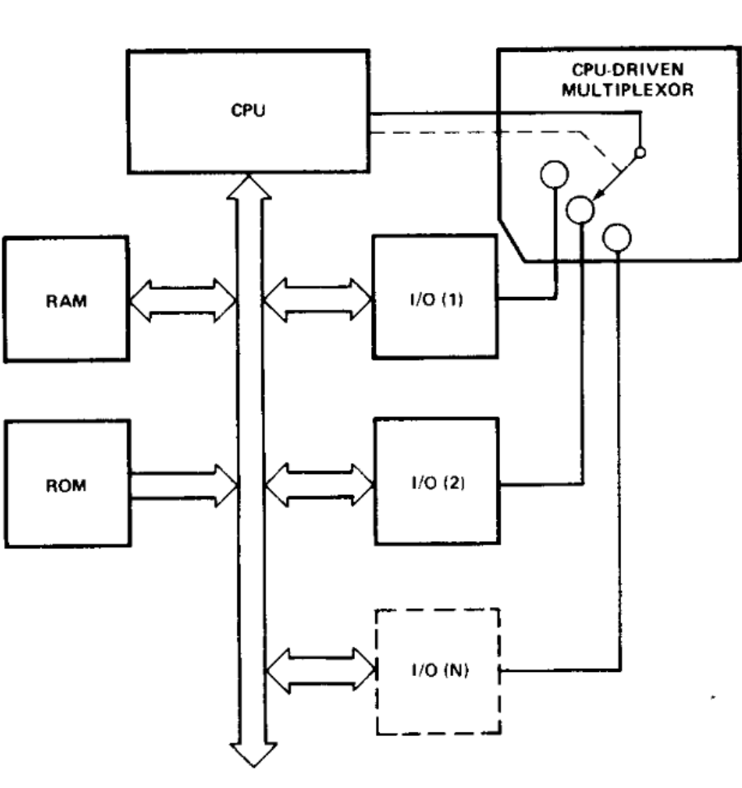
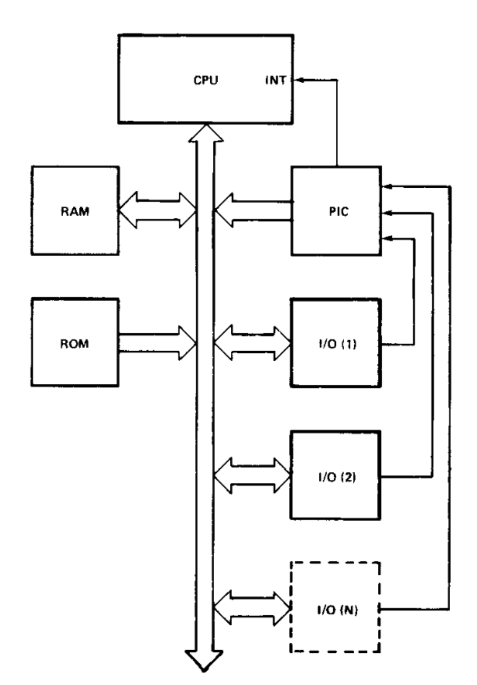

# 揭秘99%程序员都不懂的CPU神秘机制，掌握它让你的代码性能暴增10倍！

## 引言

在计算机系统中，中断是一种重要的硬件机制，它允许硬件设备和软件程序在需要CPU服务时，通过发送信号暂停当前正在执行的程序流程，从而获得CPU的即时响应。中断机制是现代操作系统实现多任务处理、设备驱动、异常处理和系统调用的基础，也是计算机体系结构中不可或缺的组成部分。

本文将全面介绍中断的分类、处理机制、相关硬件以及在操作系统中的具体应用，帮助读者深入理解这一重要概念。

## 什么是中断以及中断为什么可以大幅提升计算机性能

我们的计算机上通常会有键盘、显示器等一系列外部设备，服务这些设备最常见的方法是轮询方式。这种方式要求CPU按顺序“询问”每个设备是否需要服务。很容易看出，主程序的大部分时间都在这个连续的轮询循环中循环，并且这种方法会对系统吞吐量产生严重的负面影响，从而限制计算机可以承担的任务，降低使用这些设备的成本效益，如下图所示：



一种更理想的方法是允许CPU执行其主程序，并且仅在外部设备告诉他需要服务时才停下主程序，服务外部设备。实际上，该方法将提供一个外部异步输入，通知处理器完成当前正在执行的任何指令，并获取一个新的例程来服务请求的设备。然而，一旦这种服务完成，处理器将精确地恢复到它停止的地方继续执行主程序，如下图所示：



这种方法被称为中断（interrupt），很容器看出，有了中断后，系统吞吐量将大幅提升，因为CPU不需要再去做轮询外部设备这种毫无意义又耗时的事情了，取而代之的是有了一个专用的硬件PIC（Programmable Interrupt Controlle，可编程控制器）来处理外部设备的轮询；

## 中断分类

按照中断的来源和处理方式，中断通常可以分为三种类型：

### Exception（异常）

异常是由CPU内部事件引起的，通常与程序执行错误或特殊条件相关。根据Intel架构手册（IA-32 Intel Architecture Software Developer's Manual），中断号0-31被预留给异常。根据处理方式和严重程度的不同，异常进一步分为三类：

#### 故障（Faults）

故障是可能被纠正的异常，处理器状态可以被恢复到异常发生前的状态。对于故障类异常，返回指令指针(EIP/RIP)指向导致故障的指令，这意味着异常处理完成后会重新执行这条指令。

常见的故障类异常包括：

- **除零错误(#DE, 中断向量0)**：当程序执行除法指令且除数为0时触发
- **缺页错误(#PF, 中断向量14)**：当程序访问未映射内存页或违反内存访问权限时触发
- **一般保护错误(#GP, 中断向量13)**：当程序违反保护模式规则时触发
- **无效操作码(#UD, 中断向量6)**：当CPU遇到无法识别的指令时触发
- **设备不可用(#NM, 中断向量7)**：当尝试执行浮点指令但协处理器不可用时触发
- **对齐检查错误(#AC, 中断向量17)**：当开启对齐检查时进行非对齐内存访问触发

虽然理论上故障类异常可以修复，如缺页异常可以通过加载相应的页面解决，但某些故障（如除零错误）在实际应用中通常会导致程序终止，因为它们表明程序逻辑存在根本性错误。

#### 陷阱（Traps）

陷阱是在指令执行完成后立即报告的异常，允许程序继续执行而不会失去连续性。与故障不同，陷阱处理程序的返回地址指向陷阱指令之后的指令。

主要的陷阱类异常包括：

- **断点异常(#BP, 中断向量3)**：由INT 3指令触发，广泛用于调试
- **溢出异常(#OF, 中断向量4)**：由INTO指令在溢出标志(OF)设置时触发
- **边界检查异常(#BR, 中断向量5)**：由BOUND指令在操作数超出界限时触发
- **系统调用**：通过INT n指令（如Linux的INT 0x80）或SYSCALL/SYSENTER指令实现

陷阱特别适合于调试和系统调用实现，因为它们允许程序在异常处理后从下一条指令继续执行，实现了程序与操作系统之间的受控交互。

#### 终止（Aborts）

终止是最严重的异常类型，通常表示发生了严重的硬件错误或系统不一致状态。终止异常不总是能够报告导致异常的精确指令位置，且通常不允许恢复程序执行。

关键的终止类异常包括：

- **双重故障(#DF, 中断向量8)**：当异常处理程序本身产生异常时触发
- **机器检查异常(#MC, 中断向量18)**：由CPU内部硬件错误触发，如总线错误
- **三重故障**：当双重故障处理程序也产生异常时触发，导致处理器重置

终止类异常的主要目的是收集系统状态信息用于诊断，然后尽可能优雅地终止程序或重启系统，以防止数据损坏或安全风险。

### IRQ（Interrupt Request）或硬中断

硬中断由外部硬件设备触发，用于通知CPU设备需要服务。常见的硬件中断源包括：

- 定时器/时钟（通常是IRQ 0）：定期产生中断以维护系统时间
- 键盘控制器（通常是IRQ 1）：当按键按下或释放时触发
- 硬盘控制器（通常是IRQ 14）：数据传输完成时通知CPU
- 网络接口卡：在接收到数据包时请求CPU处理
- USB控制器：在设备连接、断开或数据传输时通知系统
- 其他外设：如打印机、声卡等

在标准PC架构中，IRQ按照优先级处理，优先级顺序为：0、1、2、8、9、10、11、12、13、14、15、3、4、5、6、7，其中0的优先级最高，7最低。

值得注意的是，硬中断处理通常分为两个阶段：
1. **顶半部(Top Half)**：快速响应中断，执行最小必要处理
2. **底半部(Bottom Half)**：延迟执行耗时操作，可以被其他中断打断

这种分层设计确保了关键中断能够及时得到处理，同时不会导致系统长时间无法响应其他事件。

### 软件中断

软件中断是由软件指令显式触发的，主要用于系统调用、软件异常处理和特权级转换。在x86架构中，INT n指令是生成软件中断的主要方式。

软件中断的典型应用包括：

- **系统调用**：用户程序通过软件中断请求操作系统服务（如文件操作、进程控制）
- **调试断点**：调试器插入INT 3指令以在指定位置暂停程序执行
- **BIOS/固件服务**：在实模式下，通过INT 10h、INT 13h等访问基本I/O服务

## 中断控制机制

### 中断控制器

#### 8259 PIC（可编程中断控制器）

8259 PIC是早期x86架构中负责中断管理的关键组件。它负责接收来自各个设备的中断请求，根据优先级排序，并将其传递给CPU。

典型的PC系统配置有两个8259 PIC，组成主从结构：
- 主PIC：处理IRQ 0-7
- 从PIC：处理IRQ 8-15，其输出连接到主PIC的IRQ 2输入

这种级联结构意味着当从PIC接收到中断时，它会通过主PIC的IRQ 2通知CPU，因此IRQ 2实际上不作为独立中断使用。

8259 PIC的工作流程如下：
1. 设备向PIC发送中断请求
2. PIC根据当前掩码和优先级确定是否立即处理
3. 如果决定处理，PIC向CPU发送INTR信号
4. CPU完成当前指令后响应中断
5. CPU通过INTA信号向PIC确认中断
6. PIC将中断向量号发送给CPU
7. CPU执行相应的中断服务程序(ISR)
8. ISR完成后向PIC发送EOI(End Of Interrupt)信号
9. PIC恢复接收新的中断请求

注意，IRQ不会并发处理。系统处理完一个IRQ并向PIC发送EOI后才会触发下一个IRQ。

#### APIC（高级可编程中断控制器）

随着多处理器系统的出现，传统的8259 PIC无法满足复杂的中断分配需求，APIC应运而生。APIC系统包括：

- **Local APIC**：集成在每个CPU中，负责处理处理器特定的中断
- **I/O APIC**：系统总线上的独立芯片，负责接收设备中断并分配给适当的CPU

APIC提供了更多的中断向量（通常为256个），支持中断优先级、中断屏蔽和处理器间中断传递(IPI)。在现代多核系统中，APIC是实现负载均衡和中断亲和性（将特定设备中断定向到特定CPU核心）的关键机制。

### 中断向量

x86架构支持最多256种不同的中断，由0到255的中断向量号标识：

- **0-31**：由Intel预留给处理器异常
- **32-255**：可由操作系统自行分配，通常32-47用于硬件IRQ

每个中断向量对应IDT(中断描述符表)中的一个条目，指向相应的中断服务程序。

> 详细内容下文会介绍

### 中断屏蔽与优先级

CPU可以通过设置IF(中断标志)位来控制是否接受可屏蔽中断：
- **CLI指令**：清除IF标志，禁用可屏蔽中断
- **STI指令**：设置IF标志，启用可屏蔽中断

不可屏蔽中断(NMI)则不受IF标志控制，总是会被CPU响应，通常用于报告严重的硬件故障如内存错误或电源故障。

现代处理器还支持更细粒度的中断控制机制，如任务优先级寄存器(TPR)，允许系统动态调整中断优先级阈值，只处理高于当前阈值的中断。

## 中断在现代系统中的应用
### 操作系统内核

在现代操作系统中，中断机制承担着以下关键功能：

- **进程调度**：时钟中断触发调度器重新评估进程优先级和时间片
- **设备驱动**：通过中断实现高效的I/O操作，避免轮询浪费CPU时间
- **系统调用**：提供用户态程序安全访问内核功能的机制
- **虚拟内存管理**：缺页中断支持按需加载和页面置换
- **错误检测与恢复**：捕获并处理程序错误，提高系统稳定性

### 虚拟化与中断虚拟化

在虚拟化环境中，中断处理变得更加复杂：

- **中断重映射**：VMM(虚拟机监视器)需要截获客户操作系统的中断处理
- **虚拟中断控制器**：为每个虚拟机提供虚拟的APIC
- **中断注入**：将物理中断转换为虚拟中断并注入到适当的虚拟机
- **中断虚拟化扩展**：现代处理器提供硬件辅助功能(如Intel的APICv)加速中断虚拟化

### 实时系统中的中断

实时系统对中断处理有特殊要求：

- **确定性响应时间**：中断处理必须在严格的时间限制内完成
- **优先级管理**：高优先级事件必须能够抢占低优先级事件处理
- **中断延迟最小化**：减少中断禁用时间，使用中断优先级阈值而非全局禁用
- **嵌套中断支持**：允许高优先级中断打断低优先级中断处理

## 最佳实践与性能考虑

### 中断处理程序设计原则

编写高效的中断处理程序应遵循以下原则：

- **最小化执行时间**：中断处理程序应尽可能简短
- **避免死锁**：中断处理程序不应等待可能被中断本身阻塞的资源
- **正确使用中断禁用**：仅在必要的临界区禁用中断
- **考虑重入性**：中断处理程序必须能安全地被其自身或其他中断打断
- **使用分层处理**：将紧急工作放在顶半部，将耗时工作推迟到底半部

### 中断相关的性能优化

现代系统中常用的中断性能优化技术：

- **中断合并(Interrupt Coalescing)**：网络设备等积累多个事件后产生单个中断
- **中断亲和性(Interrupt Affinity)**：将特定设备中断绑定到特定CPU核心
- **消息信号中断(MSI/MSI-X)**：允许设备直接向处理器发送中断信息，避免IRQ共享
- **处理器缓存优化**：确保中断处理程序和相关数据结构缓存友好
- **无锁设计**：使用原子操作和每CPU变量减少中断处理中的锁竞争


## 中断使用
### 中断表和描述符

> 要使用中断，首先我们要定义中断程序，即发生中断时处理中断的程序；

#### IVT（Interrupt Vector Table）

在实模式下，x86处理器使用位于物理内存低端(0x0000-0x03FF)的中断向量表(IVT)。IVT包含256个4字节条目，每个条目由一个16位的段值和一个16位的偏移值组成，指向相应中断处理程序的入口点。


##### 中断相关的BIOS服务

在实模式下，BIOS提供了一系列通过软件中断访问的系统服务：

###### INT 0x10（显示服务）

用于控制显示输出，功能包括：
- AH=0x00：设定显示模式
- AH=0x01：设定光标形状
- AH=0x02：设定光标位置
- AH=0x03：获取光标位置与形状
- AH=0x05：设定活动显示页
- AH=0x06/0x07：滚动窗口上/下
- AH=0x08：读取光标位置的字符和属性
- AH=0x09：在指定位置显示字符和属性
- AH=0x0E：以电传打字机模式输出字符
- AH=0x0F：获取当前视频模式

###### 其他常用BIOS中断

- **INT 0x13**：磁盘服务，用于读写硬盘和软盘扇区
- **INT 0x16**：键盘服务，用于读取键盘输入
- **INT 0x1A**：时间服务，用于读取或设置系统时间
- **INT 0x15**：系统服务，包括内存大小查询、A20线控制等
- **INT 0x19**：启动引导，重启系统并加载引导扇区
- **INT 0x1C**：定时器滴答钩子，每个时钟滴答调用一次

这些BIOS中断在现代保护模式操作系统中通常不直接使用，但在系统引导阶段和某些实模式程序中仍然发挥重要作用。

#### IDT（Interrupt Descriptor Table）

在保护模式下，IVT被更强大的中断描述符表(IDT)所取代。IDT的位置和大小由IDTR寄存器指定，可以位于内存的任意位置。

IDTR寄存器说明：

| bit | name | description |
| --- | --- | --- |
| 0-15 | limit | 定义IDT的大小（实际大小-1），单位byte |
| 16-47 | base | IDT的线性地址起始位置（注意，这里是线性地址，不是物理地址） |

> 表中的limit为什么是`实际大小-1`？因为这里的limit实际上是最大偏移量，而偏移量是从0开始的，所以最终的值应该是`实际大小-1`

> 关于什么是线性地址、什么是物理地址，请参考历史文章：万字长文爆肝 | 1MB到4GB，一文带你看懂x86内存管理的技术革命

IDT descriptor结构说明（注意，这是IA-32结构下的说明，x86-64上的结构比较复杂）（注意：offset不是物理地址，是线性地址）：


| offset | size(单位byte) | description |
| --- | --- | --- |
| 0 | 2 | offset low bits(0-15 bit) |
| 2 | 2 | selector（code segment selector），指向GDT中的条目 |
| 4 | 1 | zero |
| 5 | 1 | type and attribute（same as before）：<ul><li>bit 0-3： gate types：<ul><li>0x5：32bit task gate</li><li>0x6：16bit interrupt gate</li><li>0x7：16bit trap gate</li><li>0xE：32bit interrupt gate</li><li>0xF：32bit trap gate</li></ul></li><li>bit 4：如果是interrupt gate或者trap gate则设置为0，如果是task gate则设置为1；</li><li>bit 5-6：该gate的特权级别定义，用来保护gate不被低特权的代码调用，例如某个中断不想被ring3调用，则设置这个字段为0，此时只有ring0特权的代码可以调用该中断；</li><li>bit 7：present，设置为0时该中断被禁用；</li></ul> |

> 注意，interrupt gate处理时会自动禁用中断，trap gate类似interrupt gate，但是不会自动禁用中断；

每个描述符包含：
- 目标代码段选择符
- 处理程序入口点偏移
- 特权级(DPL)
- 类型标志
- 存在位(P)等信息

#### IRQ重映射

当系统首次启动时，IRQ 0-7被映射到中断向量0x08-0x0F，IRQ 8-15被映射到中断向量0x70-0x77。然而，这会与Intel保留的异常向量(0-31)产生冲突。

为了解决这个问题，操作系统通常会重新编程PIC，将IRQ映射到其他不冲突的中断向量范围。通常的做法是：
- 主PIC的IRQ 0-7映射到向量0x20-0x27
- 从PIC的IRQ 8-15映射到向量0x28-0x2F

这种重映射确保了硬件中断不会与处理器异常产生混淆，是现代操作系统启动初始化的重要步骤。


PIC重新映射代码片段如下：

> 代码中的`jmp 1f; 1:`为手动添加的延迟，外部设备处理可能速度没有那么快，我们手动插入一个jmp指令来稍微延迟下多个IO操作；

```assembly
# 保存当前中断屏蔽
inb $0x21, %al          # 读取主PIC屏蔽寄存器  
movb %al, %bl           # 保存主PIC屏蔽
inb $0xA1, %al          # 读取从PIC屏蔽寄存器
movb %al, %bh           # 保存从PIC屏蔽

# ICW1 - 初始化命令字1
movb $0x11, %al         # ICW1: 需要ICW4 + 级联模式 + 边沿触发
outb %al, $0x20         # 发送到主PIC命令端口
jmp 1f; 1:              # I/O延迟
outb %al, $0xA0         # 发送到从PIC命令端口
jmp 1f; 1:              # I/O延迟

# ICW2 - 中断向量基址重新映射
movb $0x20, %al         # 主PIC: IRQ 0-7 映射到 0x20-0x27
outb %al, $0x21         # 主PIC数据端口
jmp 1f; 1:              # I/O延迟
movb $0x28, %al         # 从PIC: IRQ 8-15 映射到 0x28-0x2F
outb %al, $0xA1         # 从PIC数据端口
jmp 1f; 1:              # I/O延迟

# ICW3 - 级联连接设置
movb $0x04, %al         # 主PIC: IRQ2位连接从PIC (bit 2 = 1)
outb %al, $0x21         # 主PIC数据端口
jmp 1f; 1:              # I/O延迟
movb $0x02, %al         # 从PIC: 连接到主PIC的IRQ2 (从PIC ID = 2)
outb %al, $0xA1         # 从PIC数据端口
jmp 1f; 1:              # I/O延迟

# ICW4 - 操作模式设置
movb $0x01, %al         # 8086/8088模式
outb %al, $0x21         # 主PIC数据端口
jmp 1f; 1:              # I/O延迟
outb %al, $0xA1         # 从PIC数据端口
jmp 1f; 1:              # I/O延迟

# 恢复之前保存的中断屏蔽
movb %bl, %al           # 恢复主PIC屏蔽
outb %al, $0x21
jmp 1f; 1:              # I/O延迟
movb %bh, %al           # 恢复从PIC屏蔽
outb %al, $0xA1


```

### IDT代码示例

> 以下代码为IDT设置、使用示例；

> 注意，下面的代码使用AT&T汇编；

> 为了简单，下述代码都在IPL中实现，受限于IPL只有512 byte（没错，下面的代码编译后只有不到512 byte），没有开启分页、A20地址线、PIC重新编程映射等，仅仅是开启了保护模式（因为这是必要的），然后实现了中断的声明和调用，最终实现在中断程序往屏幕输出两个红色的A；


```assembly
.code16

start:
    # 清屏
    xor %ax, %ax
    int $0x10
    # 禁用中断
    cli
    # 加载gdt
    lgdt _gdtr
    # 进入保护模式，开启分段，不开启分页
    mov %cr0, %eax
    orb $0x01, %al
    mov %eax, %cr0
    # 这里的0x08是段选择子
    ljmp $0x08, $pm_entry

_gdtr:
  # gdt大小，单位byte
  .word 3*8-1
  .long gdt
  
# 小端序
gdt:
  .word 0,0,0,0 # 第一个空表项
  # 代码段、数据段都从0x7e00开始
  
  # 定义代码段，可读可执行，可访问内存大小1M
  .word 0xFFFF  # limit
  .word 0x0000  # base
  .word 0x9A00  # base+access type，9A是access type，对应二进制：1001 1010
  .word 0x004F  # limit + flags + base，flag的二进制值为：0100

  # 定义数据段，可读可写可执行，可访问内存大小1M
  .word 0xFFFF  # limit
  .word 0x0000  # base
  .word 0x9200  # base+access type，92是access type，对应二进制：1001 0010
  .word 0x004F  # limit + flags + base，flag的二进制值为：0100

.code32
pm_entry:
    # 设置段寄存器 + 栈
    mov $0x10, %ax
    mov %ax, %ds
    mov %ax, %es
    mov %ax, %ss
    mov $0x90000, %esp

init_idt:
    # 开始初始化idt，idt最多256条记录，这里初始化256条
    mov $256, %ecx
    mov $0x80000 - 8, %edi
idt_loop:
    # 将所有的中断设置为default_handler
    addl $8, %edi
    mov $default_handler, %eax   # 处理程序地址
    mov %ax, (%edi)              # 设置偏移低16位
    shr $16, %eax
    mov %ax, 6(%edi)             # 设置偏移高16位
    movw $0x0008, 2(%edi)        # 设置代码段选择子
    movb $0x00, 4(%edi)
    movb $0x8e, 5(%edi)          # 设置类型和属性(0x8e = 1000 1110b，其中1110是0xe，表示32位interrupt gate，1000)
    loop idt_loop
    
    # 地址设置为50号中断基址，因为一个中断大小是8byte，所以这里要加50*8
    mov $0x80000 + 0x32 * 8, %edi
    mov $keyboard_handler, %eax  # 处理程序地址
    mov %ax, (%edi)              # 设置偏移低16位
    shr $16, %eax
    mov %ax, 6(%edi)             # 设置偏移高16位
    movw $0x0008, 2(%edi)        # 设置代码段选择子
    movb $0x00, 4(%edi)
    movb $0x8e, 5(%edi)          # 设置类型和属性(0x8e = 10001110b - 中断门)

    # 加载IDT
    lidt idt_desc

    sti
    # 主动调用50号中断
    int $0x32
main_loop:
    hlt
    jmp main_loop

default_handler:
    iret
keyboard_handler:
    # 往屏幕上写红色的A
    movw $0x0441, 0xB8000
    # 往屏幕上写红色的A
    movw $0x0441, 0xB8002
    iret

idt_desc:
    .word 2047
    .long 0x80000

```

## 总结

中断是计算机系统中至关重要的底层机制，它使CPU能够及时响应硬件设备和软件程序的请求，是实现多任务处理、设备驱动和异常处理的基础。通过理解中断的分类、机制和处理流程，我们可以更好地理解操作系统的工作原理，设计更高效的系统软件，并解决各种系统级问题。

随着计算机硬件的发展，中断机制也在不断演进，从简单的8259 PIC到复杂的APIC系统，从单一处理器到多核处理器，中断技术始终是连接硬件和软件的关键桥梁，在可预见的未来将继续在计算机系统中发挥核心作用。


# 联系方式

- 微信：JoeKerouac
- 微信公众号：代码深度研究院（如搜不到可添加微信获取）
- GitHub：[https://github.com/JoeKerouac](https://github.com/JoeKerouac)
