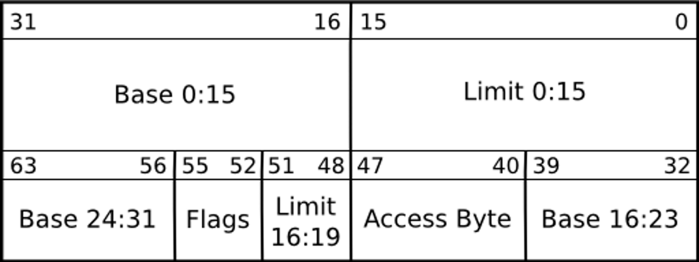
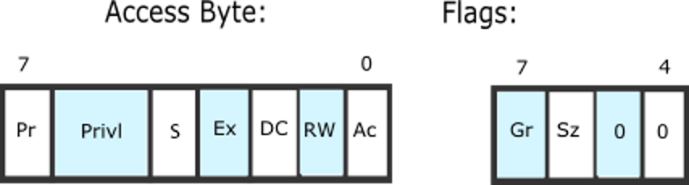
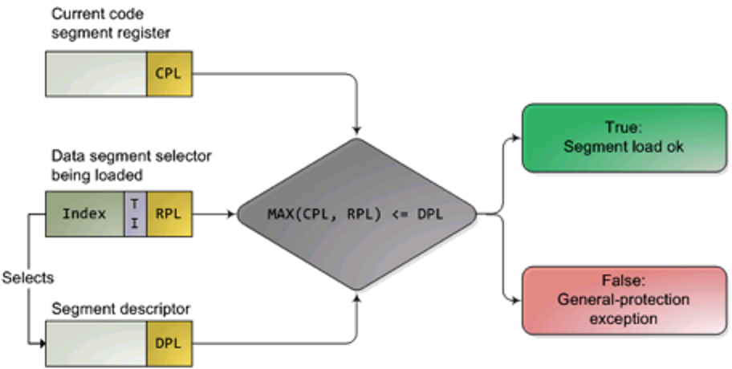

# 揭秘保护模式：CPU如何筑起操作系统的安全防线

在我们日常使用的操作系统中，处理器悄无声息地以一种称为“保护模式（Protected Mode）”的方式运行。这种模式自 80286 处理器起引入，是现代多任务、多用户操作系统的基石。但你是否思考过，它究竟“保护”了什么？又是如何实现保护的？

## 实模式的局限：操作系统的前世

在早期的 8086 架构中，CPU 运行在所谓的“实模式（Real Mode）”下，在这种模式下：

- 地址总线仅支持 1MB 内存空间；
- 内存访问几乎没有限制，任何程序都能访问任意内存；
- 缺乏权限控制，用户程序可以轻易覆盖操作系统内核；
- 不支持虚拟内存、任务切换及多用户功能。

**总结一句话：危险、脆弱、原始。**

在这种环境下运行复杂系统几乎是不可能的，于是保护模式应运而生。

## 保护模式保护内容

保护模式主要保护了以下几个方面：

- 类型检查
- 越界检查（通过段的 base 和 limit 实现）
- 寻址域限制
- 程序入口点限制
- 指令集限制：通过硬件级权限控制，确保只有内核态代码可以执行敏感操作。例如：
    - `cli`/`sti`：关闭/开启中断
    - `hlt`：挂起 CPU，等待中断
    - `lgdt`/`lidt`/`lldt`：设置 GDT、IDT、LDT
    - `ltr`：加载任务状态段（TSS）选择子
    - `mov CRx`：访问控制寄存器 CR0–CR4
    - `iret`：从中断返回（恢复 CS/EIP/EFLAGS）
    - ...其他特权指令

在提供保护的同时，保护模式还提供了以下能力，不过这些不是本次重点：

- 多任务支持（如任务状态段 TSS）；
- 硬件虚拟化基础（分页机制）；

## 内存保护

保护模式的核心功能之一是内存保护。前述类型检查、越界检查、寻址域限制和程序入口点控制，本质上都是为了保护内存，主要依赖于 **GDT（全局描述符表）** 实现。

在保护模式下：

- 每个程序只能访问其分配的内存区域；
- 通过段描述符（Segment Descriptor）和分页机制（Paging），实现：
    - 用户态无法访问内核空间；
    - 不同进程间互不干扰；
    - 防止缓冲区溢出影响系统其他部分。

🧠 **通俗理解**：每个程序都运行在自己的“安全沙箱”中。

## 虚拟内存支持

保护模式支持分页机制，使每个进程拥有独立的虚拟地址空间。这意味着：

- 操作系统可以使用超出物理内存的空间；
- 进程间相互隔离，互不可见；
- 系统更加稳定、安全。

得益于虚拟内存和隔离机制，即使某个用户态程序崩溃，也不会影响系统整体运行。

## 具体实现机制

### 特权级（Privilege Level）

x86 架构定义了四个特权级别（Ring 0 ~ Ring 3）：

- **Ring 0**：内核态，最高权限；
- **Ring 3**：用户态，最低权限。

### GDT（Global Descriptor Table）

GDT 是 IA32 架构中存储在内存中的结构，用于保存段信息。CPU 通过读取 GDT 来获取段的访问权限与地址范围等信息。

> **建议 GDT 的基址 8 字节对齐**以获得最佳性能，但非强制。

GDT 表的第一个 entry 必须全为 0。GDT 中 descriptor 的结构如下图所示：

主要字段说明：

- **limit**：段的大小 - 1，总共 20bit；
- **base**：段的起始物理地址，总共 32bit；
- **Access Byte**：访问权限定义；
- **flags**：标志位。

> 说明：
> - `limit 0:15` 表示 limit 的低 16 位；
> - `base 0:15` 表示 base 的低 16 位；
> - `base 16:23` 表示 base 的中间 8 位；
> - `limit 16:19` 表示 limit 的高 4 位；
> - `base 24:31` 表示 base 的高 8 位。

Access Byte 与 Flags 的结构如下图所示：

- **P（Present）**：段是否存在（1 为可用）；
- **DPL（Descriptor Privilege Level）**：2bit 特权级，0 最高，3 最低；
- **S**：描述符类型（1 为代码段/数据段，0 为系统段）；
- **Ex（Executable）**：1 表示代码段，0 表示数据段；
- **DC**：
    - 对数据段：0 为向上增长，1 为向下增长；
    - 对代码段：1 表示 `CPL ≥ DPL` 可执行，0 表示 `CPL == DPL` 才可执行；
- **RW（Readable/Writable）**：
    - 数据段：1 为可写；
    - 代码段：永远不可写；
- **Ac（Accessed）**：初始为 0，CPU 访问后置为 1；
- **Gr（Granularity）**：limit 单位，0 为字节，1 为 4KB；
- **Sz（Size）**：0 表示 16 位，1 表示 32 位保护模式；

### 段选择子（Segment Selector）

段寄存器（如 `CS`、`DS` 等）在保护模式下不再直接表示地址，而是作为段选择子（16bit）使用，其结构如下：

- **bit 0-1**：RPL（Requested Privilege Level，请求特权级）；
- **bit 2**：TI（Table Indicator），0 表示 GDT，1 表示 LDT；
- **bit 3-15**：段在表中的索引，每个 Entry 为 8 字节；

> 注意，这里的bit0-15是从低到高的，也就是说bit 0-1指的是最低两位；；

### 三种特权级的比较

保护模式中涉及三个特权级：

- **DPL**：定义在段描述符中；
- **RPL**：定义在段选择子中；
- **CPL**：当前运行特权级，存储在 `CS` 寄存器中；

### 内存访问保护点

CPU 在以下两个关键时刻进行权限校验：

1. **加载段选择子时**：
    - 对代码段：`max(CPL, RPL) ≤ DPL` 才能访问；
    - 对数据段：还需检查 RW 权限位等其他字段。

2. **访问线性地址页表时**：
    - 检查页表中的权限位（例如 U/S, R/W）。

段选择子的权限校验示意图如下：

> 说明：`max(CPL, RPL)` 的值越大权限越低，因此必须满足 `max(CPL, RPL) ≤ DPL` 才允许访问。

---

# 联系方式

- 微信：JoeKerouac
- 微信公众号：代码深度研究院（如搜不到可添加微信获取）
- GitHub：[https://github.com/JoeKerouac](https://github.com/JoeKerouac)
