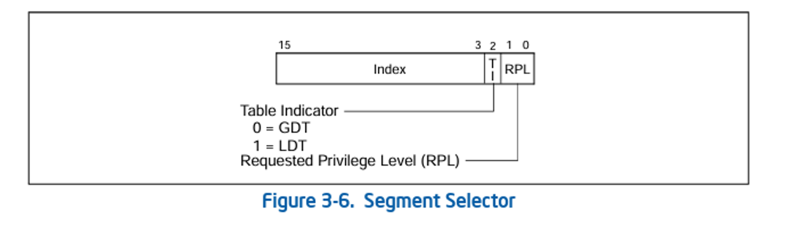
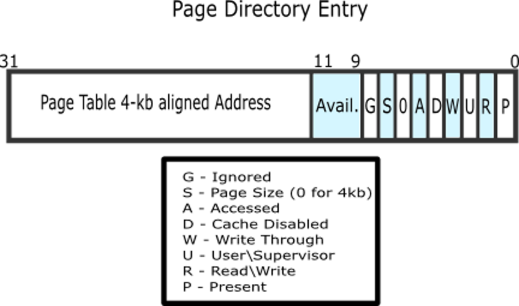
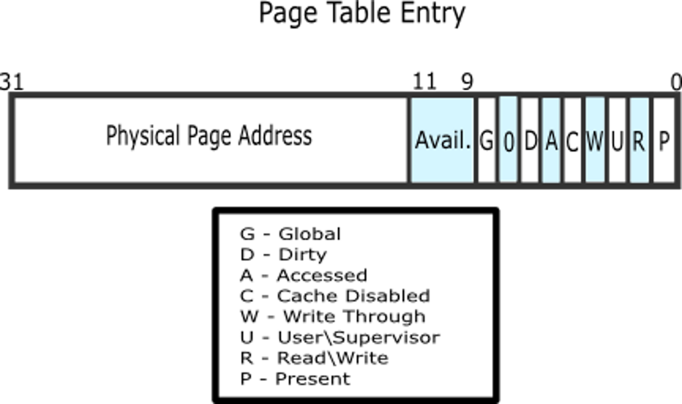
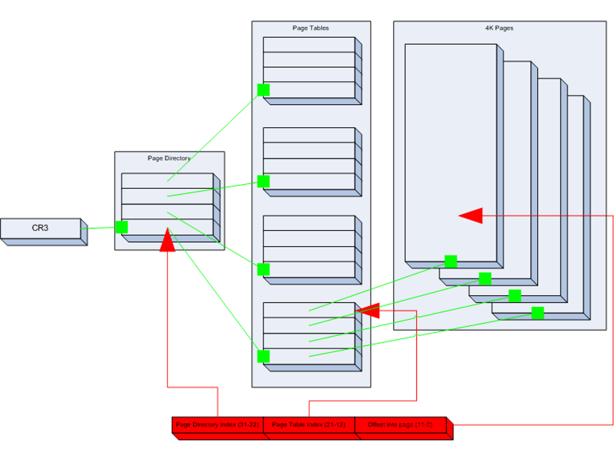
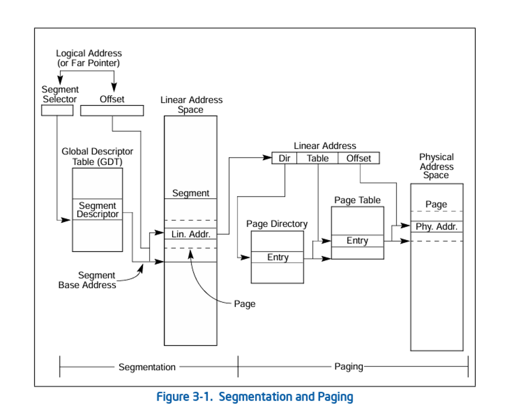

# 深入理解操作系统内存管理机制：从实模式到保护模式的演进

> **技术说明**：
> - 文中涉及的汇编代码采用AT&T汇编语法
> - 本文内容基于32位x86架构，其他架构可能存在差异
> - 适合有一定汇编和操作系统基础的读者

## 引言

操作系统的内存管理是计算机系统最核心的组成部分之一，它直接影响着系统的性能、稳定性和安全性。从早期8080处理器的简单线性寻址，到现代x86架构复杂的段页式混合管理，内存管理技术经历了深刻的变革。

本文将带你深入探索这一演进过程，理解每个阶段的设计思想、技术特点以及历史局限性，帮助你构建完整的内存管理知识体系。

## 地址空间基础概念

在深入探讨具体的内存管理机制之前，我们需要明确几个核心概念：

### 关键地址类型

**物理地址（Physical Address）**
- 处理器地址总线上实际产生的地址
- 直接对应物理内存或I/O设备的位置
- **重要提醒**：物理地址空间不仅包含内存，还包括ROM、存储控制器、网络设备等

**线性地址/虚拟地址（Linear/Virtual Address）**
- 处理器可寻址的连续地址空间
- 在未启用分页时，线性地址等同于物理地址
- 启用分页后，需要通过页表转换为物理地址

**逻辑地址（Logical Address）**
- 程序执行时使用的地址格式
- 由段选择器和偏移量组成（段:偏移）
- 需要通过段机制转换为线性地址

**虚拟内存（Virtual Memory）**
- 基于分页技术的内存管理抽象
- 支持按需调页，数据可存储在外部存储设备
- 显著提高内存利用效率和系统并发能力

## 内存管理技术演进历程

### 第一阶段：线性地址模式（8080时代）

**技术特点**：
- **地址空间**：16位地址，最大64KB寻址能力
- **寻址方式**：直接物理地址访问，无地址转换
- **内存管理**：无保护机制，程序直接操作物理内存
- **适用场景**：单任务系统，内存需求简单

这种简单直接的方式虽然效率高，但缺乏保护机制，无法支持多任务操作系统。

### 第二阶段：段寄存器寻址（8086实模式）

8086处理器（1978年）首次引入段机制，标志着内存管理技术的重要突破。

#### 核心创新

**引入地址转换机制**
- 使用"段寄存器 + 偏移量"的二维寻址方式
- 将20位物理地址空间划分为可重叠的段

**扩展寻址能力**
- 从64KB扩展到1MB（20位地址线）
- 单个段仍限制在64KB内

#### 段寄存器体系

| 段寄存器 | 全称 | 主要用途 | 典型应用场景 |
|---------|------|----------|-------------|
| **CS** | Code Segment | 代码段 | 存储当前执行的程序代码 |
| **DS** | Data Segment | 数据段 | 访问程序的全局变量和静态数据 |
| **ES** | Extra Segment | 附加段 | 字符串操作、数据复制等 |
| **SS** | Stack Segment | 堆栈段 | 函数调用、局部变量存储 |

#### 地址转换机制

**转换公式**：
```
物理地址 = 段寄存器值 × 16 + 偏移地址
```

**实际应用示例**：
```assembly
# 设置数据段寄存器
mov $0x1000, %ax
mov %ax, %ds

# 访问数据段内的数据（偏移0x0234）
# 实际物理地址 = 0x1000 × 16 + 0x0234 = 0x10234
movw $0x1234, 0x0234
```

#### 段重叠现象

由于段地址左移4位的机制，不同的段:偏移组合可能指向相同物理地址：

```
0x1000:0x0234 → 0x10234
0x1023:0x0004 → 0x10234  # 相同的物理地址
```

这种设计虽然提供了灵活性，但也带来了地址管理的复杂性。

#### 实模式内存布局

| 地址范围 | 大小 | 用途 | 重要性 |
|----------|------|------|--------|
| `0x00000-0x003FF` | 1KB | 中断向量表（IVT） | ⭐⭐⭐ |
| `0x00400-0x004FF` | 256B | BIOS数据区 | ⭐⭐ |
| `0x00500-0x07BFF` | ~30KB | 可用内存区域 | ⭐⭐⭐ |
| `0x07C00-0x07DFF` | 512B | 引导扇区加载区 | ⭐⭐⭐ |
| `0x07E00-0x9FFFF` | ~608KB | 主要可用内存 | ⭐⭐⭐ |
| `0xA0000-0xBFFFF` | 128KB | 视频内存 | ⭐⭐ |
| `0xC0000-0xFFFFF` | 256KB | ROM BIOS | ⭐ |

**编程实例**：
```assembly
# 文本模式视频内存访问示例
video_display:
    mov $0xB800, %ax       # 文本模式视频内存段地址
    mov %ax, %es           # 设置附加段寄存器
    mov $0, %di            # 屏幕左上角位置
    mov $0x0741, %ax       # 属性字节(07h) + 字符'A'(41h)
    mov %ax, %es:(%di)     # 在屏幕上显示红色字符'A'
```

### 第三阶段：段描述符表寻址（80286保护模式）

80286处理器引入保护模式，实现了质的飞跃：

> 关于保护模式，请参考上一篇文章：揭秘保护模式：CPU如何筑起操作系统的安全防线

#### 重大改进

**内存保护机制**
- 引入特权级概念（4级权限：0-3）
- 防止不同进程间的非法内存访问
- 提供系统调用的安全机制

**寻址能力提升**
- 从1MB扩展到16MB（24位地址总线）
- 为虚拟内存奠定基础

#### A20地址线：向上兼容的关键

> 你可能会疑惑，怎么突然蹦出来一个A20地址线，因为这是我们能访问1M以上内存的关键点，所以，我希望为你解释清楚；

**历史背景**：
- 8086/8088只有20根地址线（A0-A19），最大寻址1MB
- 当计算地址超过1MB时会发生**地址环绕**，例如：对于`FFFF:FFFF`这个地址，理论上对应的物理地址是0x10FFEF（0xFFFF * 16 + 0xFFFF），但是由于只有20根地址线，实际访问的地址是**0xFFEF**（高位被截断）
- 80286为了向后兼容，引入A20 Gate控制机制


**启用方式**：

- A20地址线通过**A20 Gate**进行控制
- 最初使用**8042键盘控制器**的空闲引脚来控制A20线
- A20 Gate可以**开启**或**禁用**第20位地址线

开启A20地址线后，我们就可以访问超过1M的内存，当前有多种方法可以开启A20地址线，我们这里只讲通过8042键盘控制器开启的方法，虽然这种方法需要复杂的握手协议，处理速度较慢，但是兼容性好，有兴趣的可以自行了解其他开启方法；

```assembly
enable_a20:
    call a20wait
    mov $0xD1, %al      # 向键盘控制器发送命令
    out %al, $0x64
    call a20wait
    mov $0xDF, %al      # 启用A20线
    out %al, $0x60
    call a20wait
    ret

a20wait:
    in $0x64, %al       # 等待键盘控制器就绪
    test $2, %al
    jnz a20wait
    ret
```

#### GDT（全局描述符表）机制

**GDT（Global Descriptor Table）的作用**：
- 存储段信息的核心数据结构
- 替代实模式下的简单段寄存器机制
- 提供详细的访问控制和权限管理

**段描述符结构**：


**关键字段解析**：

- **limit**：段的大小 - 1，总共 20bit；
- **base**：段的起始物理地址，总共 32bit；
- **Access Byte**：访问权限定义；
- **flags**：标志位。

> 说明：
> - `limit 0:15` 表示 limit 的低 16 位；
> - `base 0:15` 表示 base 的低 16 位；
> - `base 16:23` 表示 base 的中间 8 位；
> - `limit 16:19` 表示 limit 的高 4 位；
> - `base 24:31` 表示 base 的高 8 位。

Access Byte 与 Flags 的结构如下图所示：


- **P（Present）**：段是否存在（1 为可用）；
- **DPL（Descriptor Privilege Level）**：2bit 特权级，0 最高，3 最低；
- **S**：描述符类型（1 为代码段/数据段，0 为系统段）；
- **Ex（Executable）**：1 表示代码段，0 表示数据段；
- **DC**：
    - 对数据段：0 为向上增长，1 为向下增长；
    - 对代码段：1 表示 `CPL ≥ DPL` 可执行，0 表示 `CPL == DPL` 才可执行；
- **RW（Readable/Writable）**：
    - 数据段：1 为可写；
    - 代码段：永远不可写；
- **Ac（Accessed）**：初始为 0，CPU 访问后置为 1；
- **Gr（Granularity）**：limit 单位，0 为字节，1 为 4KB；
- **Sz（Size）**：0 表示 16 位，1 表示 32 位保护模式


**GDTR寄存器**：

当我们在内存中定义好GDT后，需要告诉CPU去哪里找GDT，CPU提供了一个GDTR寄存器，用来让我们告诉CPU去哪里找GDT，GDTR寄存器定义如下：

| bit   | name   | description                                                                            |
|-------|--------|----------------------------------------------------------------------------------------|
| 0-15  | size   | 定义GDT的大小，单位byte，比实际大小减去了1byte，因为16bit的最大值是65535 byte（8192个 entry），而gdt表的最大值是65536 byte |
| 16-47 | offset | GDT的起始位置（注意，是物理地址）                                                                     |

**段选择子结构**：

在进入保护模式，使用段描述符表寻址机制后，原来的段寄存器就变成了段选择子，定义如下：



| 字段 | 位数 | 含义 |
|------|------|------|
| **Index** | 13位 | GDT表项索引（最多8192项） |
| **TI** | 1位 | 表指示器（0=GDT，1=LDT） |
| **RPL** | 2位 | 请求特权级 |

**地址转换流程**：

```
逻辑地址（段选择子:偏移）
        ↓
   段选择子解析
        ↓
   查找GDT获取段描述符
        ↓
   权限检查与验证
        ↓
   线性地址 = 段基址 + 偏移
        ↓ 此时线性地址实际上就是物理地址（未启用分页时）
   物理地址
```

### 第四阶段：段页式混合寻址（80386及以后）

> 注意，在32位x86架构下，可以使用2级页表或者3级页表，64位x86-64架构下用的是4级页表或者5级页表， 下面我们讲的都是32位x86架构下的2级页表，其他思想类似，感兴趣的可以自行了解；

80386引入了32位架构和分页机制，形成了现代操作系统内存管理的基础。

#### 分页机制概述

**设计目标**：
- 实现真正的虚拟内存管理
- 支持按需调页和内存保护
- 提高内存利用效率

**核心组件**：
- **页目录（Page Directory）**：1024个条目，每个4字节
- **页表（Page Table）**：1024个条目，每个4字节
- **页框（Page Frame）**：4KB物理内存块

> 页目录中的每个条目指向一个页表，而页表中的每个条目指向一个页框。地址转换通过页目录内的偏移加上页表中的偏移来计算得出。

#### 二级页表结构详解

**为什么选择二级页表？**

对比一级页表的优势：

| 方面 | 一级页表 | 二级页表 |
|------|----------|----------|
| **内存占用** | 每进程固定4MB | 最小8KB，按需分配 |
| **内存利用** | 大量空间浪费 | 高效利用，适合稀疏地址空间 |
| **碎片问题** | 需要大块连续内存 | 4KB对齐即可，降低碎片 |

#### 页目录结构



**关键字段说明**：

| 字段 | 作用                          | 重要性 |
|------|-----------------------------|--------|
| **Address** | 页表物理基址（4KB对齐）               | ⭐⭐⭐ |
| **P (Present)** | 存在标志，表示页面是否在物理内存中，虚拟内存实现的基础 | ⭐⭐⭐ |
| **R/W** | 读写权限控制                      | ⭐⭐⭐ |
| **U/S** | 用户/内核访问权限                   | ⭐⭐⭐ |
| **A (Accessed)** | 访问标志，用于页面置换算法               | ⭐⭐ |
| **S (Size)** | 页面大小（0=4KB，1=4MB）           | ⭐⭐ |
| **D (Cache Disable)**   | 缓存禁用标志，设置后不缓存该页           | ⭐⭐ |

#### 页表结构



**特殊字段**：

| 字段 | 作用                                   |
|------|--------------------------------------|
| **Address**    | 4KB对齐的物理地址，也页目录不同的是，这里的地址指向的是4KB的物理块 |
| **C (cached)** | 来自前一个表的D位                            |
| **G (Global)** | 全局页标志，TLB管理,防止在CR3更新时TLB刷新缓存         |
| **D (Dirty)**  | 脏页标志，设置该标志标识页面已经被写入，该标志不会被CPU更新，一旦设置将不会自行取消设置；只对file backed的page有意义，当page被写入时硬件将该位置为1，表明该page的内容比外部（disk/flash）对应的部分要新，当系统内存不足需要回收内存时如果该位为1需要将该page对应的内存的内容刷新到disk/flash，然后将该位清0，之后改page对应的内存就可以释放了（可能还有其他操作，例如设置P位）  |

> 这里你有没有疑惑，32位系统支持4G内存，但是这里的地址字段只有20位，岂不是只能访问1M内存吗？不要忘了，这里的地址指向的是4K页框，而不是物理地址，所以最终页表能管理的内存就是4G，而不是1M；


**分页整体结构如下**



#### 地址转换完整流程

**虚拟地址分解**：
- **位31-22**：页目录索引（10位，1024项）
- **位21-12**：页表索引（10位，1024项）
- **位11-0**：页内偏移（12位，4096字节）

> 正是这个机制，限制页目录最大只能有1024项，每个页目录的页表最大只能有1024项，一个页只能有4K，因为页目录索引和页表索引只有10位，地址位（页内偏移）只有12位；

**转换步骤**：
```
1. 从CR3寄存器获取页目录物理地址
2. 用虚拟地址[31:22]索引页目录，获取页表地址
3. 用虚拟地址[21:12]索引页表，获取物理页框地址
4. 物理地址 = 页框地址 + 虚拟地址[11:0]
```

**完整转换流程图**：



#### 分页机制启用

**启用步骤**：
```assembly
# 1. 初始化页目录和页表（需要预先准备）
# 2. 设置CR3寄存器
mov page_directory, %eax  # page_directory为页目录物理地址
mov %eax, %cr3

# 3. 启用分页和保护模式
mov %cr0, %eax
or $0x80000001, %eax       # 设置PG位(31)和PE位(0)
mov %eax, %cr0

# 注意：必须同时启用PE和PG，否则会产生异常
```

## TLB：地址转换的性能优化

### TLB工作原理

**Translation Lookaside Buffer（地址转换旁路缓存）** 是CPU内置的硬件缓存，专门用于加速虚拟地址到物理地址的转换。

**关键特性**：
- **容量**：通常8-4096个页表项
- **命中率**：由于程序局部性原理，通常可达95%以上
- **访问速度**：1个CPU周期 vs 内存访问的几十个周期

### TLB管理策略

**x86架构的简单策略**：
- CR3寄存器更新时强制刷新整个TLB
- 进程切换成本较高，但实现简单

**其他架构的优化**：
- 基于进程ID的标记机制
- 选择性TLB刷新
- 软件管理的TLB

## 实际应用与性能考量

### 内存管理的性能影响

**地址转换开销**：
```
TLB命中：   ~1 CPU周期
TLB未命中： ~20-100 CPU周期（需访问页表）
缺页异常：  ~100,000+ CPU周期（需磁盘I/O）
```

**优化策略**：
- 提高TLB命中率（数据局部性）
- 合理的页面大小选择
- 高效的页面置换算法

### 现代操作系统的扩展

**64位架构的演进**：
- 4级或5级页表结构
- 更大的虚拟地址空间
- NUMA感知的内存管理

**新技术的应用**：
- 大页（Huge Pages）支持
- 内存去重和压缩
- 容器化的内存隔离

## 总结与展望

操作系统内存管理的演进历程体现了计算机系统不断追求**性能**、**安全性**和**灵活性**平衡的过程：

### 技术演进的驱动力

1. **硬件能力提升**：从16位到64位，地址空间持续扩展
2. **应用需求变化**：从单任务到多任务，从简单到复杂
3. **安全要求增强**：从无保护到细粒度权限控制

### 核心设计原则

1. **抽象与隔离**：虚拟内存为每个进程提供独立的地址空间
2. **按需分配**：分页机制实现内存的高效利用
3. **性能优化**：TLB缓存和多级页表的精妙平衡
4. **向后兼容**：每一代技术都保持对历史软件的支持

### 现代意义

这些经典的内存管理机制不仅是操作系统的基础，也为云计算、虚拟化、容器等现代技术提供了理论基础。理解这些机制有助于：

- **系统性能调优**：了解内存访问模式对性能的影响
- **安全漏洞分析**：理解内存保护机制的工作原理
- **新技术学习**：为学习现代内存管理技术打下基础

内存管理技术的发展远未停止，随着新的计算范式和硬件技术的出现，我们还将见证更多创新的出现。

---

## 技术交流

如果你对本文内容有任何疑问或想要进一步交流，欢迎通过以下方式联系：

- **微信**：JoeKerouac
- **微信公众号**：代码深度研究院
- **GitHub**：[https://github.com/JoeKerouac](https://github.com/JoeKerouac)
