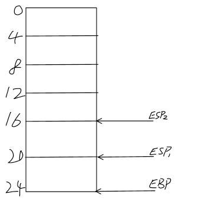

# 操作系统系列-动手写个IPL-下
> 继续上章内容，上章内容请参考`操作系统系列-动手写个IPL-上`

> 在上一节中，我们漏掉了一个重要的寄存器，那就是ip(16位，32位下对应的是eip)寄存器，ip寄存器是指令指针寄存器，指向下一条要执行的指令；ip寄存器我们无法直接修改他的值，只能通过某些指令来修改，例如jmp、call等；

## 汇编讲解
### 栈
在上节我们提到了寄存器，其中有两个特殊的寄存器`ebp`、`esp`，这两个寄存器是栈寄存器，其中`ebp`是栈底寄存器，`esp`是栈顶寄存器，栈通常用于我们存放临时数据、方法参数等，虽然`ebp`是所谓的栈底，但是由于栈是从上往下增长的，所以实际上`ebp`是内存的高地址，而`esp`是内存的低地址；栈的常用操作指令是`push`和`pop`，`push`表示压栈，即将数据放入栈中，同时会相应的减小`esp`的值（因为栈是向下增长的，所以实际上`esp`的值会减小），而`pop`表示出栈，表示将数据从栈中弹出，同时会增加`esp`的值；

> push与mov同样有带数据大小的指令，即`pushb`、`pushw`、`pushl`，分别操作8/16/32位的数据；

> `pushl %eax`相当于`subl $4, %esp`  `movl %eax, (%esp)`这两条指令，`pop`类似；


更直观一点儿的示例：


如下图所示，有一个6*32位的栈，一个格子表示32位，左边是地址，可以看到栈的起始地址（栈底）`ebp`是24，如果当前`esp`在`esp1`的位置（20），此时需要把`eax`压栈，则首先把`esp`的地址减去4，也就是指到`esp2`的位置（16），然后将`eax`的值放入当前`esp`指向的地址中（16-20这段内存空间）；





### call指令
函数调用指令，使用方法：`call address`，即`call`指令后边跟函数地址，通常我们会使用`label`（比如上一节`IPL`中的`printInt`就是一个`label`）来代替实际的地址，这样汇编器编译的时候会自动将`label`替换为实际地址，当然我们也可以直接物理编码一个地址(前提是要事先知道函数的地址，不过这对于我们的IPL来说并非不可能)，不过就是不太方便，而且容易出错，费力不讨好；


`call`指令是为数不多可以修改`ip`寄存器值的指令之一，`call function_address`相当于以下指令组合：
```
# 先将当前ip/eip压栈
pushl %eip
# 然后将要跳转的函数地址放入ip/eip寄存器中
movl function_address, %eip
```

`call`指令与`jmp`指令都能跳转到指定位置执行，不同的是，`call`指定调用的函数可以通过`ret`指令来返回，当我们调用`ret`指令时，就相当于执行以下指令：

```
# 将栈顶弹出到ip/eip寄存器，然后cpu会跳转到我们函数调用之后执行
popl %eip
```

需要注意的是，因为`ret`指令的正确执行是依赖于当前栈顶数据的正确性，而我们的函数中也是可以操作栈的，所以如果函数中进行栈相关操作，在执行`ret`的时候需要还原，否则`ret`指令就可能由于栈顶数据错误导致跳转到未知地址；

> ip/eip一旦入栈后就是一个普通数据，我们可以随意修改，此时就可以利用此思路修改函数返回地址；


### int指令
`int`指令是一个很重要的指令，表示中断调用，也是调用一个函数，不过`int`调用的函数是固定的、预先设置好的，`int`指令后边跟的是中断号，而我们的内存中会有一个中断向量表，表中记录的是不同的中断号对应的处理函数地址，而初始时，中断向量表是由`BIOS`系统提供的，我们IPL中调用的`0x10`号中断，提供的功能就是显示函数，将我们要展示的数据输出到屏幕上；


> 中断是一个重要的概念，这也是我们计算机能高效处理不同事件的核心，是真正的异步处理，中断可以来自我们的程序主动调用，像我们的IPL中那样，也可以来自于外部，例如键盘、鼠标、网卡等；

> 中断发生时，cpu会停止正在处理的程序，转而处理中断，这就意味着我们不必让cpu一直等某个事件，只需要事件来的时候给一个中断通知即可，如果没有中断机制，cpu就需要一直等在那里，或者隔一段时间查看一下事件是否就绪，效率相当低下；中断机制其实就是最底层的异步编程；

### 大小端
如果有过c语言编程的经验，可能会对大小端很熟悉，所谓的大小端，指的是一个大于1byte的数字是如何存储的，例如对于`short`（2 byte）类型的`65280`（十进制）来说：

对于大端序（Big Endian），数字的高位保存在内存的低地址，数字的低位保存在内存的高地址，这种存储方式类似于我们阅读数字的顺序，从左到右，从高位到低位，实际存储如下：

| 内存地址 | 0x0001 | 0x0002 |
| --- | --- | --- |
| 存放内容 | 0xff | 0x00 |

而对于小端序（Little Endian），数字的高位保存在内存的高地址，数字的低位保存在内存的低地址，这种存储方式与我们阅读数字的顺序相反，实际存储如下：

| 内存地址 | 0x0001 | 0x0002 |
| --- | --- | --- |
| 存放内容 | 0x00 | 0xff |


我们为什么忽然讲这个呢？有机智的小伙伴可能已经想到了，那就是跟我们的`IPL`有关，`IPL`要求磁盘的第一个扇区的最后两个字节必须为`0x55 0xaa`，其中`0x55`在第一个扇区最后两个字节内存的低地址`510`处，`0xaa`在第一个扇区最后两个字节内存的高地址`511`处，我们的`IPL`中是这么定义的：

```
.org 510
.byte 0x55, 0xaa
```

我们这里使用了`byte`这个数据类型，声明了两个字节的数据，数据从左到右在内存的地址递增，这样我们可以保证这个程序编译完后最后两字节符合`IPL`的要求，这里可以用`short`类型的数据来代替，这样只需要声明一个数字即可，但是我们并没有这么做，而原因就是因为大小端的存在，如果你编译好的程序最终是运行在大端序的架构上，那么这里如果要使用`short`代替，应该这样写：

```
.org 510
.short 0x55aa
```

而如果你编译好的程序最终是运行在小端序的架构上（例如x86架构），那么这里使用`short`代替时应该这样写：
```
.org 510
.short 0xaa55
```

可以看出，`short`虽然可以让我们只定义一个数字即可，但是由于大小端的存在，我们需要针对不同架构写不同的代码，所以还是使用`byte`更方便一点儿，不用关心大小端；


> 其中`.org 510`指令表示这个指令后边的内存地址从`510`开始（磁盘第一个扇区最后两个字节的起始地址），你也可以不用该指令，而是手动计算前边汇编所占用的字节，然后手动使用多个`.byte 0x00`将其填充到`510`地址处，不过这样比较麻烦，还容易出错，所以我们就使用该指令帮我们完成这件事；


## 小结
通过这两章我们完成了一个简单的`IPL`，同时也学习到了一些简单的汇编，汇编整体来说语法还是比较简单的，后续的文章我们就不会针对汇编指令单独讲解了，大家遇到陌生指令可以直接查汇编手册（如果需要可以联系作者获取）


# 联系我
- 作者微信：JoeKerouac
- 微信公众号（文章会第一时间更新到公众号，如果搜不出来可能是改名字了，加微信即可=_=|）：代码深度研究院
- GitHub：https://github.com/JoeKerouac


