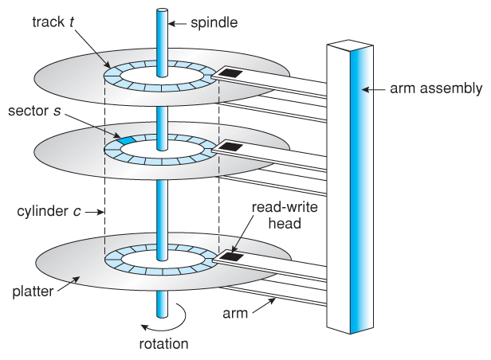

# 原来磁盘是这么读取的

在我们做操作系统时，BIOS会帮我们把磁盘的第一个扇区读到内存中，执行里边的代码，显然我们的系统不可能只有一个扇区大小，所以不可避免的要从磁盘读取数据，那么应该如何读取呢？本文告诉你如何使用PIO（Programmed I/O）读取磁盘；

## 磁盘小知识



一个硬盘通常由：

- 多个盘片（Platters）：像光盘一样的圆盘，用于存储数据。
- 每个盘片有两个面：上下两面都可以存数据。
- 每个面上有磁道（Track）：同心圆，像树的年轮一样分布。
- 每个磁道被划分为若干扇区（Sector）：最小的数据单位。
- 磁头（Head）负责读取/写入磁道上的数据。
- 柱面：柱面（Cylinder）是所有盘片上同一个位置的磁道集合。
- 扇区（Sector）是磁盘中最小的存储单位，你可以把它理解为硬盘上的一个“数据小格子”，所有数据都是按扇区进行读写的。每个扇区都有一个唯一编号，早期硬盘一个扇区的大小通常是512byte，现代硬盘通常为4K；

## 如何对磁盘寻址

对磁盘寻址通常可以通过以下两种方式：

- CHS：CHS指的就是cylinder（柱面）、head（磁头）、sector（扇区），由这三个维度确认唯一一个扇区，较为麻烦；
- LBA：LBA（Logical Block Addressing）是一种将磁盘地址逻辑化的方式，把磁盘的每个扇区从0开始按照自然数编号（例如0, 1, 2,
  ...），使用起来更方便；

其中LBA又分为两种：

- LBA28
- LBA48

其中的数字是地址线的大小，28表示地址线为28 bit，48则是48 bit，早期使用的是28，可寻址128G（2^28 * 512byte）磁盘空间，而当磁盘逐渐变大后，28
bit地址线不够用了，所以地址线扩展到了48 bit，可寻址大小为128PB（2^48 * 512byte）；

## 如何使用PIO读取磁盘

### 理论知识

> PIO模式使用大量的CPU资源，因为在磁盘和CPU之间传输的每个字节数据都必须通过CPU的IO端口总线（而不是内存）发送。在某些CPU上，PIO模式仍然可以实现每秒16MB的实际传输速度，但计算机上的其他进程不会获得任何CPU时间。

硬盘控制器通常最少有两个总线(ATA bus)：

- Primary ATA Bus（主通道）
- Secondary ATA Bus（副通道）

每个总线最多可以挂载两个设备（主设备、从设备），因此一个控制器最多控制4个IDE设备；

> 注意，这里的主通道、副通道，主设备、从设备实际上并没有主从关联性，只不过以前习惯于叫master、slave；现在因为某些原因，技术上通常会避开master、slave的叫法；

可以通过每个总线上的10个标准端口来与硬盘通信，这些端口由ATA定义，通常是固定地址，其中有：

- 8个是控制端口：
    - 主通道为0x1F0~0x1F7
    - 副通道为0x170~0x177
- 2个设备控制寄存器/备用状态端口：
    - 主通道：0x3F6~0x3F7
    - 副通道：0x376~0x377


**8个控制端口功能定义如下**

| IO端口号偏移 | 读/写方向 | 功能                 | 描述                             | 大小 LBA28/LBA48 |
|---------|-------|--------------------|--------------------------------|----------------|
| 0       | R/W   | 数据寄存器              | 读/写 PIO 数据字节                   | 16 位 / 16 位    |
| 1       | R     | 错误寄存器              | 用于检索上次执行的 ATA 命令生成的任何错误        | 8 位 / 16 位     |
| 1       | W     | 功能寄存器              | 用于控制特定命令接口功能                   | 8 位 / 16 位     |
| 2       | R/W   | 扇区计数寄存器            | 要读/写的扇区数（0 是一个特殊值）             | 8 位 / 16 位     |
| 3       | R/W   | 扇区号寄存器（LBA lo）     | 这是针对 CHS / LBA28 / LBA48 的特定内容 | 8 位 / 16 位     |
| 4       | R/W   | 磁头低位寄存器 /（LBA mid） | 部分磁盘扇区地址                       | 8 位 / 16 位     |
| 5       | R/W   | 磁头高位寄存器 /（LBA hi）  | 部分磁盘扇区地址                       | 8 位 / 16 位     |
| 6       | R/W   | 驱动器/磁头寄存器          | 用于选择驱动器和/或磁头。支持额外的地址/标志位       | 8 位 / 8 位      |
| 7       | R     | 状态寄存器              | 用于读取当前状态                       | 8 位 / 8 位      |
| 7       | W     | 命令寄存器              | 用于向设备发送 ATA 命令                 | 8 位 / 8 位      |

> 这里IO端口号偏移是基于最小控制端口的偏移量


**2个设备控制寄存器/备用状态端口定义如下**

| IO端口号偏移 | 读/写方向	 | 功能        | 描述               | 大小 LBA28/LBA48 |
|---------|--------|-----------|------------------|----------------|
| 0       | R      | 替代状态寄存器	  | 状态寄存器的副本，但不会触发中断 | 8-bit / 8-bit  |
| 0       | W      | 设备控制寄存器	  | 用于复位总线或启用/禁用中断	  | 8-bit / 8-bit  |
| 1       | R      | 驱动器地址寄存器	 | 提供驱动器选择和磁头选择信息	  | 8-bit / 8-bit  |

> 这里IO端口号偏移是基于最小设备控制端口的偏移量

**对于错误寄存器的各位表示如下**

| 位 (Bit) | 缩写 (Abbreviation) | 功能说明 (Function)                     |
|---------|-------------------|-------------------------------------|
| 0       | AMNF              | 未找到地址标记（Address mark not found）     |
| 1       | TKZNF             | 未找到0号磁道（Track zero not found）       |
| 2       | ABRT              | 命令已中止（Aborted command）              |
| 3       | MCR               | 请求更换介质（Media change request）        |
| 4       | IDNF              | 未找到ID（ID not found）                 |
| 5       | MC                | 介质已更换（Media changed）                |
| 6       | UNC               | 不可纠正的数据错误（Uncorrectable data error） |
| 7       | BBK               | 检测到坏块（Bad Block detected）           |


### 实际代码

下面给出一个PIO模式读取磁盘的示例代码：

> 注意，示例中写死了使用主通道，主设备；

```c

static inline void outb(uint16_t port, uint8_t data) {
    asm volatile ("outb %0, %1" :: "a" (data), "d" (port) : "memory");
}

static inline void insl(uint32_t port, void *addr, uint32_t cnt) {
    // insl指令应该是att特有的语法，Intel中是insd
    asm volatile (
        "cld;"
        "repne; insl;"
        : "=D" (addr), "=c" (cnt)
        : "d" (port), "0" (addr), "1" (cnt)
        : "memory", "cc");
}

/**
 * @brief 等待磁盘ready
 * 
 */
static void waitdisk(void) {
    while ((inb(0x1F6) & 0xC0) != 0x40)
        /* do nothing */;
}

/**
 * @brief 以PIO的方式读取一个扇区，扇区号使用LBA编码
 * 
 * @param dst 目标地址
 * @param secno 读取的扇区号，LBA，扇区号从0开始
 */
static void readsect(void *dst, uint32_t secno) {
    waitdisk();

    // 读取master固定写出0x40，slave写出0x50
    // 01000000b - bit6设为1表示LBA模式，bit4设为0表示主盘
    outb(0x1f6, 0x40);
    
    outb(0x1f2, 0);
    // LBA[31:24]
    outb(0x1f3, (secno >> 24) & 0xff);
    // 因为我们的secno实际是32位的，所以这里实际上应该固定是0
    // LBA[39:32]
    outb(0x1f4, 0);
    // LBA[47:40]
    outb(0x1f5, 0);

    outb(0x1f2, 1);
    // LBA[7:0]
    outb(0x1f3, secno & 0xff);
    // LBA[15:8]
    outb(0x1f4, (secno >> 8) & 0xff);
    // LBA[23:16]
    outb(0x1f5, (secno >> 16) & 0xff);

    // 48bit LBA读取命令
    outb(0x1f7, 0x24);

    // 等待磁盘ready
    waitdisk();
    // 开始从0x1f0端口读数据
    insl(0x1f0, dst, SECTSIZE / 4);
}

```


# 联系我
- 作者微信：JoeKerouac
- 微信公众号（文章会第一时间更新到公众号，如果搜不出来可能是改名字了，加微信即可=_=|）：代码深度研究院
- GitHub：https://github.com/JoeKerouac


