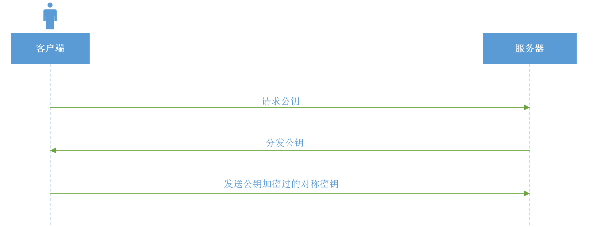

# 通过局域网中间人攻击学网络 续
## 续 HTTPS篇1
### Abstract
> 最近因为个人原因停更有段时间，后边会慢慢恢复更新；

前三篇基本把局域网中间人攻击的原理介绍了一下，根据前三篇我们可以做一个简易的工具来实现局域网攻击了，但是攻击过程中你可能会发现一个问题，当前大多数
网站都已经采用HTTPS链接了，这样会导致你抓到的数据都是加密过的，没办法查看、修改，那搞中间人攻击干啥呢？抓包抓了个寂寞吗？要解决这个问题，我们首先
要清楚HTTPS是什么；

### 什么是HTTPS，HTTPS解决了什么问题？
要了解什么是HTTPS，我们首先要知道HTTPS解决了什么问题；在传统HTTP的场景下，很容易就会被我们前边的中间人攻击手段攻击，因为数据都是明文传输的，那么
怎么解决这个问题呢？答案就是加密，我们把要传输的内容加密，这样即使被中间人截获中间人也只能得到一堆乱码，得不到真正要传输的明文；

虽然加密能解决中间人攻击的问题，但是加密本身会带来了一个新的问题，我们应该如何加密呢？传统的对称加密要求加密双方要有一个相同的密钥，这样双方才能互
相解密对方发送的加密信息，那么服务器如何告诉客户端这个加密密钥呢？因为目前为止我们的网络都是不可信的（未加密的），也就是我们不能直接通过网络传输这
个密钥，幸好我们有非对称加密，非对称加密使用一对公私钥对数据进行加解密，公钥可以加密，加密数据只有私钥可以解密，公钥无法对加密数据进行解密，也就是
我们可以随意分发公钥，只要不泄露私钥，我们的加密数据就不可能（短时间内，如果时间无限算力无限的话目前没有任何加密算法是安全的）被攻击者解密，然而
非对称加密有些问题：
- 一个是只能使用公钥加密，私钥不能做加密操作，所以当服务端把公钥分发出去后，只有客户端发往服务端的消息能被加密，而服务端发往客户端的消息无法做加
密操作，这样就只能做单向加密；
- 还有一个就是非对称加密由于其算法导致如果要做到相同的安全等级效率要比对称加密低好多，所以如果使用非对称加密来加密传输数据会导致服务端性能大幅下降；

虽然有以上两个问题，但是不要忘了我们还有对称加密，如果将其两者结合，那岂不是就可以了？我们可以这样做：将服务端的公钥分发出去，客户端随机生成一个对称
加密密钥，然后通过公钥加密发送给服务端，这样该对称加密密钥的传输安全问题就解决了，而服务端收到加密后的密钥后使用非对称加密的私钥解密出真正的对称加密
密钥，这样客户端和服务端就完成了对称密钥的交换，后续只需要使用对称加密算法加密传输数据即可，这样就完美解决上边提到的两个非对称加密的问题了；整个流程
如下图所示：

到这里，我们就完成了在不可信网络上安全的交换加密密钥并且构建安全信道通讯的过程，而这个正是HTTPS所做的事情，HTTPS将其进行了规范化，上述是比较简
单的描述，并且使用的加密套件（后续会解释）也是不安全的，完整的HTTPS协议如下图所示：

现在，我们已经弄清楚了HTTPS是什么以及HTTPS解决了什么问题；后续我们将详细解析HTTPS协议，对握手的每个步骤进行拆分详解；另外，目前作者已经实现了
一个丐版的HTTPS握手流程，在 [git仓库](https://github.com/JoeKerouac/net) 中，找到tls包，代码就在里边，如果等不及后续文章更新可以先看
源码学习，里边仅实现了两个加密套件，同时对于重连等复杂场景也没有处理，所以称其为丐版HTTPS握手，不过用来学习基本也够了；

## 联系我
- 作者微信：JoeKerouac
- 微信公众号（文章会第一时间更新到公众号）：代码深度研究院
- GitHub：https://github.com/JoeKerouac

## 参考文献
- TLS1.2定义：https://tools.ietf.org/html/rfc5246