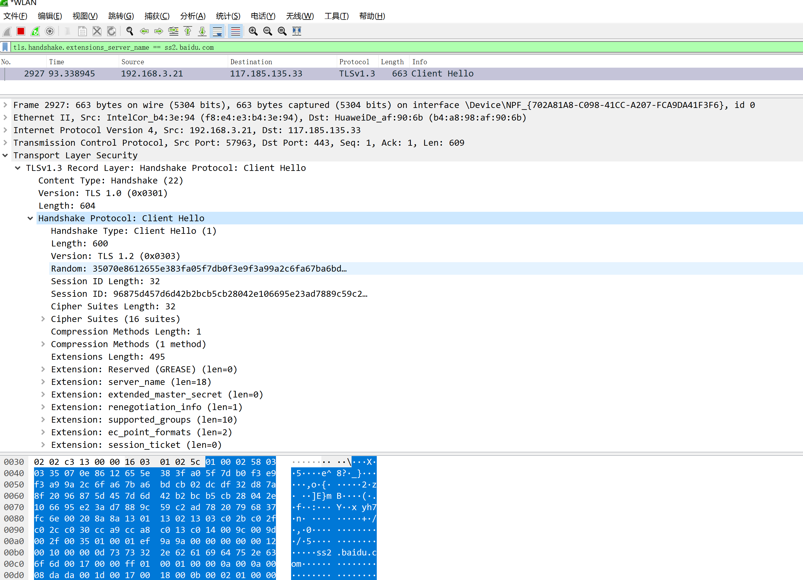

# 通过局域网中间人攻击学网络 续
## 续 HTTPS篇2
### 抓包环境
本章开始分析握手包，分析过程中会涉及抓包，为了尽可能方便，后续都采用对百度的抓包，工具；wireshark，使用过滤条件（不过滤的话包太多不好找）：
`tls.handshake.extensions_server_name == ss2.baidu.com`

### Record数据结构
HTTPS中数据都是通过Record层进行包装的，Record的数据结构如下：

```java
public class Record <T>{

    /**
     * 一个byte的contentType
     */
    private byte contentType;

    /**
     * 两个byte的版本号，高8位是主版本号，低8位是副版本号
     */
    private short version;

    /**
     * 两个byte的长度字段，表示后边数据的长度
     */
    private short length;
    
    private T content;
    
}
```

其中`contentType`是一个枚举值，枚举如下：
```
0x14: CHANGE_CIPHER_SPEC（更换到加密通道通知）
0x15: ALTER（警告信息）
0x16: HANDSHAKE（握手消息）
0x17: APPLICATION_DATA（应用数据）
```
其中`CHANGE_CIPHER_SPEC`、`ALTER`、`HANDSHAKE`都有可能在握手阶段发送；


`version`也是一个枚举值，枚举如下：
```
0x0301: TLS1.0
0x0302: TLS1.1
0x0303: TLS1.2（目前已发布的最新版就是这个版本，TLS1.3还处在草案中）
```

### ClientHello
ClientHello的数据结构如下:

```java
public class ClientHello{

    /**
     * 1byte的握手类型
     */
    private byte handshakeType;

    /**
     * 3byte的长度字段，表示后续数据长度；注意：虽然这里定义的是int，但是实际网络传输中只使用了3byte而不是4byte
     */
    private int len;

    /**
     * 2byte的版本号
     */
    private short version;

    /**
     * 固定32byte的客户端随机数，密钥交换的时候会用
     */
    private byte[] random;

    /**
     * 1byte的session长度，恢复会话的时候会用，首次连接固定是0
     */
    private byte sessionLen;

    /**
     * sessionLen 长度的session byte数组
     */
    private byte[] session;

    /**
     * 密码套件数据长度，注意：不是密码套件的数量，而是所有密码套件序列化后的字节数组长度
     */
    private short cipherSuitesLen;

    /**
     * 密码套件，一个密码套件为2byte（即一个short）
     */
    private List<Short> cipherSuites;

    /**
     * 压缩方法长度，因为一些安全问题目前压缩已经禁用了；
     */
    private byte compressionMethodLen;

    /**
     * 压缩方法byte数组，因为压缩方法禁用了，所以目前长度固定0；
     */
    private byte[] compressionMethod;

    /**
     * 2byte的扩展长度
     */
    private shrot extensionsLen;

    /**
     * 扩展
     */
    private List<Extension> extensions;
    
}
```

HTTPS握手的第一步就是一个ClientHello消息，我们先通过wireshark抓一个包来看看，wireshark抓包如下（开启wireshark后通过浏览器访问百度）：


可以看到，这个是完全符合我们上边定义的，clientHello中特别关注的有几个，分别是random、cipherSuite和extension；

#### random
这个是密钥交换过程中需要使用的，需要使用随机数（不能使用固定值），防止被攻击，具体使用后边会说，在密钥交换过程中是一个很重要的参数；

#### CipherSuite
cipherSuite定义的就是后续要使用的加密组件，下面我们用其中的 `TLS_ECDHE_RSA_WITH_AES_256_GCM_SHA384` 来讲下这一长串加密定义是什么意思；


首先是TLS是固定的，表示这是TLS加密套件；


然后是 `ECDHE_RSA` ，这个代表的是后续使用 `ECDHE` 密钥交换算法， `RSA` 表示证书密钥算法是用的RSA，这里
要特别说下 `ECDHE` 密钥交换算法，很多人脑子里一想到HTTPS估计第一时间想到的就是公钥加密一个对称加密的密钥然后私钥解密，这样来交换对称加密的密钥，但
是这种算法没有前向安全性，什么是前向安全性呢？举个例子，假如你用的这种算法来交换密钥，虽然当时可能无法破解，因为对称加密密钥被RSA公钥加密了，没有私钥
没办法解密，但是别人可以将加密数据先保存下来，等到某天，如果这个网站的RSA私钥泄露了，甚至网站开发者被政府要求主动提供私钥，这时开发者一般是无法拒绝
的，而一旦这个私钥泄露，别人就能解密之前你的加密数据了，一旦密钥泄露，之前所有的加密数据都将不安全，这个就是没有前向安全性，而ECDH（和ECDHE原理上
是一样的，不过有些细节不一样）密钥交换算法就是解决这个问题的；


然后是AES_256_GCM，这个就是最终我们要使用的对称加密算法了，AES_256_GCM就 表示使用256bit密钥的AES算法，GCM是AES的一种模式（建议使用这个模
式的AES，其他模式的AES有潜在问题，已经不太安全了），用于对加密内容生成摘要的处理，因为仅仅加密的话只能保证不被别人查看，但是无法保证不被篡改（就
是别 人拿到一串密文后，随机将其中的一个bit从0标为1或者从1变为0，如果运气够好正好 修改后解密出来的内容也是有含义的、我们也能消费，这样就会导致一
些问 题，而且我们还无从得知消息是否被篡改），所以需要加一个摘要，这样一旦消息被篡改，因 为 攻击者无法生成正确的摘要，所以我们只要验证摘要就能判断
出来 消息是被篡改过的，从而可以避免被攻击；


最后就是SHA384了，这是一个MAC算法，握手过程中密钥交换和最后的finish消息会用到；


#### extension
扩展中有几个比较重要的扩展，最终是会影响握手的，例如elliptic_curves和ec_point_formats（这个扩展值是固定的）这两个扩展，如果我们选用ECC相关
的密钥交换算法（例如ECDH），就必须有这个扩展， 告诉对方我们选用的曲线ID，还有extended_master_secret这个扩展，如果有这个扩展，那么密钥交换的
过程中一些密钥生成细节将会更改，如果不正确的设置 或者不正确的消费将会导致通信双方无法协商出一致的密钥最终导致握手失败；


## 结束
本文将clientHello包进行了一个简单的分析，同时对里边需要关注的点进行了简单的说明，可以自己尝试抓个包看看，熟悉下工具，也熟悉下抓包内容；


## 联系我
- 作者微信：JoeKerouac
- 微信公众号（文章会第一时间更新到公众号）：Java初学者
- GitHub：https://github.com/JoeKerouac

## 参考文献
- TLS1.2定义：https://tools.ietf.org/html/rfc5246