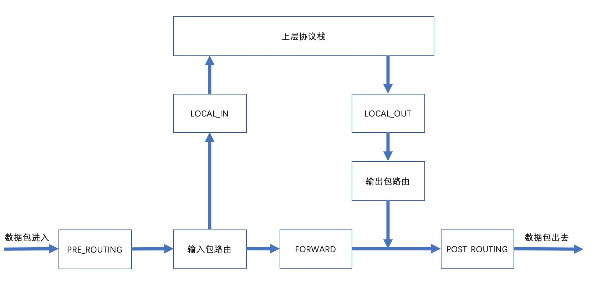

# 通过局域网中间人攻击学网络 
## 第三篇 netfilter框架之内核篇
在第二篇中，我们讲到可以用ARP欺骗的形式将局域网内某个主机的流量转发到我们的机器上，那我们如何对该流量进行拦截修改呢？在Linux下，我们可以
使用netfilter框架来实现对ip数据拦截修改；

### 什么是netfilter？
Netfilter是Linux 2.4.x引入的一个子系统，它作为一个通用的、抽象的框架，提供一整套的hook函数的管理机制，使得诸如数据包过滤、网络地址转
换(NAT)和基于协议类型的连接跟踪成为了可能。

在netfilter框架中有五个hook点，如下图所示：



五个hook点说明如下：
- PRE_ROUTING:经过混杂丢弃后所有到达本机的数据包；
- LOCAL_IN:经过PRE_ROUTING后，如果数据包的ip地址是本机，那么进入该hook；
- FORWARD:经过PRE_ROUTING后，如果发现数据包的地址不是本机，那么将会进入到该hook；
- LOCAL_OUT:本机的上层协议栈发出的数据包都会进入到该hook；
- POST_ROUTING:所有经过本机出去的数据包最终都会进入到该hook；

### 示例
netfilter框架可以允许我们注册一个回调函数，用来在指定hook点对数据包进行一些处理，一个简单的hook如下（nf_kernel_custom_hook.c）：
```
#define __KERNEL__
#define MODULE

#include <linux/netfilter_ipv4.h>
#include <linux/module.h>
#include <linux/kernel.h>
#include <linux/ip.h>
#include <linux/tcp.h>
#include <linux/udp.h>
#include <linux/netfilter.h>


static struct nf_hook_ops nfho;

// 实际的hook函数，函数定义是固定的，
unsigned int hook_func(unsigned int hooknum,struct sk_buff *skb, const struct net_device *in, const struct net_device *out, int (*okfn)(struct sk_buff*)){
    // 返回NF_QUEUE，表示要将该数据包交给用户空间处理
    return NF_QUEUE;
}

// 模块初始化函数
int init(void){
    printk(KERN_INFO "init_module nf_kernel_custom_hook\n");
    // hook函数指向我们定义的hook函数
    nfho.hook = hook_func;
    /* hook点，表示我们要将我们的函数注册到NF_IP_PRE_ROUTING这个hook点 */
    nfho.hooknum = NF_IP_PRE_ROUTING;
    // 该hook点在IPv4数据包下生效
    nfho.pf = PF_INET;
    // 定义优先级
    nfho.priority = NF_IP_PRI_FIRST;
    nf_register_hook(&nfho);
    return 0;
}

// 模块卸载函数
void cleanup(void){
    printk(KERN_INFO "cleanup_module nf_kernel_custom_hook\n");
    nf_unregister_hook(&nfho);
}

// 声明模块的初始化/卸载函数分别是哪个
module_init(init);
module_exit(cleanup);
```
对于`hook_func`函数来说，可以返回五种操作，分别如下：
- NF_DROP:0:直接删除该包
- NF_ACCEPT:1:接受该包，继续往后处理，会继续调用后续的hook函数；
- NF_STOLEN:2:忘记该包，与NF_DROP的区别是NF_DROP会释放sk_buff资源，而NF_STOLEN不会释放sk_buff资源，需要函数自己释放；
- NF_QUEUE:3:将包加入队列，然后等待用户空间决策；怎么处理；
- NF_REPEAT:4:将数据包返回上个节点处理；
- NF_STOP:5:与NF_ACCEPT类似，不同的是后边的HOOK拦截器不会被执行了，注意，实际上这个操作已经废除了；

从五种操作来说，`NF_QUEUE`是我们需要的，可以将数据包转到用户空间决策，所以上述代码直接拿来用即可；

> 为什么要转到用户空间操作呢？一是因为开篇我们就说了，作者主要是做Java的，所以还是用Java写起来比较顺手，而且我们本身是要做一个工具的，具
体的性能什么的我们其实并不是太关心，所以没必须要用c在内核搞，如果你是想要做一个简单的功能或者是对性能有要求可以直接用c写，放内核空间执行；
二是因为我们这个后续可能还需要跟用户（我们自己）交互，放内核空间不太可行，交互起来不方便，所以最终决定用NF_QUEUE转发到用户空间，由用户
空间的程序处理，这样我们就可以用Java来搞了；

### 编译/安装
现在有了上面的程序，我们就能将发往本机或者由本机转发的IP数据包拦截到用户空间了，这样我们就能进行一些操作了，比如偷看下该IP数据包的内容、拦
截该数据包等；但是我们需要将他编译安装到内核中才行，那么如何编译呢？首先我们在该文件的同一个目录中创建一个Makefile文件，文件名字就叫
`Makefile`，内容如下：

```
CONFIG_MODULE_SIG=n
obj-m+=nf_kernel_custom_hook.o
all:
	make  -C /lib/modules/$(shell uname -r)/build/ M=${PWD} modules
clean:
	make  -C /lib/modules/$(shell uname -r)/build/ M=${PWD} clean

```

然后我们在该目录下执行`make`命令即可，编译结果中会有一个`.ko`文件，然后我们使用`insmod nf_kernel_custom_hook.ko`命令来将该程序安装到
内核中，安装成功后可以使用`lsmod`查看是否安装成功，如果里边有一个叫`nf_kernel_custom_hook`的module，说明我们的程序安装成功；

到这里，我们内核空间的程序就完成了，现在我们已经借助netfilter框架将本机路由的数据包发往用户空间去决策了，我们只需要在用户空间接受该数据
包然后作相应的处理（比如删除、查看）即可；

过程中出现任何问题，都可以加作者微信`qiao1213812243`寻求帮助，作者将尽最大努力帮你解答疑惑；


### 附录
如果你只想快速的完成一个内网中间人攻击工具，那么上边的内容已经足够了，但是如果你想要了解更多，比如当我们搜索`NF_QUEUE`的时候，很多答案会
告诉我们可以选择将数据放入指定队列号的队列中，默认是0号队列，那么如果想要指定放入1号队列该怎么做呢？要知道该问题，我们就要知道netfilter的
执行链路是怎么样的，这样才能知道netfilter是怎么根据我们的返回值决策出来走哪个队列的；

通过翻阅代码可以找到函数`NF_HOOK`（定义在netfilter.h中），可以看到该函数就是netfilter的入口函数了，在`ip_forward`、
`ip_local_deliver`等函数处都回调了该函数，该函数又回调了`nf_hook`函数，该函数定义如下：
```
static inline int nf_hook(u_int8_t pf, unsigned int hook, struct net *net,
                          struct sock *sk, struct sk_buff *skb,
                          struct net_device *indev, struct net_device *outdev,
                          int (*okfn)(struct net *, struct sock *, struct sk_buff *))
{
        // 定义hook链表
        struct nf_hook_entries *hook_head = NULL;
        int ret = 1;

#ifdef CONFIG_JUMP_LABEL
        if (__builtin_constant_p(pf) &&
            __builtin_constant_p(hook) &&
            !static_key_false(&nf_hooks_needed[pf][hook]))
                return 1;
#endif
        rcu_read_lock();
        // 开始路由该数据包的hook链表（我们注册的hook就在这里边）
        // 可以看出，netfilter框架支持IPv4、IPv6、ARP（竟然还支持ARP，有点儿强大）、Bridge、DECnet；我们现在只需要IPv4，所以其他
        // 几个虽然有不认识的协议，但是我们并不关心，有兴趣的可以自行百度了解下其他几个协议，其实主要是DECnet这个没怎么见过；
        switch (pf) {
        case NFPROTO_IPV4:
                // 如果数据是IPv4的数据，那么会走这里，我们的hook函数也注册在hooks_ipv4里边，如果该hook点是NF_IP_PRE_ROUTING
                // 那么返回的hook链表里边将会包含我们上边的示例程序注册的函数；
                hook_head = rcu_dereference(net->nf.hooks_ipv4[hook]);
                break;
        case NFPROTO_IPV6:
                hook_head = rcu_dereference(net->nf.hooks_ipv6[hook]);
                break;
        case NFPROTO_ARP:
#ifdef CONFIG_NETFILTER_FAMILY_ARP
                if (WARN_ON_ONCE(hook >= ARRAY_SIZE(net->nf.hooks_arp)))
                        break;
                hook_head = rcu_dereference(net->nf.hooks_arp[hook]);
#endif
                break;
        case NFPROTO_BRIDGE:
#ifdef CONFIG_NETFILTER_FAMILY_BRIDGE
                hook_head = rcu_dereference(net->nf.hooks_bridge[hook]);
#endif
                break;
#if IS_ENABLED(CONFIG_DECNET)
        case NFPROTO_DECNET:
                hook_head = rcu_dereference(net->nf.hooks_decnet[hook]);
                break;
#endif
        default:
                WARN_ON_ONCE(1);
                break;
        }

        // 如果对应的协议，对应的hook点有对应的hook函数，那么将调用nf_hook_slow
        if (hook_head) {
                struct nf_hook_state state;

                nf_hook_state_init(&state, hook, pf, indev, outdev,
                                   sk, net, okfn);

                ret = nf_hook_slow(skb, &state, hook_head, 0);
        }
        rcu_read_unlock();

        return ret;
}
```

该函数比较简单，只是路由到了对应的hook链表，然后就交给`nf_hook_slow`函数处理了；`nf_hook_slow`函数定义如下：

```
int nf_hook_slow(struct sk_buff *skb, struct nf_hook_state *state,
                 const struct nf_hook_entries *e, unsigned int s)
{
        unsigned int verdict;
        int ret;
        
        // 循环调用hook链表中的hook函数，可以看到NF_STOP操作确实已经废除了，所以这里只剩下四个操作了
        for (; s < e->num_hook_entries; s++) {
                verdict = nf_hook_entry_hookfn(&e->hooks[s], skb, state);
                switch (verdict & NF_VERDICT_MASK) {
                case NF_ACCEPT:
                        // 什么都不做，继续下个hook函数
                        break;
                case NF_DROP:
                        // 直接释放该网络数据包的内存（即删除）
                        kfree_skb(skb);
                        ret = NF_DROP_GETERR(verdict);
                        if (ret == 0)
                                ret = -EPERM;
                        return ret;
                case NF_QUEUE:
                        // 这里是我们需要的，可以看到对于返回NF_QUEUE的，最终都会调用nf_queue函数去处理，并且会将hook函数的决策结果
                        // verdict传入进去
                        ret = nf_queue(skb, state, s, verdict);
                        if (ret == 1)
                                continue;
                        return ret;
                default:
                        // 只要不是上边一个操作，都默认是NF_STOLEN
                        return 0;
                }
        }

        return 1;
}
```

这个函数也很简洁，注意这里的`verdict & NF_VERDICT_MASK`操作，为什么这样操作呢？`NF_VERDICT_MASK`的定义是`0x000000ff`，可以看出该
操作只取了低8位，如果只需要低8位，那直接返回一个8位的数字就行，为什么还要一个32位的返回呢？别急，后边我们就知道为什么了；下面我们进入
`nf_queue`函数，`nf_queue`函数定义如下：

```
int nf_queue(struct sk_buff *skb, struct nf_hook_state *state,
             unsigned int index, unsigned int verdict)
{
        int ret;
        
        ret = __nf_queue(skb, state, index, verdict >> NF_VERDICT_QBITS);
        if (ret < 0) {
                if (ret == -ESRCH &&
                    (verdict & NF_VERDICT_FLAG_QUEUE_BYPASS))
                        return 1;
                kfree_skb(skb);
        }

        return 0;
}
```

注意看下边这一行
```
ret = __nf_queue(skb, state, index, verdict >> NF_VERDICT_QBITS);
```

其中`NF_VERDICT_QBITS`定义是`16`，将`verdict`右移16位，`verdict`是32位的，也就是取`verdict`的高16位，取这个干吗呢？做队列号用！！
`__nf_queue`函数的最后一个参数就是队列号，到这里，我们前边的问题就得到解答了，原来队列号是在返回的决策结果的高16位记录的，这也是为什么
返回结果定义为32位的数字而不是8位的数字，因为这个队列号是16位数字，所以也决定了队列最多有65536个；


到这里，我们已经知道netfilter的大概执行流程，并且知道了返回`NF_QUEUE`时如何指定队列号了，如果我们不想用默认的0号队列，比如想要用1号队
列，那么可以这样返回：
```
return 1 << 16 | NF_QUEUE;
```

学习过程中也可以看出，内核源码还是很简洁的，感觉还是挺有意思的^_^

### 相关资料
- netfilter源码下载：git clone https://git.kernel.org/pub/scm/linux/kernel/git/pablo/nf.git
- netfilter源码（Linux内核源码）在线阅读：https://lxr.missinglinkelectronics.com/linux