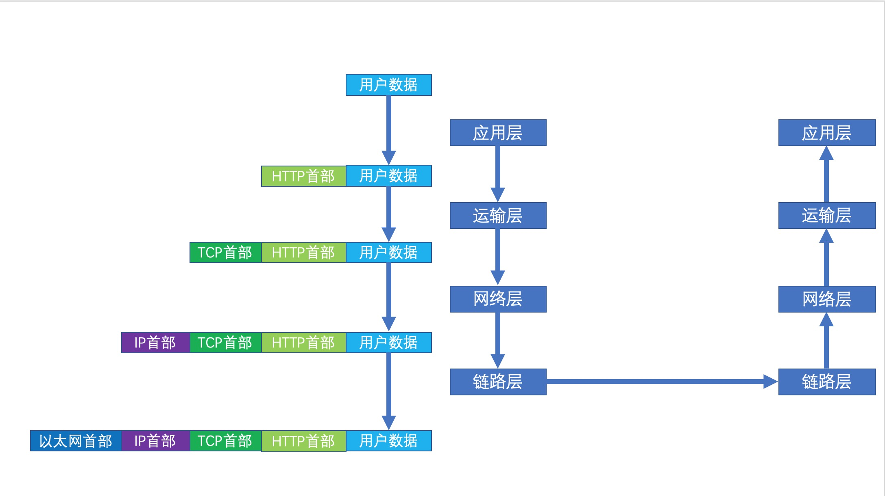

# 通过局域网中间人攻击学网络 
## 序言
### 声明
- 该文章为系列连载文章，由于作者目前工作较忙（懒），所以预期一周更新一篇；
- 作者目前主要从事Java开发，所以后续涉及部分C代码的，可能会比较菜，不符合各种规范，请见谅；
- 本系列文章仅供学习使用，请勿用作非法途径；
- 想要深入交流或者吐槽作者的，可以加作者微信，作者微信：qiao1213812243；

### 学习本系列文章前我需要有什么样的基础
- 简单的C语言编程基础；
- Java语言编程基础；
- 一些简单的网络基础；

### 我需要什么样的开发环境
- 推荐使用centos7操作系统作为编程环境；
- 推荐使用gcc作为C语言编译器；
- 推荐使用openJDK8；

如无特殊说明，作者后续代码均运行在centos7环境，对应的Linux版本为`3.10.0-1062.el7.centos.plus.i686`，使用`gcc (GCC) 4.8.5 20150623`
作为C语言编译器；

#### 为什么强调开发环境
因为后续会涉及一些内核开发，因为作者不是专业做C开发的，所以部分代码可能并没有考虑兼容性，有可能在我的环境可以run起来，但是在你的环境就不
行，因为本文并不是教你成为C语言开发高手和适配高手，为了避免学习过程中出现各种莫名其妙的问题，建议使用与作者一样的环境；

如果没有Linux的物理机，那么可以使用虚拟机代替，作者使用的是`VirtualBox`作为虚拟机容器的；

### 通过本系列文章你可以学到什么
- 网络七层OSI模型；
- 简单的C语言网络编程；
- 简单的内核编程；
- Linux的netfilter子系统（许多Linux上的著名防火墙都是基于该子系统实现的）；
- JNI知识；

## 第一篇 实现局域网中间人攻击之基础篇
### 如何实现中间人攻击
想要实现中间人攻击，我们就要知道以下几个问题：
- 互联网中不同主机是如何通信的？
- 如何将局域网内其他客户端的网络请求拦截？
- 拦截到其他客户端的请求报文后如何修改？

### 基础知识补充之OSI模型
想要搞网络，搞中间人攻击，首先你要熟悉OSI模型，那么什么是OSI模型呢？OSI模型定义如下：
```
开放式系统互联通信参考模型（英语：Open System Interconnection Reference Model，缩写为 OSI），简称为OSI模
型（OSI model），一种概念模型，由国际标准化组织提出，一个试图使各种计算机在世界范围内互连为网络的标准框架。定义
于ISO/IEC 7498-1
```
OSI模型将网络划分为以下七层：
- 物理层：物理层（Physical Layer）在局部局域网上传送数据帧（data frame），它负责管理计算机通信设备和网络媒体之间的互通。包括了针
脚、电压、线缆规范、集线器、中继器、网卡、主机适配器等；

- 数据链路层：数据链路层（Data Link Layer）负责网络寻址、错误侦测和改错。当表头和表尾被加至数据包时，会形成帧。数据链表头（DLH）是
包含了物理地址和错误侦测及改错的方法。数据链表尾（DLT）是一串指示数据包末端的字符串。例如以太网、无线局域网（Wi-Fi）和通用分组无线服
务（GPRS）等；

- 网络层：网络层（Network Layer）决定数据的路径选择和转寄，将网络表头（NH）加至数据包，以形成分组。网络表头包含了网络数据。例如:互
联网协议（IP）等；

- 传输层：传输层（Transport Layer）把传输表头（TH）加至数据以形成数据包。传输表头包含了所使用的协议等发送信息。例如:传输控制协
议（TCP）等；

- 会话层：会话层（Session Layer）负责在数据传输中设置和维护计算机网络中两台计算机之间的通信连接；

- 表达层：表达层（Presentation Layer）把数据转换为能与接收者的系统格式兼容并适合传输的格式；

- 应用层：应用层（Application Layer）提供为应用软件而设的接口，以设置与另一应用软件之间的通信。例如: HTTP，HTTPS，FTP，TELNET，SSH，
SMTP，POP3等；

以上七层模型可以简化为下面的四层模型：
- 链路层；
- 网络层；
- 运输层；
- 应用层；

可能有的读者到这里要问了，这些我都知道啊，但是有什么用呢？是的，大多数计算机专业的对这个模型肯定不陌生，但是本文并不限定读者必须是计算机
专业的，所以可能部分读者并不清楚该模型，而且相信即使是大多数计算机专业的，对该模型也不一定还记得那么清了，因为平时我们网络开发基本都是面
向应用层开发的，多数应用开发者可能并不关注更下面的网络层和数据链路层，而本文后续编程更多则是面向网络层和数据链路层的开发，所以很有必要
先补充下该分层模型；

### 一个应用数据包（比如HTTP）在主机中的旅途
以HTTP应用程序为例，一个应用数据包在主机中通过如下途径到达另外一个主机的应用中：


可以看出，发送数据时，用户数据每经过一层往下传输的时候，就会被加上该层的首部，然后传输给下层，最终一直到链路层，通过物理链路传输给另外一
台主机，另外一个主机接收到数据后会一层一层的解析，依次将各层首部去除同时往上传输，直至数据传输到应用端，与前边是一个互逆的过程，处理过程
中各层都只关心自己这一层如何处理数据，而不用关心其他层的数据处理，极大简化解耦了各层间的依赖；

### 结束
本期文章到此结束，可能有的读者到这里会说，这跟局域网中间人攻击看起来没什么关系，是的，目前看来是没什么关系，但是这些都是基础，只有理解这
些基础内容，才能更好的理解后面的文章，同时该文章只是做了一个很简单的介绍，真正想要深入学习还是要系统的去看些书，例如`TCP/IP详解`就是很
好的一本书，不过目前本文介绍的一些知识已经足够后续使用；下一章将会带来`实现局域网中间人攻击之思路篇`，带大家一起分析实现局域网中间人攻
击的一些思路，有了思路实现起来就有方向了；