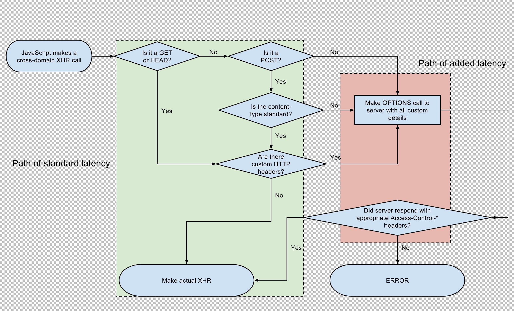

# 什么是CORS
`CORS`是通常所说`跨域请求`的英文简称，全称Cross-Origin Resource Sharing。浏览器出于安全考虑会禁止使用跨域请求，而使用`CORS`技术可以突破
该限制。

注意：浏览器限制仅限于脚本请求不能跨域，例如在js中用ajax请求，如果跨域会被拦截，但是对于标签是可以跨域的，例如使用`img`标签来跨域请求一个
图片资源，用`script`标签来跨域请求一个脚本资源。`JSONP`就是根据这个规则实现的跨域。

更多详细信息可以百度、Google查询。

# 跨域控制请求头详解
## Access-Control-Allow-Origin
### 语法
```
Access-Control-Allow-Origin: <origin> | *
```

### 说明
其中，`origin`参数的值指定了允许访问该资源的外域URI。对于不需要携带身份凭证的请求，服务器可以指定该字段的值为通配符，表示允许来自所有域的请求。

### 示例 
例如如下请求头：
```
Access-Control-Allow-Origin: http://JoeKerouac.com
```
将允许`http://JoeKerouac.com`网站的跨域请求；

## Access-Control-Expose-Headers
### 语法
```
Access-Control-Expose-Headers: <Header>[, <Header>]*
```

### 说明
在跨域访问时，XMLHttpRequest对象的getResponseHeader()方法只能拿到一些最基本的响应Header，`Cache-Control`、`Content-Language`、
`Content-Type`、`Expires`、`Last-Modified`、`Pragma`，如果要访问其他相应Header，则需要服务器设置本响应头。

### 示例
对于如下请求头：
```
Access-Control-Expose-Headers: User, Info
``` 

将被允许在客户端读取`User`和`Info`这两个Header；

## Access-Control-Max-Age
### 语法
```
Access-Control-Max-Age: <delta-seconds>
```

### 说明
`delta-seconds`参数表示`preflight`请求的结果在多少秒内有效。

### 示例
```
Access-Control-Max-Age: 100
```
表示允许`preflight`请求的结果在100秒内缓存生效；

## Access-Control-Allow-Credentials
### 语法
```
Access-Control-Allow-Credentials: true
```

### 说明
CORS请求默认不发送`Cookie`和HTTP认证信息（`Authorization`请求头），如果想要发送`Cookie`和HTTP认证信息，首先需要客户端设置`credentials`
为true，示例代码如下：
```
var xhr = new XMLHttpRequest();
xhr.withCredentials = true;
```
其次需要服务器允许发送`Cookie`和HTTP认证信息，服务器需要在响应中设置`Access-Control-Allow-Credentials`这个Header并且值为true；

### 示例
```
Access-Control-Allow-Credentials: true
```
表示允许浏览器读取response内容；

## Access-Control-Allow-Methods
### 语法
```
Access-Control-Allow-Methods: <method>[, <method>]*
```

### 说明
`Access-Control-Allow-Methods`首部字段用于预检请求的响应。其指明了实际请求所允许使用的`HTTP`方法。

### 示例
```
Access-Control-Allow-Methods: GET, POST
```
该请求头将会允许客户端使用`GET`和`POST`请求

## Access-Control-Allow-Headers
### 语法
```
Access-Control-Allow-Headers: <field-name>[, <field-name>]*
```

### 说明
`Access-Control-Allow-Headers`首部字段用于预检请求的响应。其指明了实际请求中允许携带的首部字段。

### 示例
```
Access-Control-Allow-Headers: User, Info
```
该请求头将允许客户端使用`User`和`Info`这两个请求头

# 补充说明
## 什么是`preflight`请求
CORS预检请求（`preflight`）是一种CORS请求，用于检查服务器是否理解了CORS协议以及是否使用特定的方法和标头来识别服务器。

对于`非简单跨域请求`，客户端会先发一个`OPTION`请求来check本次跨域请求是否被允许，如果允许才会发出实际的请求，否则会直接报错，这个`OPTION`请
求就是`preflight`请求；

`preflight`请求会携带三个HTTP请求头：`Access-Control-Request-Method`、`Access-Control-Request-Headers`和`Origin`；

## 什么是简单跨域请求，什么是非简单跨域请求
简单跨域请求定义如下：
Method是下列之一:
- GET
- POST
- HEAD

请求头在下面的列表中：
- Accept
- Accept-Language
- Content-Language
- Content-Type
- DPR
- Downlink
- Save-Data
- Viewport-Width
- Width

只要请求Method是上述之一，并且所有请求Header都是上述Header列表中的，就认为是简单请求（注意：Content-Type的值必须满足
是`application/x-www-form-urlencoded`、`multipart/form-data`、`text/plain`其中之一，否则也会被认为是非简单请求）；

## preflight请求流程图


# 参考
- [mozilla关于CORS的说明](https://developer.mozilla.org/zh-CN/docs/Web/HTTP/Access_control_CORS)
- [维基百科关于CORS的说明](https://en.wikipedia.org/wiki/Same-origin_policy)

# 关于作者
- 微信：qiao1213812243
- 微信公众号：java初学者
- GitHub首页:https://github.com/JoeKerouac